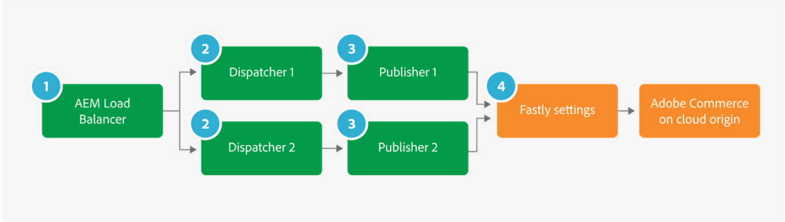

# Alignement des infrastructures (délais et limites de connexion)

Il existe des paramètres avec AEM et Adobe Commerce et l’infrastructure environnante, tels que les équilibreurs de charge qui doivent être alignés, qui sont liés aux limites de connexion et aux paramètres de délai d’expiration.

Un décalage entre ces limites signifierait que les connexions pourraient être limitées du côté AEM, tandis qu&#39;Adobe Commerce est capable de gérer plus de connexions. De même, pour les paramètres de délai d’expiration, un mauvais alignement peut entraîner des erreurs de délai d’expiration du côté AEM, alors qu’Adobe Commerce traite toujours une requête.

Pour les paramètres de délai d’expiration, les paramètres doivent être passés en revue et alignés afin d’éviter que les erreurs de délai d’expiration 503 ne s’affichent en cas de chargement. Il existe plusieurs paramètres d’infrastructure et de délai d’expiration d’application à vérifier :

## AEM équilibreur de charge

En supposant qu’il existe un équilibreur de charge de l’application AWS dans l’infrastructure et plusieurs dispatchers/éditeurs, les paramètres suivants doivent être pris en compte pour l’équilibreur de charge :

1. Les contrôles de l’intégrité de l’éditeur doivent être examinés afin d’empêcher les dispatchers de se retirer inutilement tôt du service des montées de charge. Les paramètres de délai d’expiration du contrôle de l’intégrité de l’équilibreur de charge doivent être alignés sur les paramètres de délai d’expiration de l’éditeur.

   

1. L’affinité du groupe cible du Dispatcher peut être désactivée et l’algorithme d’équilibrage de charge Tour à tour peut être utilisé. Cela suppose qu’il n’existe aucune fonctionnalité spécifique AEM ou qu’aucune AEM session utilisateur utilisée ne nécessite la définition de l’affinité de session. Cela suppose que la connexion de l’utilisateur et la gestion de session se font uniquement sur Adobe Commerce via GraphQL.

   

1. Notez que si vous n’activez pas l’affinité de session, cela peut empêcher la mise en cache des requêtes, car par défaut, Fastly ne met pas en cache les pages avec l’en-tête Set-Cookies . Adobe Commerce définit les cookies même sur les pages pouvant être mises en cache (TTL > 0), mais la valeur par défaut Fastly VCL retire ces cookies des pages pouvant être mises en cache afin que la mise en cache rapide fonctionne. Si les pages ne sont pas mises en cache, vérifiez les cookies personnalisés que vous utilisez, puis téléchargez le fichier Fastly VCL et vérifiez à nouveau le site.

## Paramètres de délai d’expiration de Dispatcher

Le /timeout des options du dispatcher &quot;renders&quot; spécifie le délai d’attente de connexion pour accéder à l’instance de publication AEM en millisecondes. Cela doit être vérifié et le paramètre par défaut &quot;0&quot; (délai d’expiration indéfini) doit être utilisé si un équilibreur de charge distinct est présent pour gérer les paramètres de délai d’expiration.

S’il n’existe aucun équilibreur de charge dans l’infrastructure, les paramètres de délai d’expiration doivent être spécifiés dans les paramètres dispatcher/timeout, avec une valeur correspondant aux paramètres de délai d’expiration GraphQL dans l’éditeur.

## Éditeurs

Limites et délais de connexion de Publisher GraphQL : Au départ, les paramètres OSGI de la fabrique de configuration du client Adobe Commerce CIF GraphQL Max HTTP connections doivent être définis sur la limite de connexions maximale par défaut, qui est actuellement définie sur 200. Même s’il existe plusieurs éditeurs dans la ferme de AEM, la limite doit être définie de la même manière pour chaque éditeur, en respectant le paramètre Fastly . Cela s’explique par le fait que, dans certains cas, un éditeur peut gérer plus de trafic que les autres éditeurs, si un dispatcher associé est exclu de la ferme par exemple. Cela signifie que tout le trafic sera acheminé par le seul dispatcher et les éditeurs restants, dans ce cas l’éditeur unique peut alors avoir besoin de toutes les connexions HTTP.

La &quot;méthode HTTP par défaut&quot; doit être définie de POST à GET. Seules les requêtes de GET sont mises en cache dans le cache Adobe Commerce GraphQL. Par conséquent, la méthode par défaut doit toujours être définie sur GET.

Le délai de connexion http et le délai de socket http doivent être définis sur une valeur correspondant au délai de connexion Fastly.

L’image suivante montre l’usine de configuration du client CIF GraphQL Magento. Les paramètres présentés ici ne sont que des exemples et doivent être réglés au cas par cas :

Les illustrations suivantes présentent les configurations d’arrière-plan Fastly. Les paramètres présentés ici ne sont que des exemples et doivent être réglés au cas par cas :

