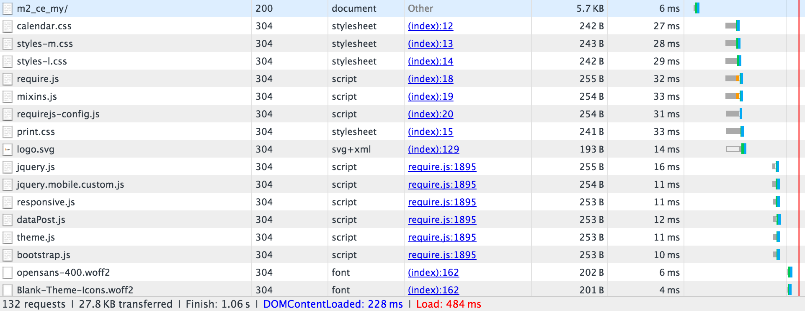

# Configurer le vernis

[Varnish Cache] est un accélérateur d’applications web open source (également appelé _accélérateur HTTP_ ou _proxy inverse HTTP de mise en cache_). Le vernis stocke (ou met en cache) des fichiers ou des fragments de fichiers en mémoire, ce qui permet à Varnish de réduire le temps de réponse et la consommation de bande passante du réseau lors de futures demandes équivalentes. Contrairement aux serveurs web tels qu&#39;Apache et nginx, Varnish a été conçu pour être utilisé exclusivement avec le protocole HTTP.

[Configuration requise](../../installation/system-requirements.md) répertorie les versions de vernis prises en charge.

>[!WARNING]
>
>Nous _vous recommandons vivement_ d’utiliser du vernis en production. La mise en cache de la page entière intégrée (au système de fichiers ou à la [base de données](https://developer.adobe.com/commerce/php/development/cache/partial/database-caching/)) est beaucoup plus lente que Varnish et Varnish est conçue pour accélérer le trafic HTTP.

Pour plus d’informations sur le vernis, voir :

- [ The Big Varnish Picture]
- [Options de démarrage de vernis]
- [Performance de vernis et de site web]

## Diagramme de topologie vernale

La figure suivante présente une vue de base du vernis dans votre topologie Commerce.


Dans la figure précédente, les requêtes HTTP des utilisateurs sur Internet génèrent de nombreuses requêtes de CSS, d’HTML, de JavaScript et d’images (appelées collectivement _ressources_). Varnish se trouve devant le serveur web et envoie ces requêtes par proxy au serveur web.

Lorsque le serveur web renvoie des ressources, les ressources pouvant être mises en cache sont stockées en vernis. Toutes les demandes suivantes pour ces ressources sont satisfaites par Varnish (ce qui signifie que les demandes n’atteignent pas le serveur web). Le vernis renvoie extrêmement rapidement le contenu mis en cache. Les résultats se traduisent par des temps de réponse plus rapides pour renvoyer le contenu aux utilisateurs et un nombre réduit de requêtes qui doivent être satisfaites par Commerce.

Les Assets mises en cache par Varnish expirent à un intervalle configurable ou sont remplacées par de nouvelles versions des mêmes ressources. Vous pouvez également effacer le cache manuellement à l’aide de la commande Admin ou [`magento cache:clean`](../cli/manage-cache.md#clean-and-flush-cache-types) .

## Présentation des processus

Cette rubrique explique comment installer initialement le vernis avec un ensemble minimal de paramètres et tester son fonctionnement. Ensuite, exportez une configuration de vernis à partir de l’administrateur Commerce et testez-la à nouveau.

Le processus peut être résumé comme suit :

1. Installez le vernis et testez-le en accédant à n’importe quelle page Commerce pour vérifier si vous obtenez des en-têtes de réponse HTTP indiquant que le vernis fonctionne.
1. Installez le logiciel Commerce et utilisez l’administrateur pour créer un fichier de configuration de vernis.
1. Remplacez votre fichier de configuration de vernis existant par celui généré par l’administrateur.
1. Testez à nouveau tout.

   Si votre répertoire `<magento_root>/var/page_cache` ne contient rien, vous avez correctement configuré le vernis avec Commerce !

>[!NOTE]
>
>- Sauf indication contraire, vous devez saisir toutes les commandes abordées dans cette rubrique en tant qu’utilisateur disposant de droits `root`.
>
>- Cette rubrique est écrite pour le vernis sur CentOS et Apache 2.4. Si vous définissez le vernis dans un autre environnement, certaines commandes peuvent être différentes. Pour plus d’informations, consultez la documentation de vernis .

## Problèmes connus

Nous connaissons les problèmes suivants avec le vernis :

- [Le vernis ne prend pas en charge SSL]

  Vous pouvez également utiliser la terminaison SSL ou un proxy de terminaison SSL.

- Si vous supprimez manuellement le contenu du répertoire `<magento_root>/var/cache`, vous devez redémarrer Varnish.

- Erreur possible lors de l’installation de Commerce :

  ```
  Error 503 Service Unavailable
  Service Unavailable
  XID: 303394517
  Varnish cache server
  ```

  Si vous rencontrez cette erreur, modifiez `default.vcl` et ajoutez un délai d’attente à la barre d’état `backend` comme suit :

  ```conf
  backend default {
      .host = "127.0.0.1";
      .port = "8080";
      .first_byte_timeout = 600s;
  }
  ```

## Présentation de la mise en cache de vernis

La mise en cache de vernis fonctionne avec Commerce en utilisant :

- [`nginx.conf.sample`](https://github.com/magento/magento2/blob/2.4/nginx.conf.sample) à partir du référentiel GitHub de Magento 2
- `.htaccess` fichier de configuration distribué pour Apache fourni avec Commerce
- `default.vcl` configuration pour le vernis généré à l’aide de [Admin](../cache/configure-varnish-commerce.md)

>[!INFO]
>
>Cette rubrique couvre uniquement les options par défaut de la liste précédente. Il existe de nombreuses autres façons de configurer la mise en cache dans des scénarios complexes (par exemple, l’utilisation d’un réseau de diffusion de contenu). Ces méthodes vont au-delà de la portée de ce guide.

Lors de la première demande de navigateur, les ressources pouvant être mises en cache sont diffusées à partir du navigateur client à partir de Varnish et mises en cache sur le navigateur.

En outre, Varnish utilise une balise d’entité (ETag) pour les ressources statiques. L’ETag permet de déterminer le moment où les fichiers statiques changent sur le serveur. Par conséquent, les ressources statiques sont envoyées au client lorsqu’il change sur le serveur, soit à une nouvelle demande d’un navigateur, soit lorsque le client actualise le cache du navigateur, généralement en appuyant sur F5 ou Ctrl+F5.

Vous trouverez plus de détails dans les sections suivantes.

## Mise en cache par requête du navigateur

Cette section utilise un inspecteur de navigateur pour montrer comment les ressources sont diffusées au navigateur dans la première requête et chargées ensuite à partir du cache du navigateur local.

### Première requête du navigateur

`nginx.conf.sample` et `.htaccess` fournissent des options pour la mise en cache du client. Lorsque la première requête est effectuée à partir d’un navigateur pour un objet pouvant être mis en cache, Varnish la transmet au client.

La figure suivante illustre un exemple d’utilisation d’un inspecteur de navigateur :


L’exemple précédent illustre une requête pour la page principale storefront (`m2_ce_my`). Les ressources CSS et JavaScript sont mises en cache dans le navigateur client.

>[!NOTE]
>
>La plupart des ressources statiques comportent un code d’état HTTP 200 (OK), indiquant que la ressource a été récupérée à partir du serveur.

### Deuxième requête de navigateur

Si le même navigateur demande à nouveau la même page, ces ressources sont diffusées à partir du cache du navigateur local, comme le montre la figure suivante.


Notez la différence de temps de réponse entre la première et la seconde requête. Là encore, les ressources statiques ont un code de réponse 200 (OK), car elles sont diffusées pour la première fois à partir du cache local.

## Utilisation d’Etag par Commerce

L’exemple suivant montre les en-têtes de réponse d’une ressource statique spécifique.


`calendar.css` comporte un en-tête de réponse ETag, ce qui signifie que le fichier CSS sur le navigateur client peut être comparé à celui sur le serveur.

En outre, les ressources statiques sont renvoyées avec un code d’état HTTP 304 (Non modifié), comme le montre la figure suivante.



Le code d’état 304 se produit car l’utilisateur a invalidé son cache local et le contenu sur le serveur n’a pas changé. En raison du code d’état 304, la ressource statique _content_ n’est pas transférée ; seuls les en-têtes HTTP sont téléchargés vers le navigateur.

Si le contenu change sur le serveur, le client télécharge la ressource statique avec un code d’état HTTP 200 (OK) et un nouveau ETag.

<!-- Link Definitions -->

[L&#39;image du grand vernis]: https://www.varnish-cache.org/docs/trunk/users-guide/intro.html
[Cache de vernis]: https://varnish-cache.org
[Options de démarrage en pointillés]: https://www.varnish-cache.org/docs/trunk/reference/varnishd.html#ref-varnishd-options
[Performances et performances du site web]: https://www.varnish-cache.org/docs/trunk/users-guide/performance.html#users-performance
[Le vernis ne prend pas en charge SSL]: https://www.varnish-cache.org/docs/3.0/phk/ssl.html
