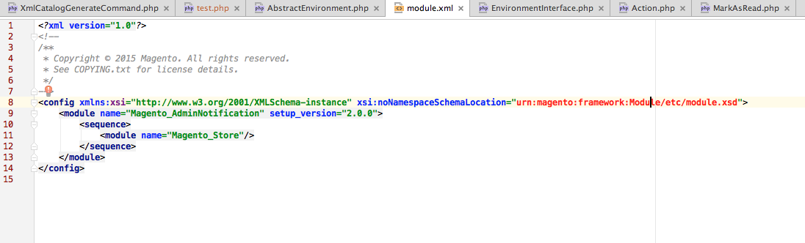
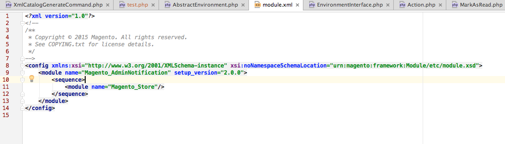
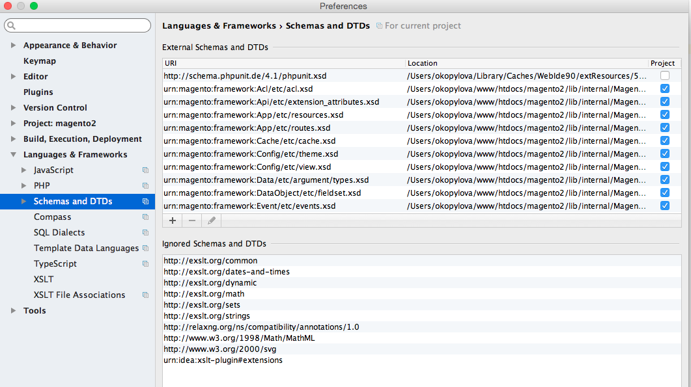

# Présentation du surligneur d’URL

{{file-system-owner}}

Le code Commerce fait référence à tous les schémas XSD [Uniform Resource Names [URN])](https://www.ietf.org/rfc/rfc2141.txt). Si vous développez du code et que vous devez référencer des fichiers XSD, cette commande configure votre environnement de développement intégré (IDE) pour reconnaître et mettre en évidence les URN. Cela facilite le développement.

Par défaut, un IDE tel que PhpStorm n’est pas configuré pour reconnaître les URN et, par conséquent, ils s’affichent en rouge comme suit :



La commande `bin/magento dev:urn-catalog:generate` permet à votre IDE (actuellement, uniquement PhpStorm et Visual Studio Code) de reconnaître et de mettre en évidence des URN comme ceux-ci :



Plus précisément, cette commande crée la configuration PhpStorm suivante :



## Configuration de votre IDE

Actuellement, seuls PhpStorm et Visual Studio Code sont pris en charge.

Syntaxe de la commande :

```shell
bin/magento dev:urn-catalog:generate <path>
```

Où `<path>` est le chemin d&#39;accès à votre fichier PhpStorm `misc.xml`, qui est situé par rapport à la racine de votre projet. En règle générale, `<path>` est `.idea/misc.xml`.

>[!INFO]
>
>Pour garder vos « schémas et DTD » à jour, exécutez la commande `dev:urn-catalog:generate` chaque fois que vous ajoutez, modifiez ou supprimez des modules Commerce 2 contenant des fichiers `*.xsd`.
