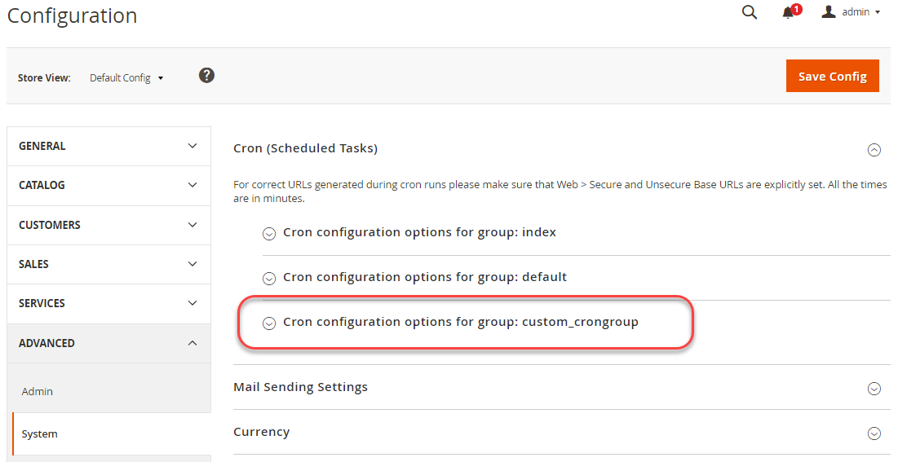

# Configuration d’une tâche cron personnalisée

Ce tutoriel détaillé explique comment créer une tâche cron personnalisée et éventuellement un groupe cron dans un exemple de module. Vous pouvez utiliser un module que vous avez déjà ou vous pouvez utiliser un exemple de module de notre [`magento2-samples` référentiel][samples].

L’exécution de la tâche cron entraîne l’ajout d’une ligne au `cron_schedule` avec le nom de la tâche cron, `custom_cron`.

Nous vous montrons également comment créer éventuellement un groupe cron, que vous pouvez utiliser pour exécuter des tâches cron personnalisées avec des paramètres autres que les paramètres par défaut de l’application Commerce.

Dans ce tutoriel, nous supposons que :

- L’application Commerce est installée dans `/var/www/html/magento2`
- Votre nom d’utilisateur et votre mot de passe de la base de données Commerce sont tous deux `magento`
- Vous effectuez toutes les actions en tant que [propriétaire du système de fichiers](../../installation/prerequisites/file-system/overview.md)

## Étape 1 : Obtention d’un exemple de module

Pour configurer une tâche cron personnalisée, vous avez besoin d’un exemple de module. Nous suggérons le `magento-module-minimal` module .

Si vous disposez déjà d’un exemple de module, vous pouvez l’utiliser ; ignorez cette étape et l’étape suivante, puis passez à l’étape 3 : Créez une classe pour exécuter cron.

**Pour obtenir un exemple de module**:

1. Connectez-vous à votre serveur Commerce en tant que [propriétaire du système de fichiers](../../installation/prerequisites/file-system/overview.md).
1. Accédez à un répertoire qui ne se trouve pas dans la racine de votre application Commerce (par exemple, votre répertoire racine).
1. Cloner le [`magento2-samples` référentiel][samples].

   ```bash
   git clone git@github.com:magento/magento2-samples.git
   ```

   Si la commande échoue avec l’erreur `Permission denied (publickey).`, vous devez [Ajoutez votre clé publique SSH à GitHub.com][git-ssh].

1. Créez un répertoire dans lequel copier l’exemple de code :

   ```bash
   mkdir -p /var/www/html/magento2/app/code/Magento/SampleMinimal
   ```

1. Copiez l’exemple de code de module :

   ```bash
   cp -r ~/magento2-samples/sample-module-minimal/* /var/www/html/magento2/app/code/Magento/SampleMinimal
   ```

1. Vérifiez correctement les fichiers copiés :

   ```bash
   ls -al /var/www/html/magento2/app/code/Magento/SampleMinimal
   ```

   Vous devriez voir le résultat suivant :

   ```terminal
   drwxrwsr-x.   4 magento_user apache  4096 Oct 30 13:19 .
   drwxrwsr-x. 121 magento_user apache  4096 Oct 30 13:19 ..
   -rw-rw-r--.   1 magento_user apache   372 Oct 30 13:19 composer.json
   drwxrwsr-x.   2 magento_user apache  4096 Oct 30 13:19 etc
   -rw-rw-r--.   1 magento_user apache 10376 Oct 30 13:19 LICENSE_AFL.txt
   -rw-rw-r--.   1 magento_user apache 10364 Oct 30 13:19 LICENSE.txt
   -rw-rw-r--.   1 magento_user apache  1157 Oct 30 13:19 README.md
   -rw-rw-r--.   1 magento_user apache   270 Oct 30 13:19 registration.php
   drwxrwsr-x.   3 magento_user apache  4096 Oct 30 13:19 Test
   ```

1. Mise à jour de la base de données et du schéma Commerce :

   ```bash
   bin/magento setup:upgrade
   ```

1. Nettoyez le cache :

   ```bash
   bin/magento cache:clean
   ```

## Étape 2 : Vérification de l’exemple de module

Avant de poursuivre, vérifiez que l’exemple de module est enregistré et activé.

1. Exécutez la commande suivante :

   ```bash
   bin/magento module:status Magento_SampleMinimal
   ```

1. Assurez-vous que le module est activé.

   ```terminal
   Module is enabled
   ```

>[!TIP]
>
>Si la sortie indique que la variable `Module does not exist`, revoir [Étape 1](#step-1-get-a-sample-module) soigneusement. Assurez-vous que votre code se trouve dans le répertoire approprié. L&#39;orthographe et la casse sont importantes; si quelque chose est différent, le module ne se charge pas. N’oubliez pas également de vous exécuter. `magento setup:upgrade`.

## Étape 3 : Création d’une classe pour exécuter cron

Cette étape affiche une classe simple pour créer une tâche cron. La classe n’écrit qu’une ligne dans la variable `cron_schedule` qui confirme qu’il est configuré correctement.

Pour créer une classe :

1. Créez un répertoire pour la classe et modifiez-le :

   ```bash
   mkdir /var/www/html/magento2/app/code/Magento/SampleMinimal/Cron && cd /var/www/html/magento2/app/code/Magento/SampleMinimal/Cron
   ```

1. Création d’un fichier nommé `Test.php` dans ce répertoire avec les contenus suivants :

   ```php
   <?php
   namespace Magento\SampleMinimal\Cron;
   
   use Psr\Log\LoggerInterface;
   
   class Test {
       protected $logger;
   
       public function __construct(LoggerInterface $logger) {
           $this->logger = $logger;
       }
   
      /**
       * Write to system.log
       *
       * @return void
       */
       public function execute() {
           $this->logger->info('Cron Works');
       }
   }
   ```

## Étape 4 : Créer `crontab.xml`

Le `crontab.xml` définit un planning pour exécuter votre code cron personnalisé.

Créer `crontab.xml` comme suit dans la variable `/var/www/html/magento2/app/code/Magento/SampleMinimal/etc` directory:

```xml
<?xml version="1.0"?>
<config xmlns:xsi="http://www.w3.org/2001/XMLSchema-instance" xsi:noNamespaceSchemaLocation="urn:magento:module:Magento_Cron:etc/crontab.xsd">
    <group id="default">
        <job name="custom_cronjob" instance="Magento\SampleMinimal\Cron\Test" method="execute">
            <schedule>* * * * *</schedule>
        </job>
    </group>
</config>
```

Le précédent `crontab.xml` exécute la variable `Magento/SampleMinimal/Cron/Test.php` une fois par minute, ce qui entraîne l’ajout d’une ligne au `cron_schedule` table.

Pour que le planning cron puisse être configuré à partir de l’administrateur, utilisez le chemin de configuration de votre champ de configuration système.

```xml
<?xml version="1.0"?>
<config xmlns:xsi="http://www.w3.org/2001/XMLSchema-instance" xsi:noNamespaceSchemaLocation="urn:magento:module:Magento_Cron:etc/crontab.xsd">
    <group id="default">
        <job name="custom_cronjob" instance="Magento\SampleMinimal\Cron\Test" method="execute">
            <config_path>system/config/path</config_path>
        </job>
    </group>
</config>
```

Où, `system/config/path` est un chemin de configuration système défini dans `etc/adminhtml/system.xml` d’un module.

## Étape 5 : Nettoyage de la compilation et du cache

Compilez le code à l’aide de la commande suivante :

```bash
bin/magento setup:di:compile
```

Et effacez le cache avec cette commande :

```bash
bin/magento cache:clean
```

## Étape 6 : Vérification de la tâche cron

Cette étape montre comment vérifier la tâche cron personnalisée en utilisant une requête SQL sur la `cron_schedule` table de base de données.

Pour vérifier cron :

1. Exécutez les tâches Commerce cron :

   ```bash
   bin/magento cron:run
   ```

1. Saisissez le `magento cron:run` deux ou trois fois.

   La première fois que vous saisissez la commande, elle met les tâches en file d’attente. par la suite, les tâches cron sont exécutées. Vous devez saisir la commande _au moins_ deux fois.

1. Exécution de la requête SQL `SELECT * from cron_schedule WHERE job_code like '%custom%'` comme suit :

   1. Entrée `mysql -u magento -p`
   1. Dans le `mysql>` invite, entrée `use magento;`
   1. Entrée `SELECT * from cron_schedule WHERE job_code like '%custom%';`

      Le résultat doit être similaire à ce qui suit :

      ```terminal
      +-------------+----------------+---------+----------+---------------------+---------------------+---------------------+---------------------+
      | schedule_id | job_code       | status  | messages | created_at        | scheduled_at        | executed_at         | finished_at     |
      +-------------+----------------+---------+----------+---------------------+---------------------+---------------------+---------------------+
      |        3670 | custom_cronjob | success | NULL     | 2016-11-02 09:38:03 | 2016-11-02 09:38:00 | 2016-11-02 09:39:03 | 2016-11-02 09:39:03 |
      |        3715 | custom_cronjob | success | NULL     | 2016-11-02 09:53:03 | 2016-11-02 09:53:00 | 2016-11-02 09:54:04 | 2016-11-02 09:54:04 |
      |        3758 | custom_cronjob | success | NULL     | 2016-11-02 10:09:03 | 2016-11-02 10:09:00 | 2016-11-02 10:10:03 | 2016-11-02 10:10:03 |
      |        3797 | custom_cronjob | success | NULL     | 2016-11-02 10:24:03 | 2016-11-02 10:24:00 | 2016-11-02 10:25:03 | 2016-11-02 10:25:03 |
      +-------------+----------------+---------+----------+---------------------+---------------------+---------------------+---------------------+
      ```

1. (Facultatif) Vérifiez que les messages sont écrits dans le journal système de Commerce :

   ```bash
   cat /var/www/html/magento2/var/log/system.log
   ```

   Vous devriez voir une ou plusieurs entrées comme suit :

   ```terminal
   [2016-11-02 22:17:03] main.INFO: Cron Works [] []
   ```

   Ces messages proviennent du `execute` dans `Test.php`:

   ```php
   public function execute() {
        $this->logger->info('Cron Works');
   ```

Si la commande SQL et le journal du système ne contiennent aucune entrée, exécutez le `magento cron:run` Commandez quelques autres fois et attendez. La mise à jour de la base de données peut prendre un certain temps.

## Étape 7 (facultative) : Configuration d’un groupe cron personnalisé

Cette étape indique comment configurer éventuellement un groupe cron personnalisé. Vous devez configurer un groupe cron personnalisé si vous souhaitez que votre tâche cron personnalisée s’exécute selon un planning différent de celui des autres tâches cron (généralement une fois par minute) ou si vous souhaitez que plusieurs tâches cron personnalisées s’exécutent avec des paramètres différents.

Pour configurer un groupe cron personnalisé :

1. Ouvrir `crontab.xml` dans un éditeur de texte.
1. Modifier `<group id="default">` to `<group id="custom_crongroup">`
1. Quittez l’éditeur de texte.
1. Créer `/var/www/html/magento2/app/code/Magento/SampleMinimal/etc/cron_groups.xml` avec les contenus suivants :

   ```xml
   <?xml version="1.0"?>
   <config xmlns:xsi="http://www.w3.org/2001/XMLSchema-instance" xsi:noNamespaceSchemaLocation="urn:magento:module:Magento_Cron:etc/cron_groups.xsd">
       <group id="custom_crongroup">
           <schedule_generate_every>1</schedule_generate_every>
           <schedule_ahead_for>4</schedule_ahead_for>
           <schedule_lifetime>2</schedule_lifetime>
           <history_cleanup_every>10</history_cleanup_every>
           <history_success_lifetime>60</history_success_lifetime>
           <history_failure_lifetime>600</history_failure_lifetime>
           <use_separate_process>1</use_separate_process>
       </group>
   </config>
   ```

Pour une description de la signification des options, voir [Personnalisation de la référence des crons](custom-cron-reference.md).

## Étape 8 : Vérification du groupe cron personnalisé

Ceci _facultatif_ L’étape indique comment vérifier votre groupe cron personnalisé à l’aide de l’administrateur.

Pour vérifier votre groupe cron personnalisé :

1. Exécutez des tâches Commerce cron pour votre groupe personnalisé :

   ```bash
   php /var/www/html/magento2/bin/magento cron:run --group="custom_crongroup"
   ```

   Exécutez la commande au moins deux fois.

1. Nettoyez le cache :

   ```bash
   php /var/www/html/magento2/bin/magento cache:clean
   ```

1. Connectez-vous à l’administrateur en tant qu’administrateur.
1. Cliquez sur **Magasins** > **Paramètres** > **Configuration** > **Avancé** > **Système**.
1. Dans le volet de droite, développez **Cron**.

   Votre groupe cron s’affiche comme suit :

   

<!-- link definitions -->

[git-ssh]: https://docs.github.com/en/authentication/connecting-to-github-with-ssh/adding-a-new-ssh-key-to-your-github-account
[samples]: https://github.com/magento/magento2-samples
