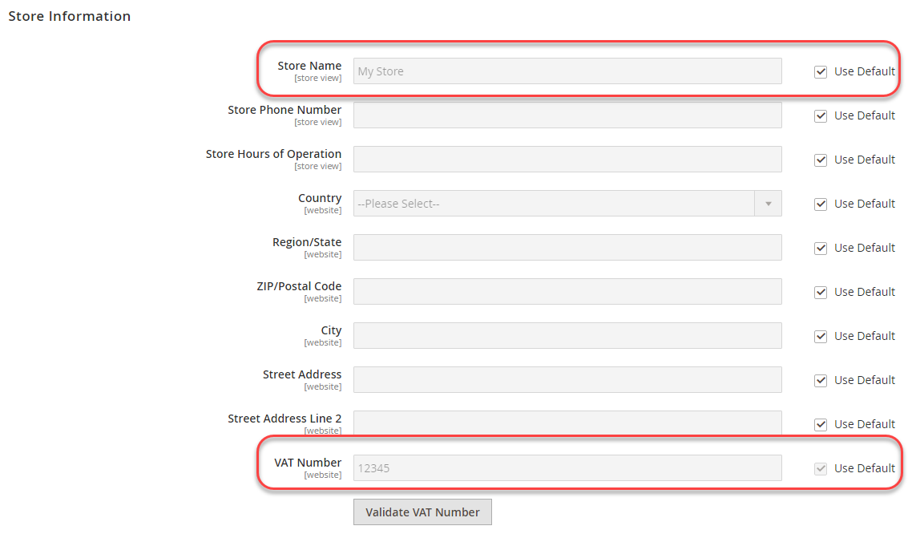

# Exemple d’utilisation des commandes de ligne de commande

Cet exemple montre comment définir des valeurs partagées, spécifiques au système et sensibles dans votre système de développement, puis déployer ces valeurs dans votre système de production.
Pour ce faire, utilisez une combinaison de configurations partagées, le fichier `config.php` et la commande d’interface de ligne de commande Commerce.

Cet exemple utilise les paramètres de configuration suivants :

- **Nombre de visites** et **Nom de magasin** pour les paramètres de configuration partagés.

  Ceux-ci sont disponibles sous **Magasins** > Paramètres > **Configuration** > Général > **Général**.

- **Envoyer des emails à** pour la valeur de configuration sensible.

  Vous pouvez le trouver sous **Magasins** > Paramètres > **Configuration** > Général > **Contacts**.

- **Domaine de messagerie par défaut** pour la valeur de configuration spécifique au système.

  Vous pouvez le trouver sous **Magasins** > Paramètres > **Configuration** > Clients > **Configuration client** > **Créer des options de compte**.

Vous pouvez suivre la même procédure que celle présentée dans cet exemple pour paramétrer les paramètres des références suivantes :

- [Référence des chemins de configuration sensibles et spécifiques au système](../reference/config-reference-sens.md)
- [Référence des chemins de configuration des paiements](../reference/config-reference-payment.md)
- [Autres références de chemins de configuration](../reference/config-reference-general.md)
- [Référence sur les chemins de configuration de l’extension Commerce Enterprise B2B](../reference/config-reference-b2b.md)

## Avant de commencer

Avant de commencer, configurez les autorisations et la propriété du système de fichiers comme décrit dans la section [Condition préalable requise pour le développement, la création et les systèmes de production](../deployment/prerequisites.md).

## Hypothèses

Cette rubrique fournit un exemple de modification de la configuration du système de production. Si vous le souhaitez, vous pouvez choisir différentes options de configuration.

Pour les besoins de cet exemple, nous supposons que :

- Vous utilisez le contrôle source Git
- Le système de développement est disponible dans un référentiel distant Git nommé `mconfig`
- Votre branche de travail Git est nommée `m2.2_deploy`

## Étape 1 : définir la configuration dans le système de développement

Pour définir les paramètres régionaux et les unités de poids par défaut dans votre système de développement :

1. Connectez-vous à l’administrateur.
1. Cliquez sur **Magasins** > Paramètres > **Configuration** > Général > **Général**.
1. Si plusieurs sites web sont disponibles, utilisez la liste **Affichage magasin** dans le coin supérieur gauche pour passer à un autre site web comme le montre la figure suivante.

   

1. Dans le volet de droite, développez **Informations sur le magasin**.
1. Si nécessaire, décochez la case **Utiliser la valeur par défaut** en regard des champs **Numéro de TVA** et **Nom de la boutique** .
1. Entrez un nombre dans le champ (par exemple, `12345`).
1. Dans le champ **Nom de la boutique**, saisissez une valeur (comme `My Store`).
1. Cliquez sur **Enregistrer la configuration**.
1. Dans le volet de navigation de gauche, sous Général, cliquez sur **Contacts**.
1. Dans le volet de droite, développez **Email Options**.
1. Si nécessaire, décochez la case **Utiliser la valeur par défaut** en regard du champ **Envoyer des emails à** .
1. Entrez une adresse électronique dans le champ .
1. Cliquez sur **Enregistrer la configuration**.
1. Utilisez la liste **Affichage magasin** pour sélectionner la **configuration par défaut** comme le montre la figure suivante.

   

1. Dans le volet de gauche, cliquez sur Clients > **Configuration client**.
1. Dans le volet de droite, développez **Créer des options de compte**.
1. Si nécessaire, décochez la case **Utiliser la valeur du système** en regard du champ **Domaine de messagerie par défaut** .
1. Saisissez un nom de domaine dans le champ .
1. Cliquez sur **Enregistrer la configuration**.
1. Si vous y êtes invité, videz le cache.

## Etape 2 : mise à jour de la configuration

Maintenant que vous avez modifié la configuration dans l’administrateur, écrivez la configuration partagée dans un fichier comme suit :

{{$include /help/_includes/config-save-config.md}}

Même si `app/etc/env.php` (la configuration spécifique au système) a été mise à jour, ne l’archivez pas dans le contrôle source.
Vous allez créer les mêmes paramètres de configuration sur votre système de production plus loin dans cette procédure.

## Étape 3 : Mettre à jour votre système de génération et générer des fichiers

Maintenant que vous avez validé vos modifications dans la configuration partagée pour le contrôle de code source, vous pouvez extraire ces modifications dans votre système de génération, compiler le code et générer des fichiers statiques.

{{$include /help/_includes/config-update-build-system.md}}

## Étape 4 : mise à jour du système de production

La dernière étape du processus consiste à mettre à jour votre système de production. Vous devez le faire en deux parties :

- Mise à jour des paramètres sensibles et spécifiques au système
- Mise à jour des paramètres partagés

### Mise à jour des paramètres sensibles et spécifiques au système

Pour définir les paramètres sensibles et spécifiques au système à l’aide de variables d’environnement, vous devez connaître les éléments suivants :

- Portée de chaque paramètre

  Si vous avez suivi les instructions de l’étape 1, la portée de **Envoyer des emails à** est le site web et la portée de **Domaine de messagerie par défaut** est globale (c’est-à-dire, l’étendue de configuration par défaut).

  Vous avez besoin du code du site web pour définir la valeur de configuration **Envoyer des emails à** .

  Pour plus d’informations sur la recherche de cette valeur, voir : [Utilisation de variables d’environnement pour remplacer les paramètres de configuration](../reference/override-config-settings.md#environment-variables).

- Chemins de configuration des paramètres utilisés dans cet exemple :

  | Nom du paramètre | Chemin de configuration |
  | -------------------- | -------------------------------------- |
  | Envoyer des emails à | `contact/email/recipient_email` |
  | Domaine de messagerie par défaut | `customer/create_account/email_domain` |

  Pour tous les chemins de configuration sensibles et spécifiques au système, voir : [Référence des chemins de configuration sensibles et spécifiques au système](../reference/config-reference-sens.md).

### Définition des variables à l’aide des commandes de l’interface de ligne de commande

Utilisez les commandes d’interface de ligne de commande suivantes pour définir des paramètres de configuration spécifiques au système et sensibles :

- `magento config:set` pour les paramètres spécifiques au système
- `magento config:sensitive:set` pour les paramètres sensibles

Pour définir le paramètre spécifique au système **Domaine de messagerie par défaut**, qui se trouve dans la portée par défaut, utilisez la commande suivante :

```bash
bin/magento config:set customer/create_account/email_domain <email domain>
```

Il n’est pas nécessaire d’utiliser la portée dans la commande, car il s’agit de la portée par défaut.

Toutefois, pour définir des valeurs pour **Envoyer des emails à**, vous devez connaître le type de portée (`website`) et le code de portée, qui est probablement différent sur chaque site.

Exemple :

```unix
bin/magento config:sensitive:set contact/email/recipient_email --scope=website --scope-code=<website code> <email address>
```

### Mise à jour des paramètres partagés

Cette section explique comment extraire toutes les modifications que vous avez apportées à votre développement et créer des systèmes dans un environnement de production, ce qui met à jour les paramètres de configuration partagés (Nom du magasin et Numéro de TVA).

{{$include /help/_includes/config-update-prod-system.md}}

### Vérification des paramètres de configuration dans Admin

Pour vérifier les paramètres de configuration :

1. Connectez-vous à l’administrateur de votre système de production.
1. Cliquez sur **Magasins** > Paramètres > **Configuration** > Général > **Général**.
1. Utilisez la liste **Affichage magasin** dans le coin supérieur gauche pour passer à un autre site web.

   Les options de configuration partagées que vous définissez dans le système de développement s’affichent de la même manière que ce qui suit.

   

   >[!INFO]
   >
   >Le champ **Nom du magasin** est modifiable dans la portée du site web, mais si vous passez à la portée de configuration par défaut, il n’est pas modifiable. C’est le résultat de la définition des options dans le système de développement. La valeur de **Numéro de TVA** n’est pas modifiable dans la portée du site web.

1. Si vous ne l’avez pas déjà fait, passez à la portée de la configuration par défaut.
1. Dans le volet de navigation de gauche, sous Général, cliquez sur **Contacts**.

   Le champ **Envoyer des emails à** n’est pas modifiable, comme le montre la figure suivante. Il s’agit d’un paramètre sensible.

   

1. Dans le volet de gauche, cliquez sur Clients > **Configuration client**.
1. Dans le volet de droite, développez **Créer des options de compte**.

   La valeur du champ **Default Email Domain** s’affiche comme suit. Il s’agit d’un paramètre spécifique au système.

   
