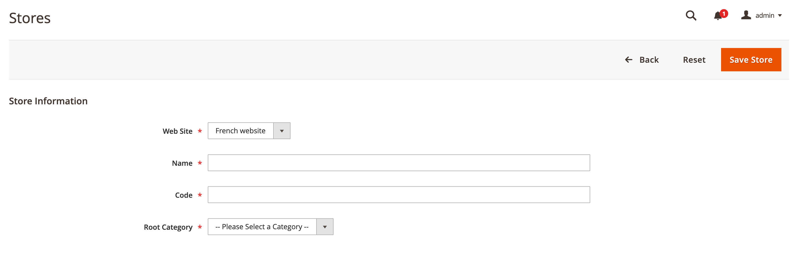

# Configuration de plusieurs vues dans l’administrateur

Cette tâche nécessite de créer une catégorie racine (et d’autres catégories, si vous le souhaitez) pour chaque magasin. Les tâches abordées dans cette rubrique offrent un moyen de configurer plusieurs magasins. Pour plus d’informations, reportez-vous aux ressources suivantes du Guide de l’utilisateur de Commerce :

- [Catégories](https://docs.magento.com/user-guide/catalog/categories.html)
- [Ajout de sites web](https://docs.magento.com/user-guide/stores/stores-all-create-website.html)
- [Store URLs](https://docs.magento.com/user-guide/stores/store-urls.html)
- [Contenu](https://docs.magento.com/user-guide/cms/content-menu.html)

>[!INFO]
>
>Par exemple, nous utilisons un site web français avec le code de site web `french` dans cette rubrique. Pour des tutoriels détaillés, reportez-vous à la section [Tutoriel : configuration de plusieurs sites web avec Apache](ms-apache.md) et [Tutoriel : configuration de plusieurs sites web avec nginx](ms-nginx.md)

## Étape 1 : création de catégories racine

La création d’une catégorie racine est facultative, mais nous vous montrons comment le faire dans ce tutoriel lorsque vous souhaitez que chaque site web ait une catégorie racine unique. Vous pouvez créer d’autres catégories si vous le souhaitez.

Pour créer une catégorie racine :

1. Connectez-vous à l’administrateur en tant qu’utilisateur autorisé à créer des catégories.
1. Cliquez sur **Catalogue** > **Catégories**.
1. Cliquez sur **Ajouter la catégorie racine**.
1. Dans le champ **Nom de la catégorie**, saisissez un nom unique pour identifier cette catégorie.
1. Assurez-vous que l’option Activer la catégorie est définie sur **Oui**.

   Pour plus d’informations sur les autres options de cette page, voir [Catégories racine](https://docs.magento.com/user-guide/catalog/category-root.html).

   La figure suivante illustre un exemple.

   

1. Cliquez sur **Enregistrer**.
1. Répétez ces tâches autant de fois que nécessaire pour créer des catégories racine pour vos magasins.

## Étape 2 : créer des sites web

Pour créer un site web :

1. Connectez-vous à l’administrateur en tant qu’utilisateur autorisé à créer des sites web, des magasins et des vues de magasin.
1. Cliquez sur **Magasins** > **Paramètres** > **Tous les magasins**.
1. Sur la page _Magasins_, cliquez sur **Créer un site Web**.

   - **Nom** : saisissez un nom pour identifier le site web.
   - **Code** : saisissez un code unique ; par exemple, si vous disposez d’un magasin français, vous pouvez saisir `french`
   - **Ordre de tri** : saisissez un ordre de tri numérique facultatif.

   La figure suivante illustre un exemple.

   

1. Cliquez sur **Enregistrer le site Web**.
1. Répétez ces tâches autant de fois que nécessaire pour créer vos sites web.

## Étape 3 : création de magasins

Pour créer un magasin :

1. Dans le panneau _Admin_, cliquez sur **Magasins** > **Paramètres** > **Toutes les boutiques**.
1. Sur la page _Magasins_, cliquez sur **Créer un magasin**.

   - **Site Web** : cliquez sur le nom du site Web auquel associer ce magasin.
   - **Nom** : saisissez un nom pour identifier le magasin.
   - **Code** : saisissez un code unique pour identifier le magasin.
   - **Catégorie racine** : cliquez sur le nom de la catégorie racine de ce magasin.

   La figure suivante illustre un exemple.

   

1. Cliquez sur **Enregistrer la boutique**.
1. Répétez ces tâches autant de fois que nécessaire pour créer vos magasins.

## Étape 4 : création de vues de magasin

Pour créer une vue de magasin :

1. Dans le panneau _Admin_, cliquez sur **Magasins** > **Paramètres** > **Toutes les boutiques**.
1. Sur la page Magasins, cliquez sur **Créer une vue de magasin**.

   - **Magasin** : cliquez sur le nom du magasin auquel associer cette vue de magasin.
   - **Nom** : saisissez un nom pour identifier cette vue de magasin.
   - **Code** : saisissez un nom unique pour identifier cette vue de magasin.
   - **Status**—Sélectionnez **Enabled**.

   La figure suivante illustre un exemple.

   

1. Cliquez sur **Enregistrer la vue de la boutique**.
1. Répétez ces tâches autant de fois que nécessaire pour créer vos vues de magasin.

## Étape 5 : modifier l’URL de base du site web

Pour accéder à un site web à l’aide d’une URL unique telle que `http://french.magento.mg`, vous devez modifier l’URL de base de chaque site dans l’administrateur.

Pour modifier l’URL de base du site web :

1. Dans le panneau _Admin_, cliquez sur **Magasins** > **Paramètres** > **Configuration** > **Général** > **Web**.
1. Dans la liste **Affichage magasin** située en haut de la page, cliquez sur le nom d’un de vos sites web comme le montre la figure suivante.

   

1. Dans le volet de droite, développez **URL de base**.
1. Dans la section _URL de base_, effacez la mention **Utiliser la valeur système**.
1. Saisissez l’URL `http://french.magento.mg` dans les champs **URL de base** et **URL de lien de base** .

1. Répétez l’étape précédente dans la section _URL de base (sécurisées)_ .

   >[!INFO]
   >
   >Si vous configurez une URL de base pour le déploiement d’Adobe Commerce sur l’infrastructure cloud, vous devez remplacer la première période par trois tirets. Par exemple, si votre URL de base est `french.branch-sbg7pPa-f3dueAiM03tpy.us.magentosite.cloud`, saisissez `http://french---branch-sbg7pPa-f3dueAiM03tpy.us.magentosite.cloud`. Si vous configurez une URL de base pour les tests locaux, utilisez un point.

1. Cliquez sur **Enregistrer la configuration**.

1. Répétez ces tâches pour d’autres sites web.

## Étape 6 : Ajout du code de magasin à l’URL de base

Commerce vous offre la possibilité d’ajouter le code de magasin à l’URL de base du site, ce qui simplifie le processus de configuration de plusieurs magasins. Avec cette option, vous n’avez pas à créer de répertoires sur le système de fichiers Commerce pour stocker `index.php` et `.htaccess`.

Cela empêche `index.php` et `.htaccess` de se désynchroniser avec le code base de Commerce lors des futures mises à niveau.

Voir le [Guide de l’utilisateur de Commerce](https://docs.magento.com/user-guide/stores/store-urls.html).

Pour ajouter le code de magasin à l’URL de base :

1. Dans le panneau _Admin_, cliquez sur **Magasins** > **Paramètres** > **Configuration** > **Général** > **Web**.
1. Dans la liste **Affichage magasin** située en haut de la page, cliquez sur **Configuration par défaut** comme le montre la figure suivante.

   

1. Dans le volet de droite, développez **Url Options**.
1. Décochez la case **Utiliser la valeur système** en regard de _Ajouter le code magasin aux URL_.
1. Dans la liste _Ajouter un code de magasin aux URL_, cliquez sur **Oui**.

   

1. Cliquez sur **Enregistrer la configuration**.
1. Si vous y êtes invité, videz le cache. (**Système** > **Gestion du cache**).

## Étape 7 : modification de l’URL de base de la vue de magasin par défaut

Vous devez effectuer cette étape en dernier lieu, car vous perdrez l’accès à l’administrateur ; votre accès est renvoyé une fois que vous avez configuré les hôtes virtuels comme expliqué dans les rubriques spécifiques au serveur web.

Pour modifier l’URL de base de la vue de magasin par défaut :

1. Dans le panneau _Admin_, cliquez sur **Magasins** > **Paramètres** > **Configuration** > **Général** > **Web**.

1. Dans la liste _Affichage magasin_ située en haut de la page, cliquez sur **Configuration par défaut**.

   

1. Dans le volet de droite, développez **URL de base**.
1. Dans la section _URL de base_, effacez la mention **Utiliser la valeur système**.
1. Saisissez l’URL `http://magento.mg` dans les champs **URL de base** et **URL de lien de base** .

1. Répétez l’étape précédente dans la section **URL de base (sécurisées)** .

   >[!INFO]
   >
   >Si vous configurez une URL de base pour Adobe Commerce sur l’infrastructure cloud, vous devez remplacer la première période par trois tirets. Par exemple, si votre URL de base est `french.branch-sbg7pPa-f3dueAiM03tpy.us.magentosite.cloud`, saisissez `http://french---branch-sbg7pPa-f3dueAiM03tpy.us.magentosite.cloud`

1. Cliquez sur **Enregistrer la configuration**.

>[!INFO]
>
>Le code d’affichage du site web, du magasin et du magasin peut inclure des lettres (a-z ou A-Z), des chiffres (0-9) et des traits de soulignement (_) uniquement. En outre, le premier caractère doit être une lettre. Si des majuscules ou des minuscules sont utilisées, la correspondance n’est pas sensible à la casse en interne pour permettre le remplacement des paramètres de configuration par le biais de variables d’environnement. Voir [Utilisation de variables d’environnement pour remplacer les paramètres de configuration](../reference/override-config-settings.md#environment-variables).