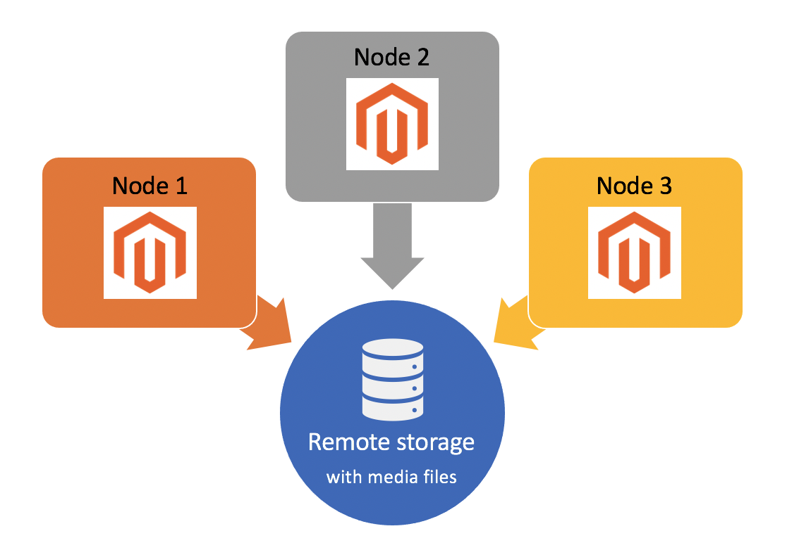

# Configurer le stockage distant

Le module de stockage étendu permet de stocker des fichiers multimédias et de planifier des imports et des exports dans un conteneur de stockage distant persistant à l’aide d’un service de stockage tel qu’AWS S3.

Par défaut, l’application Adobe Commerce stocke les fichiers multimédias dans le même système de fichiers que l’application. Cette approche n’est pas efficace pour les configurations complexes multi-serveurs et peut entraîner une dégradation des performances lors du partage de ressources. Grâce au module de stockage étendu, vous pouvez stocker des fichiers multimédias dans le répertoire `pub/media` et importer/exporter des fichiers dans le répertoire `var` du stockage d’objets distant afin de tirer parti du redimensionnement des images côté serveur.

>[!BEGINSHADEBOX]

Le stockage distant _et_ le stockage dans la base de données ne peuvent pas être activés en même temps. Vous devez désactiver le stockage de la base de données avant d&#39;activer le stockage distant.

```shell
bin/magento config:set system/media_storage_configuration/media_database 0
```

L’activation du stockage distant peut affecter votre expérience de développement. Par exemple, certaines fonctions de fichier PHP peuvent ne pas fonctionner comme prévu. L’utilisation du framework Commerce pour les opérations sur les fichiers doit être appliquée. La liste des fonctions natives PHP interdites est disponible dans le référentiel [magento-coding-standard](https://github.com/magento/magento-coding-standard/blob/develop/Magento2/Sniffs/Functions/DiscouragedFunctionSniff.php).

>[!ENDSHADEBOX]

>[!INFO]
>
>- Le stockage distant est disponible uniquement pour Commerce version 2.4.2 et ultérieure. Voir les notes de mise à jour de la version [2.4.2](/help/release/release-notes/open-source/2-4-2.md).
>
>- Le module de stockage distant offre une prise en charge _limitée_ d’Adobe Commerce sur les infrastructures cloud. Adobe ne peut pas résoudre entièrement les problèmes liés au service de carte de stockage tiers. Consultez [Configuration du stockage distant pour Commerce sur l’infrastructure cloud](cloud-support.md) pour obtenir des conseils sur l’implémentation du stockage distant pour les projets cloud.



## Options de stockage à distance

Vous pouvez configurer le stockage distant à l’aide de l’option `remote-storage` avec la commande [`setup` CLI](../../installation/tutorials/deployment.md). L&#39;option `remote-storage` utilise la syntaxe suivante :

```text
--remote-storage-<parameter-name>="<parameter-value>"
```

Le `parameter-name` fait référence au nom du paramètre de stockage distant spécifique. Le tableau suivant répertorie les paramètres disponibles pour la configuration du stockage distant :

| Paramètre de ligne de commande | Nom du paramètre | Description | Valeur par défaut |
|--- |--- |--- |--- |
| `remote-storage-driver` | conducteur | Nom de la carte<br>Valeurs possibles :<br>**file** : désactive le stockage distant et utilise le système de fichiers local <br>**aws-s3** : utilisez le [service Amazon Simple Storage Service (Amazon S3)](remote-storage-aws-s3.md) | aucun |
| `remote-storage-bucket` | seau | Nom du conteneur ou de stockage d’objets | aucun |
| `remote-storage-prefix` | préfixe | Préfixe facultatif (emplacement dans le stockage des objets) | vide |
| `remote-storage-region` | région | Nom de la région | aucun |
| `remote-storage-key` | clé d’accès | Clé d’accès facultative | vide |
| `remote-storage-secret` | clé secrète | Clé secrète facultative | vide |

### Adaptateurs de stockage

L’emplacement de stockage par défaut est dans le système de fichiers local. Un _adaptateur de stockage_ vous permet de vous connecter à un service de stockage et de stocker vos fichiers n&#39;importe où. [!DNL Commerce] prend en charge la configuration des services de stockage suivants :

- [Amazon Simple Storage Service (Amazon S3)](remote-storage-aws-s3.md)

## Activer le stockage distant

Vous pouvez installer le stockage distant lors d’une installation d’Adobe Commerce ou ajouter du stockage distant à une instance Commerce existante. Les exemples suivants illustrent chaque méthode à l’aide d’un ensemble de paramètres `remote-storage` avec des commandes d’interface de ligne de commande Commerce `setup`. Vous devez au minimum fournir les `driver`, `bucket` et `region` de stockage.

- Exemple : installation de Commerce avec un stockage distant

  ```shell
  bin/magento setup:install --remote-storage-driver="aws-s3" --remote-storage-bucket="myBucket" --remote-storage-region="us-east-1"
  ```

- Exemple : activer le stockage distant sur un Commerce existant

  ```shell
  bin/magento setup:config:set --remote-storage-driver="aws-s3" --remote-storage-bucket="myBucket" --remote-storage-region="us-east-1"
  ```

>[!TIP]
>
>Pour Adobe Commerce sur l’infrastructure cloud, consultez [Configuration du stockage distant pour Commerce sur l’infrastructure cloud](cloud-support.md).

## Migration du contenu

Après avoir activé le stockage distant pour une carte spécifique, vous pouvez utiliser l&#39;interface de ligne de commande pour migrer les fichiers _media_ existants vers le stockage distant.

```shell
./magento2ce/bin/magento remote-storage:sync
```

>[!INFO]
>
>La commande sync migre uniquement les fichiers du répertoire `pub/media`, _pas_ les fichiers d’import/export du répertoire `var`. Voir [Importation/exportation planifiée](https://experienceleague.adobe.com/docs/commerce-admin/systems/data-transfer/data-scheduled-import-export.html?lang=fr) dans le Guide de l’utilisateur de _Commerce 2.4_.

