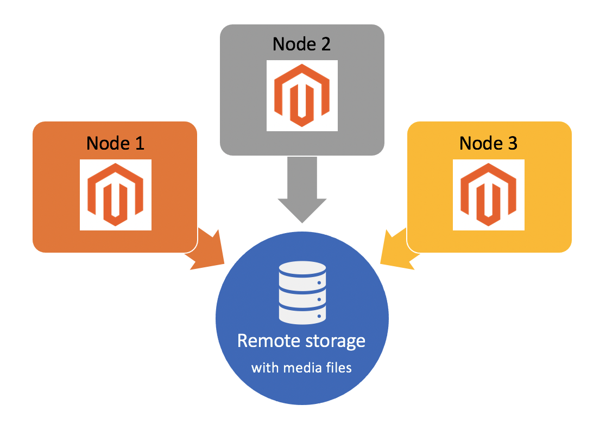

# Configuration du stockage distant

Le module Stockage distant offre la possibilité de stocker des fichiers multimédias et de planifier des imports/exports dans un conteneur de stockage distant persistant à l’aide d’un service de stockage, tel qu’AWS S3. Par défaut, la variable [!DNL Commerce] L’application stocke les fichiers multimédia dans le même système de fichiers que celui qui contient l’application. Cela n’est pas efficace pour les configurations multi-serveurs complexes et peut entraîner une dégradation des performances lors du partage des ressources. Avec le module de stockage à distance, vous pouvez stocker les fichiers multimédias dans le `pub/media` et importer/exporter des fichiers dans `var` du répertoire de stockage d’objets distants pour tirer parti du redimensionnement d’image côté serveur.

>[!INFO]
>
>Le stockage à distance n’est disponible que dans les versions 2.4.2 et ultérieures. Voir [Notes de mise à jour de la version 2.4.2](https://devdocs.magento.com/guides/v2.4/release-notes/open-source-2-4-2.html).

>[!INFO]
>
>Le module de stockage à distance dispose des _limité_ prise en charge sur Adobe Commerce sur l’infrastructure cloud. Adobe ne peut pas résoudre entièrement les problèmes liés au service d’adaptateur de stockage tiers.



## Options de stockage distant

Vous pouvez configurer le stockage à distance à l’aide de la fonction `remote-storage` avec l’option [`setup` Commande CLI][setup]. Le `remote-storage` utilise la syntaxe suivante :

```text
--remote-storage-<parameter-name>="<parameter-value>"
```

Le `parameter-name` fait référence au nom du paramètre de stockage distant spécifique. Le tableau suivant répertorie les paramètres disponibles pour la configuration du stockage à distance :

| Paramètre de ligne de commande | Nom du paramètre | Description | Valeur par défaut |
|--- |--- |--- |--- |
| `remote-storage-driver` | conducteur | Nom de l’adaptateur<br>Valeurs possibles :<br>**fichier**: Désactive le stockage distant et utilise le système de fichiers local <br>**aws-s3**: Utilisez la variable [Amazon Simple Storage Service (Amazon S3)](remote-storage-aws-s3.md) | none |
| `remote-storage-bucket` | compartiment | Stockage d’objet ou nom du conteneur | none |
| `remote-storage-prefix` | préfixe | Préfixe facultatif (emplacement dans le stockage d’objets) | empty |
| `remote-storage-region` | region | Nom de la région | none |
| `remote-storage-key` | clé d&#39;accès | Clé d’accès facultative | empty |
| `remote-storage-secret` | clé secrète | Clé secrète facultative | empty |

### Adaptateurs de stockage

L’emplacement de stockage par défaut se trouve dans le système de fichiers local. A _adaptateur de stockage_ vous permet de vous connecter à un service de stockage et de stocker vos fichiers n’importe où. [!DNL Commerce] prend en charge la configuration des services de stockage suivants :

- [Amazon Simple Storage Service (Amazon S3)](remote-storage-aws-s3.md)

## Activer le stockage à distance

Vous pouvez installer un stockage à distance lors d’une nouvelle [!DNL Commerce] installation ou ajout à une instance Commerce existante à l’aide de `remote-storage` paires nom-valeur de paramètre avec `setup` Commandes de l’interface de ligne de commande. Au minimum, vous devez fournir l&#39;espace de stockage `driver`, `bucket`, et `region`.

Les exemples suivants permettent d’activer le stockage à distance avec un adaptateur de stockage AWS S3 aux États-Unis :

- Installer les nouvelles [!DNL Commerce] avec stockage à distance

   ```bash
   bin/magento setup:install --remote-storage-driver="aws-s3" --remote-storage-bucket="myBucket" --remote-storage-region="us-east-1"
   ```

- Activer le stockage à distance sur le site existant [!DNL Commerce]

   ```bash
   bin/magento setup:config:set --remote-storage-driver="aws-s3" --remote-storage-bucket="myBucket" --remote-storage-region="us-east-1"
   ```

## Limites

Le stockage à distance et le stockage dans la base de données ne peuvent pas être activés simultanément. Désactivez le stockage dans la base de données si vous utilisez le stockage à distance.

```bash
bin/magento config:set system/media_storage_configuration/media_database 0
```

L’activation du stockage à distance peut affecter votre expérience de développement établie. Par exemple, certaines fonctions de fichier PHP peuvent ne pas fonctionner comme prévu. L’utilisation de Commerce Framework pour les opérations de fichier doit être appliquée.

La liste des fonctions natives PHP interdites est disponible dans [Magento Coding Standard] référentiel.

## Migration de contenu

Après avoir activé le stockage à distance pour un adaptateur spécifique, vous pouvez utiliser l’interface de ligne de commande pour migrer les _media_ vers le stockage distant.

```bash
./magento2ce/bin/magento remote-storage:sync
```

>[!INFO]
>
>La commande sync migre uniquement les fichiers dans la variable `pub/media` répertoire, _not_ les fichiers d’importation/exportation dans la variable `var` répertoire . Voir [Importation/exportation planifiée][import-export] dans le _Guide de l’utilisateur de Commerce 2.4_.

<!-- link definitions -->

[import-export]: https://docs.magento.com/user-guide/system/data-scheduled-import-export.html
[Magento Coding Standard]: https://github.com/magento/magento-coding-standard/blob/develop/Magento2/Sniffs/Functions/DiscouragedFunctionSniff.php
[setup]: ../../installation/tutorials/deployment.md
