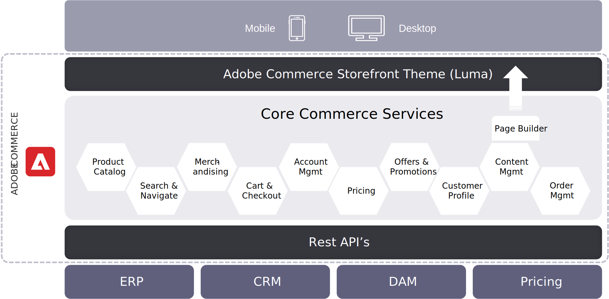

# Architecture du storefront Adobe Commerce couplée (héritée)

L’option de déploiement par défaut actuelle pour la plupart des clients commerciaux comprend :

- Prise en charge de 100 % des fonctionnalités sur B2B et B2C
- Thème de référence de la fonctionnalité (Luma) qui peut être rapidement déployé/personnalisé
- Expertise en mise en oeuvre des partenaires MSI
- Totalement compatible avec les fonctionnalités commerciales telles que le créateur de pages ou l’évaluation et l’aperçu
- Compatibilité large avec les extensions dans Adobe Commerce Marketplace

## Inconvénients de la vitrine héritée

- **Pas de tête**: toute partie de l’application Adobe Commerce monolithique. Aucune séparation de la logique commerciale et des processus entre le serveur frontal et le serveur principal.

- **Non PWA**— Bien que le thème soit réactif, les performances du site sont loin derrière les meilleurs PWA de la classe.

- **Architecture front-end (composants de l’interface utilisateur d’Adobe Commerce)**: spécialistes d’Adobe Commerce/PHP pour construire à partir de storefront hérité.

Avant d&#39;entrer dans des options sans interface, commençons par l&#39;architecture plus familière du storefront. Si l’absence de tête est découplée, il s’agit de l’architecture couplée du storefront, la plus souvent vue avec nos démonstrations Luma.

C’est là que les fonctionnalités de storefront sont étroitement intégrées aux services commerciaux principaux, et non séparées par cette couche d’API GraphQL. Il y a donc beaucoup de logique commerciale associée à ce thème. Cette approche n&#39;est pas sans tête, et elle n&#39;est pas PWA.

Il s’agit actuellement de l’option la plus courante utilisée par les commerçants, car elle prend entièrement en charge les fonctionnalités avec les fonctionnalités de commerce B2B et B2C. La communauté y est familière, il existe un écosystème d’expertise mature et il est largement compatible avec les extensions Adobe Commerce Marketplace.

Cependant, il manque les avantages dont nous avons parlé plus tôt. Sans séparation des couches, il existe de nombreuses dépendances et de nombreux points d’échec potentiels lorsque des modifications sont effectuées. Ce n&#39;est pas aussi performant qu&#39;un PWA bien implémenté et si un commerçant n&#39;a pas d&#39;expertise dans le développement d&#39;Adobe Commerce ou de PHP, il devra aller chercher ces ressources.
