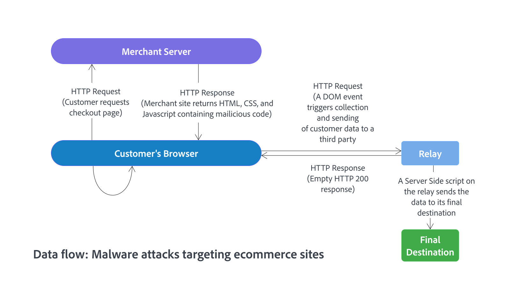

# Sécurisation de votre site et de votre infrastructure Commerce

L’établissement et la maintenance d’un environnement sécurisé pour les projets Adobe Commerce déployés sur l’infrastructure cloud sont une responsabilité partagée entre la clientèle d’Adobe Commerce, les partenaires en solutions et Adobe. L’objectif de ce guide est de fournir les bonnes pratiques pour le côté client de l’équation.

Bien que vous ne puissiez pas éliminer tous les risques de sécurité, l’application de ces bonnes pratiques renforce la position de sécurité des installations Commerce. Un site et une infrastructure sécurisés constituent une cible moins attrayante pour les attaques malveillantes, garantissent la sécurité de la solution et des informations sensibles des clients et contribuent à réduire au minimum les incidents liés à la sécurité qui peuvent entraîner des perturbations du site et des enquêtes coûteuses.

>[!NOTE]
>
>Pour plus d’informations sur les rôles et les responsabilités en matière de sécurisation et de maintenance des projets Adobe Commerce sur les infrastructures cloud, voir [Modèle de responsabilité partagée](https://experienceleague.adobe.com/en/docs/commerce-operations/security-and-compliance/shared-responsibility#security-responsibilities-chart)) dans le _Guide de sécurité et de conformité d’Adobe Commerce_.

[Toutes les versions prises en charge](../../../release/versions.md) de :

- Adobe Commerce sur les infrastructures cloud
- Adobe Commerce On-Premise

## Recommandations prioritaires

Adobe considère que les recommandations suivantes sont de la plus haute priorité pour tous les clients. Implémentez ces bonnes pratiques de sécurité clés dans tous les déploiements de Commerce :

 **Activez l’authentification à deux facteurs pour votre administrateur et toutes les connexions SSH**

- [Sécurité pour l’administrateur Commerce](https://experienceleague.adobe.com/docs/commerce-admin/systems/security/2fa/security-two-factor-authentication.html)

- [Connexions SSH sécurisées](https://experienceleague.adobe.com/docs/commerce-cloud-service/user-guide/project/multi-factor-authentication.html) (infrastructure cloud)

Lorsque MFA est activé sur un projet, tous les comptes d’infrastructure cloud Adobe Commerce dotés d’un accès SSH doivent suivre un workflow d’authentification. Ce workflow nécessite un code d’authentification à deux facteurs (2FA) ou un jeton API et un certificat SSH pour accéder à l’environnement.

 **Sécuriser l’administrateur**

- [Configurez une URL d’administration autre que celle par défaut](https://experienceleague.adobe.com/docs/commerce-admin/stores-sales/site-store/store-urls.html#use-a-custom-admin-url) au lieu d’utiliser le `admin` par défaut ou un terme courant tel que `backend`. Cette configuration réduit l’exposition aux scripts qui tentent d’obtenir un accès non autorisé à votre site.

- [Configurer des paramètres de sécurité avancés](https://experienceleague.adobe.com/docs/commerce-admin/systems/security/security-admin.html)—Ajoutez une clé secrète aux URL, faites en sorte que les mots de passe soient sensibles à la casse et limitez la durée de la session d&#39;administrateur, l&#39;intervalle de durée de vie des mots de passe et le nombre de tentatives de connexion autorisées avant de verrouiller un compte utilisateur d&#39;administrateur. Pour une sécurité renforcée, configurez la durée d’inactivité du clavier avant l’expiration de la session en cours et assurez-vous que le nom d’utilisateur et le mot de passe soient sensibles à la casse.

- [Activez ReCAPTCHA](https://experienceleague.adobe.com/docs/commerce-admin/systems/security/captcha/security-google-recaptcha.html) pour protéger l’administrateur contre les attaques automatisées par force brute.

- Appliquez le principe de moindre privilège lors de l’attribution d’[autorisations d’administrateur](https://experienceleague.adobe.com/docs/commerce-admin/systems/user-accounts/permissions.html) aux rôles et rôles aux comptes utilisateur d’administrateur.

 **Effectuez la mise à niveau vers la dernière version d’Adobe Commerce**

Gardez votre code à jour en [mettant à niveau votre projet Commerce vers la dernière version](#upgrade-to-the-latest-release) d’Adobe Commerce, des services Commerce et des extensions, y compris les correctifs de sécurité, les correctifs logiciels et les autres correctifs fournis par Adobe.

 **Valeurs de configuration sensibles sécurisées**

Utilisez [gestion de la configuration](../../../configuration/cli/set-configuration-values.md) pour verrouiller les valeurs de configuration critiques.

Les commandes `lock config` et `lock env` de l’interface de ligne de commande configurent les variables d’environnement pour les empêcher d’être mises à jour par l’administrateur. La commande écrit la valeur dans le fichier `<Commerce base dir>/app/etc/env.php`. (Pour Commerce sur les projets d’infrastructure cloud, voir [Gestion de la configuration du magasin](https://experienceleague.adobe.com/docs/commerce-cloud-service/user-guide/configure-store/store-settings.html#sensitive-data).)

 **Exécuter des analyses de sécurité**

Utilisez le service d&#39;analyse de sécurité Commerce [&#128279;](https://experienceleague.adobe.com/docs/commerce-admin/systems/security/security-scan.html) pour surveiller tous les sites Adobe Commerce à la recherche de risques de sécurité et de programmes malveillants connus, et abonnez-vous pour recevoir des mises à jour de correctifs et des notifications de sécurité.

## Assurer la sécurité des extensions et du code personnalisé

Lorsque vous étendez Adobe Commerce en ajoutant des extensions tierces à partir de la Marketplace Adobe Commerce ou que vous ajoutez du code personnalisé, assurez la sécurité de ces personnalisations en appliquant les bonnes pratiques suivantes :

 **Choisissez un partenaire ou un intégrateur de solution (SI) qui maîtrise parfaitement la sécurité**—Assurez des intégrations sécurisées et la diffusion sécurisée du code personnalisé en sélectionnant des organisations qui appliquent des pratiques de développement sécurisées et qui ont une solide expérience en matière de prévention et de résolution des problèmes de sécurité.

 **Utiliser des extensions sécurisées**—Identifiez les extensions les plus appropriées et les plus sécurisées pour les déploiements de Commerce en consultant votre intégrateur de solution ou votre développeur et en suivant les [bonnes pratiques relatives aux extensions Adobe](../planning/extensions.md).

- Seules les extensions sources provenant du Marketplace Adobe Commerce ou de l’intégrateur de solution. Si l’extension est sourcée par un intégrateur, assurez-vous que la propriété de la licence d’extension est transférable, au cas où l’intégrateur change.

- Réduisez l&#39;exposition aux risques en limitant le nombre d&#39;extensions et de fournisseurs.

- Si possible, vérifiez le code d’extension pour la sécurité avant de l’intégrer à l’application Commerce.

- Assurez-vous que les développeurs d’extensions PHP suivent les directives de développement, les processus et les bonnes pratiques de sécurité d’Adobe Commerce. Plus précisément, les développeurs doivent éviter d&#39;utiliser les fonctionnalités PHP qui peuvent conduire à l&#39;exécution de code à distance ou à une cryptographie faible. Voir [Sécurité](https://developer.adobe.com/commerce/php/best-practices/security/) dans le *Guide des bonnes pratiques pour les développeurs d’extensions*.

 **Code d’audit** : consultez votre serveur et votre référentiel de code source pour identifier les restes de développement. Assurez-vous qu&#39;aucun fichier journal accessible, aucun répertoire .git visible publiquement, aucun tunnel pour exécuter des instructions SQL, aucun vidage de base de données, aucun fichier d&#39;informations php ou aucun autre fichier non protégé qui ne soit pas requis et qui puisse être utilisé lors d&#39;une attaque n&#39;est disponible.

## Mettre à niveau vers la dernière version

Adobe publie en permanence des composants de solution mis à jour pour améliorer la sécurité et mieux protéger les clients contre d’éventuels compromis. La mise à niveau vers la dernière version de l’application Adobe Commerce, des services installés et des extensions, ainsi que l’application des correctifs actuels constituent la première et la meilleure ligne de défense contre les menaces de sécurité.

Commerce publie généralement des mises à jour de sécurité tous les trimestres, mais se réserve le droit de publier des correctifs pour les menaces de sécurité majeures en fonction de la priorité et d’autres facteurs.

Consultez les ressources suivantes pour plus d’informations sur les versions d’Adobe Commerce disponibles, les cycles de publication, ainsi que le processus de mise à niveau et de correctif :

- [Versions publiées](../../../release/versions.md)
- [Disponibilité du produit](../../../release/product-availability.md) (services Adobe Commerce et extensions créées par Adobe)
- [Politique relative au cycle de vie d’Adobe Commerce](../../../release/lifecycle-policy.md)
- [Guide de mise à niveau](../../../upgrade/overview.md)
- [Application de correctifs](../../../upgrade/patches/overview.md)

>[!TIP]
>
>Obtenez les dernières informations de sécurité et atténuez les problèmes de sécurité connus en vous abonnant au service de notification de sécurité [Adobe](https://www.adobe.com/subscription/adbeSecurityNotifications.html).

## Développement d’un plan de reprise après sinistre

Si votre site Commerce est compromis, contrôlez les dommages et restaurez rapidement les opérations normales de l’entreprise en développant et en mettant en œuvre un plan de reprise après sinistre complet.

Si un client ou une cliente a besoin de restaurer une instance Commerce en raison d’une catastrophe, Adobe peut lui fournir des fichiers de sauvegarde. Le client et l’intégrateur de solution, le cas échéant, peuvent effectuer la restauration.

Dans le cadre d’un plan de reprise après sinistre, Adobe recommande vivement aux clients d’[exporter la configuration de leur application Adobe Commerce](../../../configuration/cli/export-configuration.md) afin de faciliter le redéploiement si nécessaire à des fins de continuité d’activité. La principale raison pour laquelle exporter la configuration vers le système de fichiers est que la configuration du système prévaut sur la configuration de la base de données. Dans un système de fichiers en lecture seule, l’application doit être redéployée pour modifier les paramètres de configuration sensibles et offrir ainsi une couche de protection supplémentaire.

### Informations supplémentaires

**Adobe Commerce déployé sur une infrastructure cloud**

- [Sauvegarde et reprise après sinistre](https://experienceleague.adobe.com/docs/commerce-cloud-service/user-guide/architecture/pro-architecture.html#backup-and-disaster-recovery)

- [Gestion de la configuration du magasin pour Adobe Commerce sur les infrastructures cloud](https://experienceleague.adobe.com/docs/commerce-cloud-service/user-guide/configure-store/store-settings.html)

**Adobe Commerce déployé sur site**

- [Exporter les paramètres de configuration](../../../configuration/cli/export-configuration.md)

   - [Importer les paramètres de configuration](../../../configuration/cli/import-configuration.md)

   - [Sauvegarde et restauration du système de fichiers, du support et de la base de données](../../../installation/tutorials/backup.md)

## Maintenir un site et une infrastructure sécurisés

Cette section résume les bonnes pratiques de maintenance de la sécurité du site et de l’infrastructure pour une installation Adobe Commerce. Bon nombre de ces pratiques exemplaires visent à sécuriser l&#39;infrastructure informatique en général, de sorte que certaines des recommandations peuvent déjà être mises en œuvre.

 **Bloquer l’accès non autorisé**—Contactez votre partenaire d’hébergement pour configurer un tunnel VPN afin de bloquer l’accès non autorisé au site Commerce et aux données client. Configurez un tunnel SSH pour bloquer tout accès non autorisé à l’application Commerce.

 **Utiliser un pare-feu d&#39;application web**—Analysez le trafic et découvrez des schémas suspects, tels que l&#39;envoi d&#39;informations de carte de crédit à une adresse IP inconnue à l&#39;aide d&#39;un pare-feu d&#39;application web.

Les installations Adobe Commerce déployées sur des infrastructures cloud peuvent utiliser les services WAF intégrés disponibles avec l’intégration [Fastly services](https://experienceleague.adobe.com/docs/commerce-cloud-service/user-guide/cdn/fastly.html)

 **Configurer des paramètres de sécurité de mot de passe avancés**—Configurez des mots de passe sécurisés et modifiez-les au moins tous les 90 jours, comme recommandé par la norme PCI Data Security dans la section 8.2.4. Voir [Configurer les paramètres de sécurité d’administration](https://experienceleague.adobe.com/docs/commerce-admin/systems/security/security-admin.html).

 **Utiliser HTTPS** : si le site Commerce vient d’être implémenté, lancez l’ensemble du site en utilisant HTTPS. Non seulement Google utilise HTTPS comme facteur de classement, mais de nombreux utilisateurs n’envisagent même pas d’acheter sur un site, sauf s’il est sécurisé par HTTPS.

## Protection contre les programmes malveillants

Les attaques de logiciels malveillants ciblant les sites d&#39;e-commerce sont bien trop courantes, et les acteurs de la menace développent continuellement de nouvelles façons de récupérer les informations de carte de crédit et les informations personnelles des transactions.

Cependant, Adobe a constaté que la plupart des compromis de site ne sont pas dus à un hacker innovant. Les acteurs de la menace profitent plutôt des vulnérabilités existantes non corrigées, des mots de passe inadéquats et des paramètres de propriété et d&#39;autorisation faibles du système de fichiers.

Dans les attaques les plus courantes, du code malveillant est injecté dans l’en-tête absolu ou le pied de page absolu d’un magasin client. Là, le code collecte les données de formulaire saisies par un client dans le storefront, y compris les informations de connexion du client et les données du formulaire de passage en caisse. Ensuite, ces données sont envoyées à un autre emplacement à des fins malveillantes plutôt qu’au serveur principal de Commerce. En outre, les logiciels malveillants peuvent empêcher l&#39;administrateur d&#39;exécuter du code qui remplace le formulaire de paiement d&#39;origine par un faux formulaire qui remplace toutes les protections définies par le fournisseur de paiement.

Les fraudeurs de cartes de crédit côté client sont un type de programme malveillant qui incorpore du code dans le contenu du site web du commerçant qui peut être exécuté dans le navigateur d’un utilisateur, comme illustré dans la figure suivante.

Après certaines actions, telles que l’envoi d’un formulaire par un utilisateur ou la modification d’une valeur de champ, l’émulateur sérialise les données et les envoie à des points d’entrée tiers. Ces points d’entrée sont généralement d’autres sites web compromis qui servent de relais pour envoyer les données à leur destination finale.

>[!TIP]
>
>Si un site Commerce est affecté par une attaque par programme malveillant, suivez les bonnes pratiques d’Adobe Commerce pour [répondre à un incident de sécurité](../maintenance/respond-to-security-incident.md).

### Connaître les attaques les plus courantes

Vous trouverez ci-dessous une liste des catégories courantes d’attaques qu’Adobe recommande à tous les clients Commerce de connaître et contre lesquelles ils doivent prendre des mesures de protection :

- **Endommagement du site** : un attaquant endommage un site web en modifiant l’aspect visuel du site ou en ajoutant ses propres messages. Bien que l&#39;accès au site et aux comptes d&#39;utilisateurs ait été compromis, les informations de paiement restent souvent sécurisées.

- **Réseaux de zombies** : le serveur Commerce du client fait partie d&#39;un réseau de zombies qui envoie des courriers indésirables. Placer sur la liste bloquée Bien que les données utilisateur ne soient généralement pas compromises, le nom de domaine du client peut être limité par des filtres de spam, empêchant la diffusion de tout e-mail provenant du domaine. Le site du client peut également faire partie d’un réseau de robots, ce qui entraîne une attaque par déni de service distribué (DDoS) sur un ou plusieurs autres sites. Le réseau de zombies peut bloquer le trafic IP entrant vers le serveur Commerce et empêcher les clients d’effectuer des achats.

- **Attaques directes du serveur**—Les données sont compromises, des portes dérobées et des logiciels malveillants sont installés et les opérations du site sont affectées. Les informations de paiement qui ne sont pas stockées sur le serveur sont moins susceptibles d&#39;être compromises par ces attaques.

- **Capture de carte silencieuse** - Dans cette attaque des plus désastreuses, les intrus installent un logiciel malveillant ou de capture de carte caché, ou pire, modifient le processus de passage en caisse pour collecter les données de carte de crédit. Ensuite, les données sont envoyées à un autre site pour être vendues sur le web profond. De telles attaques peuvent passer inaperçues pendant une longue période et peuvent entraîner une compromission majeure des comptes clients et des informations financières.

- **Journalisation des clés silencieuse** : l’acteur de la menace installe le code de journalisation des clés sur le serveur du client afin de rassembler les informations d’identification de l’utilisateur administrateur pour qu’il puisse se connecter et lancer d’autres attaques sans être détecté.

### Protection contre les attaques par recherche de mot de passe

Les attaques par recherche de mot de passe forcée peuvent entraîner un accès administrateur non autorisé. Protégez votre site contre ces attaques en suivant ces bonnes pratiques :

- Identifiez et protégez tous les points d’accès externes à l’installation de Commerce.

  Vous pouvez sécuriser l’accès à l’administrateur, qui nécessite généralement le plus de protection, en suivant les [recommandations de priorité](#priority-recommendations) d’Adobe lors de la configuration de votre projet Commerce.

- Contrôlez l’accès au site Commerce en configurant une liste de contrôle d’accès qui autorise uniquement l’accès aux utilisateurs provenant d’une adresse IP ou d’un réseau spécifié.

  Vous pouvez utiliser une liste de contrôle d’accès Fastly Edge avec un fragment de code VCL personnalisé pour filtrer les requêtes entrantes et autoriser l’accès par adresse IP. Voir [Custom VCL for allow requests](https://experienceleague.adobe.com/docs/commerce-cloud-service/user-guide/cdn/custom-vcl-snippets/fastly-vcl-allowlist.html).

  >[!TIP]
  >
  >Si vous employez une main-d’œuvre distante, assurez-vous que les adresses IP des employés distants sont incluses dans la liste des adresses avec l’autorisation d’accéder au site Commerce.

### Empêcher les exploits de détournement de clic

Adobe protège votre boutique des attaques de détournement de clic en fournissant l’en-tête de requête HTTP `X-Frame-Options` que vous pouvez inclure dans les requêtes à votre storefront. Voir [Empêcher les exploits de détournement de clic](../../../configuration/security/xframe-options.md) dans le *Guide de configuration d’Adobe Commerce*.
