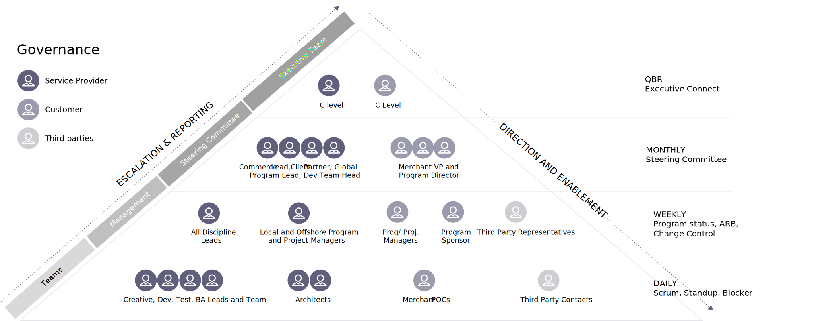

# Gouvernance des projets

La gouvernance du projet est une fonction de surveillance alignée sur la structure de gouvernance de l’organisation et qui englobe le cycle de vie du projet. Il fournit au chef de projet et à l’équipe la structure, les processus, les modèles de prise de décision et les outils pour gérer et contrôler le projet, tout en assurant la réussite de la livraison du projet. La gouvernance de projet est un élément essentiel, en particulier pour les projets complexes et stratégiques.

Le modèle de gouvernance définit, documente et communique des pratiques personnalisées et efficaces afin de fournir une méthode complète de contrôle du projet et de fournir une visibilité périodique à tous les niveaux pour garantir la réussite. Il contient un cadre pour la prise de décisions; définit les rôles, les responsabilités et les responsabilités pour la réalisation du projet; et détermine l&#39;efficacité. La structure de gouvernance s’étend de l’équipe d’exécution jusqu’à la direction, en définissant les activités, le reporting, la réaffectation et le flux d’informations.

À différents niveaux, les équipes examinent des mesures sprint et de projet spécifiques pour comprendre les progrès et prendre des mesures correctives si nécessaire. Ces mesures au niveau du sprint peuvent inclure la vitesse et la charge de chaque sprint.

## Détails réguliers de la réunion

- Examen trimestriel des activités

   - Discuter des stratégies d&#39;escalade de la croissance

   - Mettre en évidence les succès et les objectifs actuels

   - Aligner sur les résultats souhaités pour les trimestres à venir

- Comité directeur mensuel

   - Coordonner et examiner l’avancement du projet

   - Prise de décision sur les principaux éléments d’impact (le cas échéant)

   - Il permet de s’assurer que la satisfaction et les préoccupations des clients sont enregistrées et prises en compte.

- Comité de projet hebdomadaire

   - Choix des objectifs, du plan et de l’organisation pour la semaine

   - Prendre des décisions d’architecture en fonction des besoins

   - Réviser et agir sur les rapports d’état du projet

   - Démonstration de la plateforme et des fonctionnalités

   - Réaffectation de requêtes/problèmes/suggestions

- Réunion quotidienne

   - Discutez des éléments d’action et effectuez-en le suivi, y compris le sprint/les panoramas/les billets en attente actuels

   - Suivi de la progression du projet

## IPC de performance

Outre les mesures sprint, il est également essentiel de mesurer les indicateurs clés de performance de projet et de qualité. Cela permet non seulement d&#39;assurer le niveau de qualité tout au long du plan, mais cela maintient l&#39;équipe sur la bonne voie et empêche le projet de se retirer des rails.

## Storyboard et vélocité

## Déploiement Sprint et release

Des défis ou des changements se produisent tout au long de la durée d’un projet. Donner aux personnes appropriées de votre organisation la possibilité de suivre, de mesurer et de pivoter lorsqu’un défi est relevé va augmenter la probabilité que vous sortiez du projet ayant atteint vos objectifs et que vous soyez satisfait du résultat.

<table>
<thead>
  <tr>
    <th>Mesure des performances clés</th>
    <th>Unité de mesure</th>
    <th>Mesures rapportées</th>
  </tr>
</thead>
<tbody>
  <tr>
    <td>Couverture du test</td>
    <td>%</td>
    <td>Nombre d’exigences vérifiables couvertes par les cas de test VS Total des exigences vérifiables en base</td>
  </tr>
  <tr>
    <td>Densité des défauts</td>
    <td>%</td>
    <td>Nombre de défauts valides trouvés VS Nombre total de cas de test exécutés</td>
  </tr>
  <tr>
    <td>Défaut de fuite vers SIT/ UAT / Production</td>
    <td>%</td>
    <td>Défauts signalés dans Production VS Défauts signalés dans Production + Défauts signalés par AQ+UAT</td>
  </tr>
  <tr>
    <td>Efficacité des tests</td>
    <td>%</td>
    <td>Défauts valides surmontés/défauts valides surmontés</td>
  </tr>
  <tr>
    <td>Qualité du code</td>
    <td># + %</td>
    <td>Complexité, LoC, violations, couverture du code pour le sprint</td>
  </tr>
</tbody>
</table>
