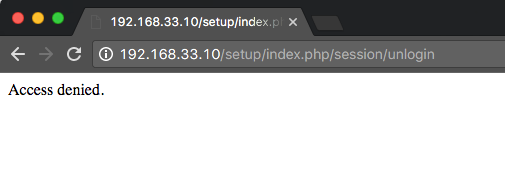

# Modifier docroot pour améliorer la sécurité

Dans une installation standard avec un serveur web Apache, Adobe Commerce est installé à la racine web par défaut : `/var/www/html/magento2`.

Le répertoire `magento2/` contient les éléments suivants :

- `pub/`
- `setup/`
- `var/`

L’application est diffusée à partir de `/var/www/html/magento2/pub`. Le reste du système de fichiers est vulnérable, car il est accessible à partir d’un navigateur.
La définition de la racine web sur le répertoire `pub/` empêche les visiteurs du site d&#39;accéder aux zones sensibles du système de fichiers depuis un navigateur.

Cette rubrique décrit comment modifier la racine docroot Apache sur une instance existante pour servir des fichiers à partir du répertoire `pub/`, qui est plus sécurisé.

## Remarque à propos de Nginx

Si vous utilisez [nginx](../prerequisites/web-server/nginx.md) et le fichier [`nginx.conf.sample`](https://github.com/magento/magento2/blob/2.4/nginx.conf.sample) inclus dans le répertoire d&#39;installation, vous traitez probablement déjà des fichiers du répertoire `pub/`.

Lorsqu’elle est utilisée dans votre bloc de serveur qui définit votre site, la configuration `nginx.conf.sample` remplace les paramètres docroot de votre serveur pour servir les fichiers du répertoire `pub/`. Par exemple, reportez-vous à la dernière ligne de la configuration suivante :

```conf
# /etc/nginx/sites-available/magento

upstream fastcgi_backend {
   server  unix:/run/php/php7.4-fpm.sock;
}

server {

         listen 80;
         server_name 192.168.33.10;
         set $MAGE_ROOT /var/www/html/magento2ce;
         include /var/www/html/magento2ce/nginx.conf.sample;
}
```

## Avant de commencer

Pour suivre ce tutoriel, vous devez accéder à une installation fonctionnelle s’exécutant sur une pile LAMP :

- Linux
- Apache (2.4+)
- MySQL (5.7+)
- PHP (7.4)
- Elasticsearch (7.x) ou OpenSearch (1.2)
- Adobe Commerce (2.4+)

>[!NOTE]
>
>Pour plus d’informations[&#x200B; consultez les sections &#x200B;](../prerequisites/overview.md)Conditions préalables et [Guide d’installation](../overview.md).

## &#x200B;1. Modifier la configuration du serveur

Le nom et l’emplacement de votre fichier d’hôte virtuel dépendent de la version d’Apache que vous exécutez. Cet exemple montre le nom et l’emplacement du fichier d’hôte virtuel sur Apache v2.4.

1. Connectez-vous à votre serveur d’applications.
1. Modifiez votre fichier d’hôte virtuel :

   ```bash
   vim /etc/apache2/sites-available/000-default.conf
   ```

1. Ajoutez le chemin d’accès à votre répertoire `pub/` à la directive `DocumentRoot` :

   ```conf
   <VirtualHost *:80>
   
            ServerAdmin webmaster@localhost
            DocumentRoot /var/www/html/magento2ce/pub
   
            ErrorLog ${APACHE_LOG_DIR}/error.log
            CustomLog ${APACHE_LOG_DIR}/access.log combined
   
            <Directory "/var/www/html">
                        AllowOverride all
            </Directory>
    </VirtualHost>
   ```

1. Redémarrez Apache :

   ```bash
   systemctl restart apache2
   ```

## &#x200B;2. Mettez à jour votre URL de base

Si vous avez ajouté un nom de répertoire au nom d’hôte ou à l’adresse IP de votre serveur pour créer l’URL de base lors de l’installation de l’application (par exemple, `http://192.168.33.10/magento2`), vous devez la supprimer.

>[!NOTE]
>
>Remplacez `192.168.33.10` par le nom d’hôte de votre serveur.

1. Connexion à la base de données :

   ```bash
   mysql -u <user> -p
   ```

1. Indiquez la base de données créée lors de l&#39;installation de l&#39;application :

   ```shell
   use <database-name>
   ```

1. Mettez à jour l’URL de base :

   ```shell
   UPDATE core_config_data SET value='http://192.168.33.10' WHERE path='web/unsecure/base_url';
   ```

## &#x200B;3. Mettre à jour le fichier env.php

Ajoutez le nœud suivant au fichier `env.php`.

```conf
'directories' => [
    'document_root_is_pub' => true
]
```

Reportez-vous à la référence [env.php](../../configuration/reference/config-reference-envphp.md) pour plus d&#39;informations.

## &#x200B;4. Changement de mode

[Les modes d’application](../../configuration/bootstrap/application-modes.md) qui comprennent le `production` et le `developer`, sont conçus pour améliorer la sécurité et faciliter le développement. Comme les noms l’indiquent, vous devez passer en mode `developer` lors de l’extension ou de la personnalisation de l’application, puis en mode `production` lors de l’exécution dans un environnement en ligne.

Le passage d’un mode à l’autre est une étape importante pour vérifier que la configuration du serveur fonctionne correctement. Vous pouvez basculer entre les modes à l’aide de l’outil CLI :

1. Accédez au répertoire d’installation.
1. Passez en mode `production`.

   ```bash
   bin/magento deploy:mode:set production
   ```

   ```bash
   bin/magento cache:flush
   ```

1. Actualisez votre navigateur et vérifiez que le storefront s’affiche correctement.
1. Passez en mode `developer`.

   ```bash
   bin/magento deploy:mode:set developer
   ```

   ```bash
   bin/magento cache:flush
   ```

1. Actualisez votre navigateur et vérifiez que le storefront s’affiche correctement.

## &#x200B;5. Vérification du storefront

Accédez au storefront dans un navigateur web pour vérifier que tout fonctionne.

1. Ouvrez un navigateur web et saisissez le nom d’hôte ou l’adresse IP de votre serveur dans la barre d’adresse. Par exemple, `http://192.168.33.10`.

   La figure suivante présente un exemple de page storefront. S’il s’affiche comme suit, votre installation a été un succès !

   

   Reportez-vous à la [section de dépannage](https://support.magento.com/hc/en-us/articles/360032994352) si la page affiche une erreur 404 (Introuvable) ou ne parvient pas à charger d’autres ressources telles que des images, des fichiers CSS et JS.

1. Essayez d’accéder à un répertoire d’applications à partir d’un navigateur. Ajoutez le nom du répertoire au nom d’hôte ou à l’adresse IP de votre serveur dans la barre d’adresse :

   Si un message 404 ou le message « Accès refusé » s’affiche, cela signifie que vous avez réussi à restreindre l’accès au système de fichiers.

   
