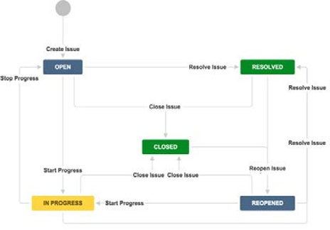

# Communication

La communication est essentielle au succès d’un projet de commerce électronique.

## Processus de communication

La création d’un processus de communication fort au sein de toute équipe de commerce électronique consiste à gérer toutes les ressources et tous les processus aussi efficacement que possible, et à investir dans les personnes qui comptent. Une partie de la stratégie que les entreprises doivent adopter consiste à déléguer des tâches aux bonnes personnes, ou logiciels, dans leurs équipes. En général, chaque commerce d&#39;e-commerce doit s&#39;attaquer à trois principaux domaines :

- Produit
- Acquisition client
- Rétention des clients

La plupart des rôles relèvent de ces trois domaines.

Vous trouverez ci-dessous quelques-unes des entreprises de commerce électronique du processus qui doivent adopter pour s’attaquer, gérer et améliorer efficacement ces trois domaines sur le plan opérationnel.

- Créez des solutions de gestion des workflows et des tâches auxquelles votre équipe peut facilement accéder et comprendre
- Concevoir un processus d’intégration efficace
- Créez un workflow que les employés peuvent utiliser dans la gestion de produits, les opérations de commerce électronique, l’exécution des commandes et la distribution.

## Outils de communication

Il est de notoriété publique que la mauvaise communication dans toute relation de travail est préjudiciable aux organisations et aux équipes. Des études ont montré que des pertes financières par an se chiffrent en millions en raison d&#39;une communication inadéquate entre les employés. Il est probable que les membres du personnel assument des rôles et des responsabilités différents, ce qui les amène à être pris dans de nombreuses directions. Heureusement, il existe un éventail de technologies pour aider les gens à rester ouverts et connectés par des lignes de communication claires.

Nous allons explorer certains de ces outils, qui se sont avérés très efficaces au sein des grandes et petites organisations.

### JIRA

Les outils d&#39;application pour la gestion de projet et le suivi des problèmes existent depuis un bon moment maintenant. Ces outils simplifient le processus de communication entre les employés et assurent l’évolutivité du projet ou de la plateforme.

JIRA est connu pour cocher toutes les cases en ce qui concerne l&#39;échange d&#39;informations et la gestion de projet fondamentale. L’application permet aux équipes de partager plus de connaissances et d’informations, ce qui permet de mieux comprendre les objectifs commerciaux, les objectifs et les tâches de toute équipe. Lorsqu’elle est bien utilisée, elle peut améliorer la collaboration et l’efficacité au sein d’une organisation.

La liste suivante répertorie les façons dont JIRA peut être utilisé au sein de n’importe quelle organisation :

- Workflows agiles gérables
- Champs personnalisés illimités et voies de navigation
- Gestion des bogues et des tests
- Intégration transparente des sources et des problèmes
- Recherche et filtrage
- Mentions utilisateur et plusieurs personnes désignées
- Planification du projet
- Gestion des tâches
- Gestion des ressources
- Planification des ressources
- Rapports avancés
- Panneaux JIRA personnalisables
- Panneaux Kanban et Scrum prêts à l&#39;emploi
- Sécurité et administration avancées
- Intégration avec des API REST flexibles
- Hébergement JIRA
- Importation efficace de données à partir d’autres systèmes

#### Exemple de workflow JIRA

JIRA permet aux équipes de créer et d’écrire des tâches détaillées, de générer des rapports, de personnaliser les workflows et d’affecter relativement rapidement des tâches à tous les individus.

Les responsables du commerce, les équipes de marketing et de développement, même les parties prenantes de niveau C, peuvent suivre la progression quotidienne, hebdomadaire, mensuelle et annuelle d’une tâche ou d’un projet JIRA donné. L’outil de gestion de projet Atlassian est disponible en trois versions, dont JIRA Align, JIRA Core et JIRA Software.

L’utilisation de JIRA dans n’importe quel commerce électronique offre la possibilité pour plusieurs équipes de collaborer à l’aide d’une seule plateforme. Souvent, les entreprises assistent aux équipes marketing, de développement, créatives et de commerce électronique qui travaillent toutes dans des silos différents. Disposer d’un outil de gestion de projet comme JIRA permet à chaque équipe de représenter différentes priorités. Les problèmes peuvent représenter les éléments dont les équipes souhaitent effectuer le suivi et sont tous contenus dans différents projets qui sont composés de tâches récurrentes que les équipes doivent effectuer. Chaque problème passe par un processus appelé workflow.

Le bon workflow peut créer ou interrompre des lignes de communication. Les équipes peuvent créer leurs propres workflows pour définir les étapes qu’un problème suit vers la fin. Jira permet aux entreprises de personnaliser les workflows en fonction de leurs besoins et obligations tout en correspondant facilement à la manière dont les équipes fonctionnent le plus efficacement possible.

À mesure que les problèmes sont suivis dans un workflow, tous les membres de l’équipe, du département ou même de l’entreprise gagnent en visibilité sur leur état. Un workflow garantit également qu’un problème passe toutes les étapes avant qu’il ne soit terminé, c’est ainsi que les équipes se souviennent de toutes ces priorités.

### Confluence

La création d&#39;une banque d&#39;information et de savoir riche peut être fastidieuse. Il faut une équipe prête à se rassembler et à prêter attention à la création de processus autour de la gestion de la documentation. Toutefois, une fois cette opération effectuée correctement, la création d’une base de connaissances proactives peut réduire considérablement le nombre de problèmes dans votre file d’attente d’assistance et économiser ainsi des heures de travail à votre équipe.

Que vous créiez ou teniez à jour un site web ou que vous documentiez les processus de commerce électronique fondamentaux, Confluence est un espace interactif où des individus de l’ensemble de l’entreprise peuvent créer, planifier et fournir des commentaires sur tous les types de documentation.

Les équipes d’e-commerce peuvent créer des modèles et des listes de contrôle normalisés pour les préparatifs de déploiement, les lancements de produits, les articles pratiques, les scripts de test et la résolution des problèmes. De plus, l’application Confluence est un produit Atlassien qui s’intègre bien avec JIRA. Les deux applications peuvent travailler ensemble de manière harmonieuse. Le contenu créé est facilement accessible aux équipes de l’ensemble de l’organisation et permet à chacun de collaborer sur des sujets dans un seul espace.

### Stand-ups

Dans le monde des start-ups, des stand-ups sont nés. Les entreprises utilisent de plus en plus les réunions pour examiner leurs processus. Des recherches ont montré que les employés préfèrent généralement moins de réunions, mais que pour avoir une ligne de communication et une ouverture claires, il est important de réunir les gens à l&#39;occasion pour assurer le succès de n&#39;importe quelle entreprise et plus spécifiquement des opérations de commerce électronique.

Par conséquent, comme alternative plus occasionnelle à des réunions longues et rigides, les entreprises de toutes tailles ont adopté un style de stand-up plus détendu. La culture des stand-up au sein de n&#39;importe quelle équipe de commerce électronique permet des discussions courtes et rapides, où tous les membres ont la possibilité de s&#39;exprimer, où des objectifs sont fixés et où des liens solides d&#39;équipe sont maintenus.

L’utilisation de sauvegardes au sein de toute équipe de commerce électronique est particulièrement utile lors de la planification des déploiements, de la gestion des livrables et des problèmes de débogage.

## Communication d’équipe

Les compétences en communication d&#39;équipe sont enseignées dans de nombreux contextes différents, mais la culture d&#39;entreprise donne le ton.

Voici quelques conseils pour améliorer la communication :

- Gardez vos messages clairs, utilisez un langage simple et évitez le jargon. Bien que vos équipes soient susceptibles de connaître la terminologie du commerce électronique, le jargon peut encore empêcher toute compréhension.
- Rencontrez votre équipe là où ils se sentent à l&#39;aise, que ce soit par le biais de messages écrits traditionnels ou vidéo envoyés par email.
- Utilisation de JIRA et de Confluence pour la gestion de projet, la planification et la documentation
- Restez à l’affût et impactez l’ensemble de l’équipe
