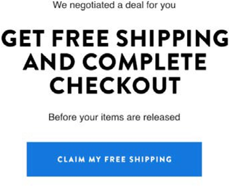

# Marketing par e-mail

Le marketing par e-mail (en termes simples) envoie des messages marketing aux prospects et aux clients actuels par e-mail afin de promouvoir, d’attirer et de vendre des produits aux clients. Les équipes marketing ont un contrôle total sur la récupération des informations sur les clients et l’envoi de contenu personnalisé aux clients par le biais de campagnes par e-mail direct. Le courrier électronique agit comme un outil qui permet d’établir une relation entre vos clients et votre marque.

Pourquoi envisagez-vous le marketing par e-mail :

- Permet de créer une relation avec les clients actuels et futurs

- Permet d’augmenter les ventes et le taux de conversion

- Permet d’accélérer la croissance des entreprises

- ne nécessite pas de tiers, tels qu’Instagram ou Facebook ;

## Courriel de bienvenue

Il est essentiel de faire la première impression en dernier dans le commerce électronique. Si le premier email que vous envoyez à de nouveaux clients est efficace, il laissera une impression durable dans la mémoire du client. Essayez de garder le design simple et original. Par exemple, certaines marques proposent des remises dans l’email lorsque le client s’inscrit.

## Email traité

Le courrier électronique traité est l’une des meilleures formes de courrier électronique, car il permet aux abonnés d’en savoir plus sur le produit. Vous pouvez également envoyer des emails traités en fonction de la segmentation des clients.

## Email d’engagement

Les clients peuvent facilement ignorer les emails, mais si les emails sont envoyés en tant qu’emails d’engagement, la probabilité qu’un client les supprime sans les examiner est plus faible. Les courriers électroniques d’engagement peuvent prendre la forme d’une campagne qui fournit aux utilisateurs une promotion, comme la livraison gratuite.

## Courrier électronique de référence

Le bouche à oreille est l&#39;une des meilleures stratégies marketing. Par exemple, envoyer un email de référence à un client existant. Par exemple, &quot;Référez-vous à un ami et recevez 10 $ !&quot; L’e-mail de référence motive les clients à diffuser le mot de manière organique, ce qui vous aide à gagner plus de clients.

## Email de réduction

Offrir des remises par email est une stratégie marketing efficace. Vous devez proposer des remises aux abonnés pour conserver leur fidélité.

## Email d’abandon

Les clients abandonnent leur panier pour diverses raisons, y compris des frais d&#39;expédition élevés ou une politique de retour insatisfaisante. Vous pouvez essayer de convertir ces clients en acheteurs performants en leur envoyant un email de rappel sur le produit qu’ils ont laissé dans leur panier. En outre, vous pouvez offrir des avantages pour terminer leur passage en caisse, y compris la livraison gratuite, une remise ou un bon pour leur prochain achat. Cela permet d’augmenter le taux de conversion.

## Courriel de confirmation de commande

Les emails de confirmation de commande aident non seulement à stimuler les ventes, mais aussi à donner aux clients la confiance qu’ils ont passé leur commande, ce qui augmente l’expérience client et la fidélité.

## Courriel du questionnaire

Une fois que les clients ont reçu leurs commandes, vous devez envoyer un courrier électronique d’enquête de relance pour leur demander leur expérience et leurs suggestions d’amélioration. Certains détaillants fournissent également un bon cadeau si les clients répondent à l&#39;enquête, car la plupart du temps les clients ne répondent pas aux enquêtes, car ils n&#39;ont aucune motivation pour le faire.

