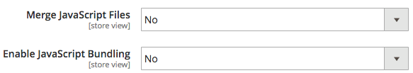
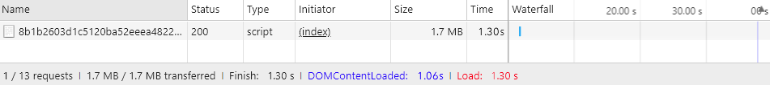
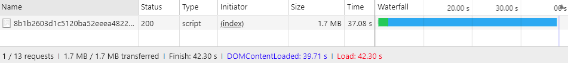

# Groupement de [!DNL JavaScript] avancé

Regrouper des modules [!DNL JavaScript] pour de meilleures performances revient à réduire deux choses :

1. Nombre de requêtes du serveur.
1. La taille de ces requêtes de serveur.

Dans une application modulaire, le nombre de requêtes du serveur peut atteindre des centaines. Par exemple, la capture d’écran suivante montre uniquement le début de la liste des modules [!DNL JavaScript] chargés sur la page d’accueil d’une installation nettoyée.


## Fusion et regroupement

Par défaut, [!DNL Commerce] offre deux moyens de réduire le nombre de requêtes du serveur : la fusion et le regroupement. Ces paramètres sont désactivés par défaut. Vous pouvez les activer dans l’interface utilisateur d’administration dans **[!UICONTROL Stores]** > **Paramètres** > **[!UICONTROL Configuration]** > **[!UICONTROL Advanced]** > **[!UICONTROL Developer]** > **[!UICONTROL [!DNL JavaScript] Settings]** ou à partir de la ligne de commande.



### Groupement de base

Pour activer le regroupement intégré à partir de la ligne de commande :

```bash
php -f bin/magento config:set dev/js/enable_js_bundling 1
```

Il s’agit d’un mécanisme de [!DNL Commerce] natif qui combine toutes les ressources présentes dans le système et les répartit entre des lots de même taille (bundle_0.js, bundle_1.js ... bundle_x.js) :

![[!DNL Commerce] le regroupement](../assets/performance/images/magentoBundling.png)

Mieux, mais le navigateur charge toujours TOUS les lots [!DNL JavaScript], pas seulement ceux nécessaires.

[!DNL Commerce] groupement réduit le nombre de connexions par page, mais pour chaque requête de page, il charge tous les groupements, même si la page demandée ne peut dépendre que de fichiers d’un ou de deux groupements. Les performances s’améliorent une fois que le navigateur met les lots en cache. Cependant, comme le navigateur charge ces lots de manière synchrone, la première visite de l’utilisateur dans un storefront [!DNL Commerce] peut prendre un certain temps pour effectuer le rendu et nuire à l’expérience de l’utilisateur.

### Fusion de base

Pour activer la fusion intégrée à partir de la ligne de commande :

```bash
php -f bin/magento config:set dev/js/merge_files 1
```

Cette commande fusionne tous les fichiers [!DNL JavaScript] synchrones en un seul fichier. Il n’est pas utile d’activer la fusion sans activer le regroupement, car [!DNL Commerce] utilise RequireJS. Si vous n’activez pas le regroupement, [!DNL Commerce] fusionne uniquement RequireJS et sa configuration. Lorsque vous activez à la fois le regroupement et la fusion, [!DNL Commerce] crée un seul fichier [!DNL JavaScript] :



## Temps de rendu réels

Les temps de chargement précédents regroupés et fusionnés s’affichent parfaitement dans un environnement de développement. Mais dans le monde réel, de nombreuses choses peuvent ralentir le rendu : connexions lentes, seuils de connexion élevés, réseaux limités. En outre, les appareils mobiles ne s’affichent pas aussi rapidement que les ordinateurs de bureau.

Pour tester et préparer votre déploiement storefront en temps réel, nous vous recommandons d’effectuer des tests avec le profil de limitation natif Chrome de « Slow 3G ». Avec la 3G lente, nos temps de sortie groupés précédents reflètent désormais les réalités de connexion de nombreux utilisateurs :


Avec une connectivité 3G lente, il faut environ 44 secondes pour charger tous les lots pour la page d’accueil d’une installation [!DNL Commerce] propre.

Il en va de même lors de la fusion des lots dans un seul fichier. Les utilisateurs pouvaient toujours attendre environ 42 secondes pour le chargement initial de la page, comme illustré ici :



Grâce à une approche plus avancée du regroupement des [!DNL JavaScript], nous pouvons améliorer ces temps de chargement.

## Groupement avancé

N’oubliez pas que l’objectif du regroupement des [!DNL JavaScript] est de réduire le nombre et la taille des ressources demandées pour chaque page chargée dans le navigateur. Pour ce faire, nous voulons créer nos bundles afin que chaque page de notre magasin n’ait à télécharger qu’un bundle commun et un bundle spécifique à chaque page consultée.

Pour ce faire, définissez vos lots par types de page. Vous pouvez catégoriser les pages de [!DNL Commerce] en plusieurs types de page, y compris Catégorie, Produit, CMS, Client, Panier et Passage en caisse. Chaque page classée dans l’un de ces types de page comporte un ensemble différent de dépendances de module RequireJS. Lorsque vous regroupez vos modules RequireJS par type de page, vous n’obtenez qu’une poignée de lots qui couvrent les dépendances de n’importe quelle page de votre magasin.

Par exemple, vous pouvez vous retrouver avec un lot pour les dépendances communes à toutes les pages, un lot pour les pages CMS uniquement, un lot pour les pages Catalogue uniquement, un autre lot pour les pages Recherche uniquement et un lot pour les pages Extraction.

Vous pouvez également créer des lots par objectif : pour les fonctionnalités courantes, les fonctionnalités liées aux produits, les fonctionnalités d’expédition, les fonctionnalités de passage en caisse, les taxes et les validations de formulaire. La définition des lots dépend de vous et de la structure de votre magasin. Vous constaterez peut-être que certaines stratégies de groupement fonctionneront mieux que d&#39;autres.

Une installation [!DNL Commerce] épurée permet d’obtenir des performances suffisantes en divisant les lots par types de page, mais certaines personnalisations peuvent nécessiter une analyse plus approfondie et d’autres distributions de ressources.

### Outils requis

Les étapes suivantes nécessitent que vous installiez et que vous soyez familiarisé avec les outils suivants :

- [nodejs](https://nodejs.org/en/download/)
- [r.js](http://requirejs.org/docs/optimization.html#download)
- [[!DNL PhantomJS]](https://phantomjs.org/) (facultatif)

### Exemple de code

Des versions complètes de l’exemple de code utilisé dans cet article sont disponibles ici :

- [build.js](../assets/performance/code-samples/build.js)
- [deps.js](../assets/performance/code-samples/deps.js)
- [deps-map.sh](../assets/performance/code-samples/deps-map.sh.txt)

### Partie 1 : création d’une configuration de regroupement

#### 1\ Ajouter un fichier build.js

Créez un fichier `build.js` dans le répertoire racine [!DNL Commerce]. Ce fichier contient l’ensemble de la configuration de version de vos lots.

```javascript
({
    optimize: 'none',
    inlineText: true
})
```

Plus tard, nous modifierons le paramètre `optimize:` de_ `none` en `uglify2` pour réduire la sortie du lot. Mais pour l’instant, pendant le développement, vous pouvez laisser cette option définie sur `none` pour garantir des versions plus rapides.

#### 2\ Ajoutez des dépendances, des shims, des chemins et un mappage RequireJS.

Ajoutez les nœuds de configuration de build RequireJS suivants, `deps`, `shim`, `paths` et `map`, à votre fichier de build :

```javascript
({
    optimize: 'none',
    inlineText: true,

    deps: [],
    shim: {},
    paths: {},
    map: { "*": {} },
})
```

#### 3\ Agrégez les valeurs d’instance required-config.js.

Au cours de cette étape, vous devez agréger tous les différents nœuds de configuration `deps`, `shim`, `paths` et `map` du fichier `requirejs-config.js` de votre magasin dans les nœuds correspondants de votre fichier `build.js`. Pour ce faire, vous pouvez ouvrir l’onglet **[!UICONTROL Network]** dans le panneau Outils de développement de votre navigateur et accéder à n’importe quelle page de votre boutique, telle que la page d’accueil. Dans l’onglet Réseau , l’instance du fichier `requirejs-config.js` de votre magasin apparaît près du haut et est mise en surbrillance :


Dans ce fichier, vous trouverez plusieurs entrées pour chacun des nœuds de configuration (`deps`, `shim`, `paths`, `map`). Vous devez agréger ces valeurs de nœud multiples dans le nœud de configuration unique de votre fichier build.js. Par exemple, si l’instance `requirejs-config.js` de votre magasin comporte des entrées pour 15 nœuds de `map` distincts, vous devez fusionner les entrées pour les 15 nœuds dans le nœud de `map` unique de votre fichier `build.js`. Il en sera de même pour les nœuds `deps`, `shim` et `paths`. Sans script pour automatiser ce processus, cela peut prendre du temps.

Vous devez modifier le chemin d’accès `mage/requirejs/text` en `requirejs/text` dans `paths` nœud de configuration comme suit :

```javascript
({
    //...
    paths: {
        //...
        "text": "requirejs/text"
    },
})
```

#### 4\ Ajout d’un nœud de modules

À la fin du fichier `build.js`, ajoutez le tableau modules[] comme espace réservé pour les lots que vous définissez ultérieurement pour votre storefront.

```javascript
({
    optimize: 'none',
    inlineText: true,

    deps: [],
    shim: {},
    paths: {},
    map: { "*": {} },

    modules: [],
})
```

#### 5\ Récupération des dépendances RequireJS

Vous pouvez récupérer toutes les dépendances de module [!DNL RequireJS] à partir des types de page de votre boutique à l’aide de :

1. [!DNL PhantomJS] à partir de la ligne de commande (en supposant que vous ayez [!DNL PhantomJS] installé).
1. Commande RequireJS dans la console de votre navigateur.

#### Pour utiliser [!DNL PhantomJS] :

Dans le répertoire racine [!DNL Commerce], créez un fichier appelé `deps.js` et copiez-le dans le code ci-dessous. Ce code utilise [!DNL [!DNL PhantomJS]] pour ouvrir une page et attendre que le navigateur charge toutes les ressources de la page. Il génère ensuite toutes les dépendances [!DNL RequireJS] pour une page donnée.

```javascript
"use strict";
var page = require('webpage').create(),
    system = require('system'),
    address;

if (system.args.length === 1) {
    console.log('Usage: $phantomjs deps.js url');
    phantom.exit(1);
} else {
    address = system.args[1];
    page.open(address, function (status) {
        if (status !== 'success') {
            console.log('FAIL to load the address');
        } else {
            setTimeout(function () {
                console.log(page.evaluate(function () {
                    return Object.keys(window.require.s.contexts._.defined);
                }));
                phantom.exit();
            }, 5000);
        }
    });
}
```

Ouvrez un terminal dans le répertoire racine [!DNL Commerce] et exécutez le script sur chaque page de votre magasin qui représente un type de page spécifique :

<pre>
phantomjs deps.js <i>url-to-specific-page</i> &gt; <i>text-file-presentation-pagetype-dependencies</i>
</pre>

Voici, par exemple, quatre pages de l’exemple de boutique sur le thème Luma qui représentent les quatre types de page que nous utiliserons pour créer nos quatre lots (page d’accueil, catégorie, produit, panier) :

```
phantomjs deps.js http://m2.loc/ > bundle/homepage.txt
phantomjs deps.js http://m2.loc/women/tops-women/jackets-women.html > bundle/category.txt
phantomjs deps.js http://m2.loc/beaumont-summit-kit.html > bundle/product.txt
phantomjs deps.js http://m2.loc/checkout/cart/?SID=m2tjdt7ipvep9g0h8pmsgie975 > bundle/cart.txt (prepare a shopping cart)
..............
```

#### Pour utiliser la console du navigateur :

Si vous ne souhaitez pas utiliser [!DNL PhantomJS], vous pouvez exécuter la commande suivante à partir de la console de votre navigateur lors de l’affichage de chaque type de page dans votre storefront :

```shell
Object.keys(window.require.s.contexts._.defined)
```

Cette commande (utilisée dans le script [!DNL PhantomJS]) crée la même liste de dépendances [!DNL RequireJS] et les affiche dans la console du navigateur. L’inconvénient de cette approche est que vous devrez créer vos propres fichiers texte de type lot/page.

#### 6 Formater et filtrer la sortie

Après avoir fusionné les dépendances [!DNL RequireJS] dans des fichiers texte de type page, vous pouvez utiliser la commande suivante sur chaque fichier de dépendance de type page pour remplacer les virgules dans vos fichiers par des nouvelles lignes :

```bash
sed -i -e $'s/,/\\\n/g' bundle/category.txt
sed -i -e $'s/,/\\\n/g' bundle/homepage.txt
sed -i -e $'s/,/\\\n/g' bundle/product.txt
....
```

Vous devez également supprimer tous les mixins de chaque fichier, car les mixins dupliquent des dépendances. Utilisez la commande suivante sur chaque fichier de dépendance :

```bash
sed -i -e 's/mixins\!.*$//g' bundle/homepage.txt
sed -i -e 's/mixins\!.*$//g' bundle/category.txt
sed -i -e 's/mixins\!.*$//g' bundle/product.txt
...
```

#### 7\ Identifier les lots uniques et communs

L’objectif est de créer un lot commun de fichiers [!DNL JavaScript] dont toutes les pages ont besoin. Ainsi, le navigateur n’a plus qu’à charger le lot commun avec un ou plusieurs types de page spécifiques.

Ouvrez un terminal dans le répertoire racine [!DNL Commerce] et utilisez la commande suivante pour vérifier que vous disposez de dépendances que vous pouvez diviser en lots distincts :

```bash
sort bundle/*.txt |uniq -c |sort -n
```

Cette commande fusionne et trie les dépendances trouvées dans les fichiers `bundle/*.txt`.  La sortie affiche également le nombre de fichiers contenant chaque dépendance :

```
1 buildTools,
1 jquery/jquery.parsequery,
1 jsbuild,
2 jquery/jquery.metadata,
2 jquery/validate,
2 mage/bootstrap,
3 jquery
3 jquery/ui
3 knockoutjs/knockout
...
```

Cette sortie montre que `buildTools` est une dépendance dans un seul des fichiers bundle/*.txt. La dépendance `jquery/jquery.metadata` se trouve dans deux (2) fichiers et `es6-collections` dans trois (3) fichiers.

Notre sortie n’affiche que trois types de pages (page d’accueil, catégorie et produit), qui nous indiquent :

- Trois dépendances sont propres à un seul type de page (indiqué par le chiffre 1).
- Trois autres dépendances se produisent sur deux types de page (indiqués par le chiffre 2).
- Les trois dernières dépendances sont communes aux trois types de page (indiqués par le chiffre 3).

Cela nous indique que nous pouvons probablement améliorer la vitesse de chargement des pages de notre boutique en divisant nos dépendances en différents lots, une fois que nous savons quels types de page ont besoin de quelles dépendances.

#### 8\ Créer un fichier de distribution de dépendances

Pour déterminer les types de page qui nécessitent les dépendances, créez un fichier dans le répertoire racine [!DNL Commerce] appelé `deps-map.sh` et copiez-le dans le code ci-dessous :

```shell
awk 'END {
 for (R in rec) {
   n = split(rec[R], t, "/")
   if (n > 1)
     dup[n] = dup[n] ? dup[n] RS sprintf("\t%-20s -->\t%s", rec[R], R) : \
       sprintf("\t%-20s -->\t%s", rec[R], R)
   }
 for (D in dup) {
   printf "records found in %d files:\n\n", D
   printf "%s\n\n", dup[D]
   }
 }
{
 rec[$0] = rec[$0] ? rec[$0] "/" FILENAME : FILENAME
}' bundle/*.txt
```

Vous pouvez également trouver le script à l’adresse [https://www.unix.com/shell-programming-and-scripting/140390-get-common-lines-multiple-files.html](https://www.unix.com/shell-programming-and-scripting/140390-get-common-lines-multiple-files.html)

Ouvrez un terminal dans le répertoire racine [!DNL Commerce] et exécutez le fichier :

```bash
bash deps-map.sh
```

La sortie de ce script, appliquée à nos trois exemples de types de page, doit ressembler à ceci (mais beaucoup plus longtemps) :

```
bundle/product.txt   -->   buildTools,
bundle/category.txt  -->   jquery/jquery.parsequery,
bundle/product.txt   -->   jsbuild,

bundle/category.txt/bundle/homepage.txt -->    jquery/jquery.metadata,
bundle/category.txt/bundle/homepage.txt -->    jquery/validate,
bundle/category.txt/bundle/homepage.txt -->    mage/bootstrap,

bundle/category.txt/bundle/homepage.txt/bundle/product.txt --> jquery,
bundle/category.txt/bundle/homepage.txt/bundle/product.txt --> jquery/ui,
bundle/category.txt/bundle/homepage.txt/bundle/product.txt --> knockoutjs/knockout,
```

Ces informations sont suffisantes pour créer une configuration de lots.

#### &#x200B;9. Créer des lots dans votre fichier build.js

Ouvrez le fichier de configuration `build.js` et ajoutez vos lots au nœud `modules` . Chaque lot doit définir les propriétés suivantes :

- `name`— le nom du lot. Par exemple, un nom de `bundles/cart` génère un lot `cart.js` dans un sous-répertoire `bundles`.

- `create` : indicateur booléen utilisé pour créer le lot (valeurs : `true` ou `false`).

- `include` : tableau de ressources (chaînes) incluses en tant que dépendances pour la page. RequireJS suit toutes les dépendances et les inclut dans le lot, sauf si elles sont exclues.

- `exclude` : tableau de lots ou de ressources à exclure du lot.

```javascript
{
    name: 'bundles/catalog',
    create: true,
    include: [
        'addToWishlist',
        'priceBundle',
        'priceUtils',
        'priceOptions',
        'sticky',
        'productSummary',
        'slide'
    ],
    exclude: [
        'requirejs/require',
        'bundles/default',
        'mage/bootstrap'
    ],
}
```

Cet exemple réutilise des ressources `mage/bootstrap` et `requirejs/require`, en accordant une priorité plus élevée à leurs composants les plus importants et aux composants qui doivent être chargés de manière synchrone. Les lots présents sont les suivants :

- `requirejs/require` : le seul lot chargé de manière synchrone
- `mage/bootstrap` : lot d’amorçage avec composants de l’interface utilisateur
- `bundles/default` : lot par défaut requis pour toutes les pages
- `bundles/cart` : lot requis pour la page du panier
- `bundles/shipping` : lot courant pour le panier et la page de passage en caisse (en supposant que le passage en caisse ne soit jamais ouvert directement, la page de passage en caisse se charge encore plus rapidement si la page de panier a été ouverte précédemment et que le lot d’expédition a déjà été chargé)
- `bundles/checkout` : tout pour l’extraction
- `bundles/catalog` : tout pour les pages de produits et de catégories.

### Partie 2 : générer des lots

Les étapes ci-dessous décrivent le processus de base pour générer des lots de [!DNL Commerce] plus efficaces. Vous pouvez automatiser ce processus comme vous le souhaitez, mais vous devrez tout de même utiliser `nodejs` et `r.js` pour générer vos lots. Et si vos thèmes comportent des personnalisations liées au [!DNL JavaScript] et ne peuvent pas réutiliser le même fichier `build.js`, vous devrez peut-être créer plusieurs configurations `build.js` par thème.

#### &#x200B;1. Générer des sites de magasin statiques

Avant de générer des lots, exécutez la commande de déploiement statique :

```bash
php -f bin/magento setup:static-content:deploy -f -a frontend
```

Cette commande génère des déploiements de magasin statiques pour chaque thème et paramètre régional que vous avez configuré. Par exemple, si vous utilisez le thème Luma et un thème personnalisé avec des paramètres régionaux en anglais et en français, vous générez quatre déploiements statiques :

- ...luma/en_US
- ...luma/fr_FR
- ...custom/en_US
- ...custom/fr_FR

Pour générer des lots pour tous les thèmes et paramètres régionaux de la boutique, répétez les étapes ci-dessous pour chaque thème et paramètre régional de la boutique.

#### &#x200B;2. Déplacez le contenu statique du magasin vers un répertoire temporaire

Tout d’abord, vous devez déplacer le contenu statique du répertoire cible vers un répertoire temporaire, car RequireJS remplace tout le contenu du répertoire cible.

```bash
mv pub/static/frontend/Magento/{theme}/{locale} pub/static/frontend/Magento/{theme}/{locale}_tmp
```

Par exemple :

```bash
mv pub/static/frontend/Magento/luma/en_US pub/static/frontend/Magento/luma/en_US_tmp
```

#### &#x200B;3. Exécuter l’optimiseur r.js

Exécutez ensuite l’optimiseur r.js sur le fichier `build.js` à partir du répertoire racine de [!DNL Commerce]. Les chemins d’accès à tous les répertoires et fichiers sont relatifs au répertoire de travail.

```bash
r.js -o build.js baseUrl=pub/static/frontend/Magento/luma/en_US_tmp dir=pub/static/frontend/Magento/luma/en_US
```

Cette commande génère des lots dans un sous-répertoire `bundles` du répertoire cible, ce qui dans ce cas génère des `pub/static/frontend/Magento/luma/en_US/bundles`.

Voici à quoi pourrait ressembler le contenu du nouveau répertoire du lot :

```bash
ll pub/static/frontend/Magento/luma/en_US/bundles
```

```
total 1900
drwxr-xr-x  2 root root    4096 Mar 28 11:24 ./
drwxr-xr-x 70 root root    4096 Mar 28 11:24 ../
-rw-r--r--  1 root root  116417 Mar 28 11:24 cart.js
-rw-r--r--  1 root root  187090 Mar 28 11:24 catalog.js
-rw-r--r--  1 root root  307619 Mar 28 11:24 checkout.js
-rw-r--r--  1 root root 1240608 Mar 28 11:24 default.js
-rw-r--r--  1 root root   74233 Mar 28 11:24 shipping.js
```

#### &#x200B;4. Configurez RequireJS pour utiliser des lots

Pour que RequireJS utilise vos lots, ajoutez un rappel `onModuleBundleComplete` après le nœud `modules` dans le fichier `build.js` :

```javascript
[
    {
       //...
       exclude: [
           'requirejs/require',
           'bundles/default',
           'bundles/checkout',
           'bundles/cart',
           'bundles/shipping',
           'mage/bootstrap'
       ],
   },
],
bundlesConfigOutFile: `${config.dir}/requirejs-config.js`,
onModuleBundleComplete: function(data) {
    if (this.bundleConfigAppended) {
        return;
    }
    this.bundleConfigAppended = true;

    // bundlesConfigOutFile requires a simple require.config call in order to modify the configuration
    const bundleConfigPlaceholder = `
(function (require) {
require.config({});
})(require);
    `;

    fs.appendFileSync(this.bundlesConfigOutFile, bundleConfigPlaceholder);
}
```

#### &#x200B;5. Réexécutez la commande de déploiement.

Exécutez la commande suivante pour effectuer le déploiement :

```bash
r.js -o app/design/frontend/Magento/luma/build.js baseUrl=pub/static/frontend/Magento/luma/en_US_tmp dir=pub/static/frontend/Magento/luma/en_US
```

Ouvrez `requirejs-config.js` dans le répertoire `pub/static/frontend/Magento/luma/en_US` pour vérifier que RequireJS a ajouté le fichier avec les appels de configuration de regroupement :

```javascript
require.config({
    bundles: {
        "bundles/default": ["mage/template", "mage/apply/scripts", "mage/apply/main", "mage/mage", "mage/translate", "mage/loader"],
        "bundles/cart": ["Magento_Ui/js/lib/validation/utils", "Magento_Ui/js/lib/validation/rules", "Magento_Ui/js/lib/validation/validation"]
    }
}
```

>[!NOTE]
>
>Lors de la configuration des lots, veillez à placer les appels `requirejs.config()` dans l’ordre dans lequel vous souhaitez qu’ils soient exécutés, car les appels sont exécutés dans l’ordre dans lequel ils apparaissent.

#### &#x200B;6. Tester les résultats

Une fois la page chargée, notez que le navigateur charge différentes dépendances et lots. Par exemple, voici les résultats pour le profil « 3G lent » :


Le temps de chargement de page d’une page d’accueil vide est désormais deux fois plus rapide que l’utilisation du regroupement natif de [!DNL Commerce]. Mais nous pouvons faire encore mieux.

#### &#x200B;7. Optimiser les lots

Même s’ils sont compressés, les fichiers [!DNL JavaScript] restent volumineux. Minimisez-les à l’aide de RequireJS, qui utilise uglifier pour réduire les [!DNL JavaScript] afin d’obtenir de bons résultats.

Pour activer l’optimiseur dans votre fichier `build.js`, ajoutez `uglify2` comme valeur de la propriété d’optimisation en haut du fichier `build.js` :

```javascript
({
    optimize: 'uglify2',
    inlineText: true
})
```

Les résultats peuvent être significatifs :


Les temps de chargement sont désormais trois fois plus rapides qu’avec le regroupement natif de [!DNL Commerce].
