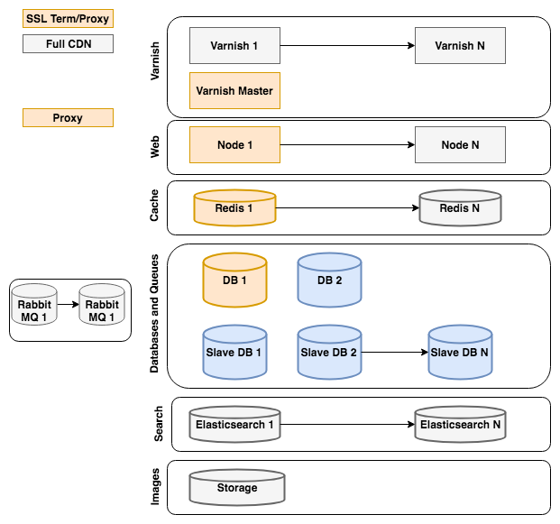

# Architecture de référence

Cette rubrique décrit une configuration recommandée générique pour les instances Adobe Commerce utilisant des serveurs standard hébergés physiquement dans un centre de données (non virtualisés) dans lequel les ressources ne sont pas partagées avec d’autres utilisateurs. Votre fournisseur d’hébergement, en particulier s’il se spécialise dans l’hébergement haute performance de Commerce, peut recommander une configuration différente qui soit également ou plus efficace pour vos besoins.

Pour Adobe Commerce dans les environnements d’infrastructure cloud, voir [Architecture de démarrage](https://devdocs.magento.com/cloud/architecture/starter-architecture.html).

## [!DNL Commerce] Diagramme d’architecture de référence

La variable [!DNL Commerce] Le diagramme de l’architecture de référence représente l’approche recommandée pour la configuration d’une [!DNL Commerce] site.

La couleur de chaque élément du diagramme indique si l’élément fait partie de Magento Open Source ou d’Adobe Commerce et s’il est obligatoire.

* Les éléments orange sont requis pour Magento Open Source
* Les éléments gris sont facultatifs pour Magento Open Source.
* Les éléments bleus sont facultatifs pour Adobe Commerce.

Les sections suivantes contiennent des recommandations et des considérations pour chaque section du diagramme de l’architecture de référence de Commerce.

### [!DNL Varnish]

* A [!DNL Varnish] La grappe peut se développer en fonction du trafic d’un site.
* Réglez la taille de l’instance en fonction du nombre de pages du cache nécessaire.
* Sur un site à trafic élevé, utilisez un [!DNL Varnish] Principal pour garantir le vidage en cache d’une requête (au plus) par niveau web

### Web

* Activer l’échelle des noeuds pour le trafic et la redondance
* Un noeud est maître et exécute cron
* Vous pouvez également utiliser un noeud Admin et Worker dédié.

### Cache

* Envisagez de mettre en oeuvre une instance Redis distincte pour les sessions.
* Vous pouvez avoir une instance Redis par cache.
* Dimensionnez l’instance pour qu’elle contienne la plus grande taille de cache attendue.

### Base de données et files d’attente

* Les sites à trafic élevé peuvent optimiser les performances de la base de données avec des bases de données esclaves et fractionner les bases de données pour les commandes/paniers (dans Adobe Commerce).
* Envisagez d’utiliser une base de données esclave pour permettre une récupération rapide et des sauvegardes de données.
* Les sites à faible trafic peuvent stocker des images dans la base de données

### Rechercher {#search-heading}

* Réglage du nombre d’instances en fonction du trafic de recherche

### Stockage

* Envisagez d’utiliser GFS ou GlusterFS pour le stockage des pub/médias.
* Vous pouvez également utiliser le stockage DB pour les sites à faible trafic.

### Recommandé [!DNL Varnish] architecture de référence

Magento prend en charge plusieurs moteurs de mise en cache de pages entières (fichier, Memcache, Redis, [!DNL Varnish]) prêtes à l’emploi, ainsi que la couverture étendue par le biais d’extensions. [!DNL Varnish] est le moteur de cache de page complète recommandé.  [!DNL Commerce] prend en charge de nombreuses [!DNL Varnish] configurations.

Pour les sites qui ne nécessitent pas de disponibilité élevée, nous vous recommandons d’utiliser une [!DNL Varnish] configuration avec la terminaison SSL de Nginx.

![Simple [!DNL Varnish] Configuration avec arrêt SSL](../assets/performance/images/single-varnish-with-ssl-termination.png)

Pour les sites qui nécessitent une haute disponibilité, nous vous recommandons d’utiliser un [!DNL Varnish] configuration avec un équilibreur de charge d’arrêt SSL.

![Haute disponibilité à deux niveaux [!DNL Varnish] configuration avec SSL mettant fin à l’équilibreur de charge](../assets/performance/images/ha-2-tier-varnish-with-ssl-term-load-balancer.png)
