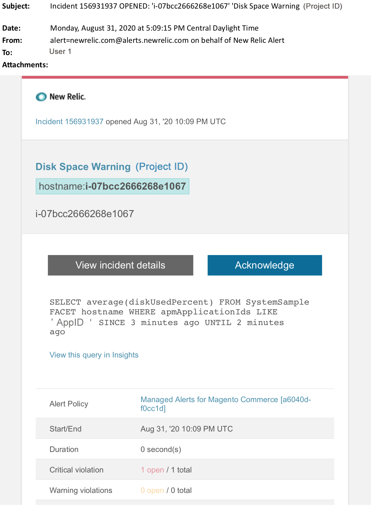

# Alertes gérées pour Adobe Commerce : alerte d’avertissement de disque

Cet article décrit les étapes de dépannage à suivre lorsque vous recevez une alerte de disque d’avertissement pour Adobe Commerce dans [!DNL New Relic]. Une action immédiate est nécessaire pour remédier au problème. L’alerte se présente comme suit, selon le canal de notification d’alerte que vous avez sélectionné.

{width="500"}

## Produits et versions concernés

* Adobe Commerce sur les infrastructures cloud, architecture Pro Plan.

## Problème

Vous recevrez une alerte en [!DNL New Relic] si vous vous êtes inscrit aux alertes [Gérées pour Adobe Commerce](managed-alerts-for-magento-commerce.md) et qu’un ou plusieurs seuils d’alerte ont été dépassés. Ces alertes ont été développées par Adobe pour fournir aux clients un ensemble de normes à l’aide des informations provenant des services d’assistance et d’ingénierie.

<u> **Do!** </u>

* Abandonner tout déploiement planifié jusqu’à ce que cette alerte soit effacée.
* Mettez immédiatement votre site en mode de maintenance s’il ne répond plus du tout. Pour connaître les étapes à suivre, reportez-vous à la section [&#x200B; Activer ou désactiver le mode de maintenance &#x200B;](https://experienceleague.adobe.com/fr/docs/commerce-operations/installation-guide/tutorials/maintenance-mode) du Guide d’installation de Commerce. Veillez à ajouter votre adresse IP à la liste des adresses IP exemptées pour vous assurer que vous pouvez toujours accéder à votre site à des fins de dépannage. Pour connaître les étapes, reportez-vous à la section [Tenir à jour la liste des adresses IP exemptées](https://experienceleague.adobe.com/fr/docs/commerce-operations/installation-guide/tutorials/maintenance-mode#maintain-the-list-of-exempt-ip-addresses) du Guide d’installation de Commerce.

<u> **Non !** </u>

* Lancez d’autres campagnes marketing qui peuvent apporter d’autres pages vues à votre site.
* Exécutez des indexeurs ou des crons supplémentaires, ce qui peut entraîner une contrainte supplémentaire sur le CPU ou le disque.
* Effectuez toutes les tâches administratives majeures (c’est-à-dire Administration de Commerce, importations/exportations de données).
* Videz votre cache. Votre site peut ne plus répondre (si vous ne rencontrez pas déjà de panne) si vous effectuez l’une des actions « Ne pas » avant d’avoir enquêté et résolu la cause de l’alerte.

## Solution

Procédez comme suit pour identifier et dépanner la cause :

1. Dans [!DNL New Relic], passez en revue les disques pour une utilisation optimale. Pour connaître les étapes, reportez-vous à **[!UICONTROL Storage]** onglet sur la page Hôtes de surveillance des infrastructures [[!DNL New Relic]  : [!UICONTROL Storage] onglet &#x200B;](https://docs.newrelic.com/docs/infrastructure/infrastructure-data/infrastructure-ui-pages/infra-hosts-ui-page/#storage) :
   * Si dans [!DNL New Relic] vous constatez une augmentation lente de l’utilisation du disque, essayez les options suivantes :
      * Optimisation de l’espace disque en ajustant l’allocation de l’espace. Pour connaître les étapes, reportez-vous à la section [Gérer l’espace disque](https://experienceleague.adobe.com/fr/docs/commerce-on-cloud/user-guide/develop/storage/manage-disk-space) dans le guide Commerce sur le cloud . Vous devrez peut-être également demander de l’espace disque supplémentaire (contactez l’équipe chargée de votre compte Adobe).
      * Libérez de l’espace disque pour MySQL. Pour connaître la procédure à suivre[&#x200B; voir la section &#x200B;](https://experienceleague.adobe.com/fr/docs/commerce-knowledge-base/kb/troubleshooting/database/mysql-disk-space-is-low-on-magento-commerce-cloud) L’espace disque MySQL est faible.
      * Si [!DNL New Relic] indique une augmentation rapide de l’utilisation du disque, cela peut indiquer qu’un problème a provoqué une augmentation très rapide d’un fichier dans un répertoire. Effectuez les vérifications suivantes :
         1. Vérifiez l’espace disque global pour identifier le problème en exécutant la commande suivante dans l’interface de ligne de commande/terminal : `df -h`
         1. Après avoir identifié un répertoire dont l’utilisation du disque est inattendue et croissante, vous devez vérifier le système de fichiers concerné. L&#39;exemple suivant montre comment vérifier le répertoire de fichiers `pub/media/`. Il s’agit du répertoire utilisé par Adobe Commerce pour stocker les journaux et les fichiers multimédias volumineux. Toutefois, vous devez exécuter cette commande pour tout répertoire affichant une utilisation inattendue du disque : `du -sch ~/pub/media/*`.

Si la sortie du terminal affiche un fichier dans l’un de ces répertoires, ce qui augmente rapidement l’utilisation du disque et que vous savez que le contenu du fichier n’est pas nécessaire, envisagez de supprimer le fichier. Si vous n’êtes pas à l’aise avec cette action, [envoyez un ticket d’assistance Adobe Commerce](https://experienceleague.adobe.com/fr/docs/commerce-knowledge-base/kb/help-center-guide/magento-help-center-user-guide#support-case).
