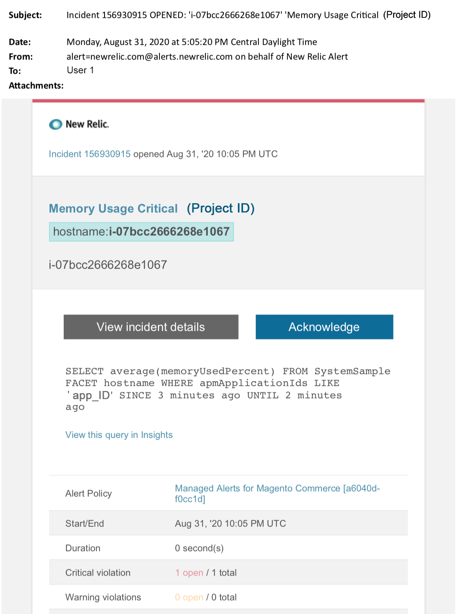

# Alertes gérées sur Adobe Commerce : alerte critique de la mémoire

Cet article décrit les étapes de dépannage à suivre lorsque vous recevez une alerte critique de mémoire pour Adobe Commerce dans [!DNL New Relic]. Une action immédiate est nécessaire pour remédier au problème.

{width="500"}

## Produits et versions concernés

Toutes les versions d’Adobe Commerce sur l’infrastructure cloud Planifient l’architecture.

## Problème

Vous recevrez une alerte gérée en [!DNL New Relic] si vous vous êtes inscrit aux [alertes gérées pour Adobe Commerce](managed-alerts-for-magento-commerce.md) et qu’un ou plusieurs seuils d’alerte ont été dépassés. Ces alertes ont été développées par Adobe pour fournir aux clients un ensemble de normes à l’aide des informations provenant des services d’assistance et d’ingénierie.

<u> **Do!** </u>

* Abandonner tout déploiement planifié jusqu’à ce que cette alerte soit effacée.
* Mettez immédiatement votre site en mode de maintenance s’il ne répond plus du tout. Pour connaître les étapes, consultez [Activation ou désactivation du mode de maintenance](https://experienceleague.adobe.com/en/docs/commerce-operations/installation-guide/tutorials/maintenance-mode) dans le Guide d’installation de Commerce. Veillez à ajouter votre adresse IP à la liste des adresses IP exemptées pour vous assurer que vous pouvez toujours accéder à votre site à des fins de dépannage. Pour connaître les étapes à suivre, voir [Tenir à jour la liste des adresses IP exemptées](https://experienceleague.adobe.com/en/docs/commerce-operations/installation-guide/tutorials/maintenance-mode#maintain-the-list-of-exempt-ip-addresses) dans le Guide d’installation de Commerce.

<u>**Non !**</u>

* Lancez d’autres campagnes marketing qui peuvent apporter des pages vues supplémentaires à votre site.
* Exécutez des indexeurs ou des crons supplémentaires, ce qui peut entraîner une contrainte supplémentaire sur le CPU ou le disque.
* Effectuez toutes les tâches administratives majeures (c’est-à-dire Administration de Commerce, importations/exportations de données).
* Videz votre cache.

Votre site peut ne plus répondre (si vous ne rencontrez pas déjà de panne) si vous effectuez l’une des actions « Ne pas » avant d’avoir enquêté et résolu la cause de l’alerte.

## Solution

Pour identifier et résoudre les problèmes, procédez comme suit.

>[!WARNING]
>
>Comme il s’agit d’une alerte critique, il est vivement recommandé d’effectuer l’**étape 1** avant d’essayer de résoudre le problème (étape 2 et suivantes).

1. Vérifiez si un ticket d’assistance Adobe Commerce existe. Pour connaître les étapes, voir [Suivi de vos tickets d’assistance](https://experienceleague.adobe.com/en/docs/commerce-knowledge-base/kb/help-center-guide/magento-help-center-user-guide#track-support-case) dans la base de connaissances de l’assistance Commerce. L’assistance peut avoir déjà reçu une alerte de seuil de [!DNL New Relic], créé un ticket et commencé à travailler sur le problème. S’il n’existe aucun ticket, créez-en un. Le ticket doit contenir les informations suivantes :
   * Motif du contact : sélectionnez **[!UICONTROL New Relic]** alerte CRITIQUE reçue
   * Description de l’alerte
   * [[!DNL New Relic] Lien de l’incident](https://docs.newrelic.com/docs/alerts-applied-intelligence/new-relic-alerts/alert-incidents/view-violation-event-details-incidents). Cela est inclus dans vos [alertes gérées pour Adobe Commerce](managed-alerts-for-magento-commerce.md).

1. Utilisez la page Infrastructure d’[[!DNL New Relic] APM](https://docs.newrelic.com/docs/infrastructure/infrastructure-ui-pages/infra-hosts-ui-page/) pour identifier les processus les plus gourmands en mémoire. Pour connaître les étapes, reportez-vous à la page [[!DNL New Relic] Hôtes de surveillance des infrastructures : Onglet Processus](https://docs.newrelic.com/docs/infrastructure/infrastructure-ui-pages/infra-hosts-ui-page/#processes) :
   * Si des services comme [!DNL Redis], MySQL ou PHP sont les principales sources de consommation de mémoire, essayez ce qui suit :
1. Vérifiez que vous disposez des dernières versions. Les versions plus récentes peuvent parfois corriger les fuites de mémoire. Si vous n’utilisez pas la dernière version, envisagez d’effectuer une mise à niveau. Pour connaître les étapes, reportez-vous à la section [Services de modification](https://experienceleague.adobe.com/docs/commerce-cloud-service/user-guide/configure/service/services-yaml.html) dans le guide de Commerce sur le cloud.
1. Si le problème avec le service n’est pas lié à la version, essayez les méthodes suivantes :
1. **MySQL** : recherchez des problèmes tels que les requêtes à exécution longue, les clés de Principal non définies et les index en double. Pour connaître les étapes, reportez-vous à la section [Problèmes de base de données les plus courants dans Adobe Commerce sur l’infrastructure cloud](https://experienceleague.adobe.com/docs/commerce-operations/implementation-playbook/best-practices/maintenance/resolve-database-performance-issues.html) dans le guide d’implémentation de Commerce.
1. **[!DNL Redis]** : si [!DNL Redis] est une source majeure de consommation de mémoire, [envoyez un ticket d’assistance](https://experienceleague.adobe.com/en/docs/commerce-knowledge-base/kb/help-center-guide/magento-help-center-user-guide#support-case).
1. **PHP** : Si PHP est une source majeure de consommation de mémoire, passez en revue les processus en cours d&#39;exécution en exécutant `ps aufx` dans l&#39;interface de ligne de commande/le terminal. Dans la sortie du terminal, vous verrez les tâches et processus cron en cours d’exécution. Vérifiez la sortie pour le temps d’exécution des processus. S’il existe un fichier cron dont la durée d’exécution est longue, il est possible qu’il soit suspendu. Pour connaître les étapes de dépannage, consultez les sections [Performances lentes, crons à exécution lente et longue](https://experienceleague.adobe.com/en/docs/commerce-knowledge-base/kb/troubleshooting/miscellaneous/slow-performance-slow-and-long-running-crons) et [La tâche Cron est bloquée au statut « en cours d’exécution »](https://experienceleague.adobe.com/en/docs/commerce-knowledge-base/kb/troubleshooting/miscellaneous/cron-job-is-stuck-in-running-status) de la base de connaissances de l’assistance Commerce.
1. Si vous avez toujours du mal à identifier la source du problème, utilisez la page Transaction d’[[!DNL New Relic] APM](https://docs.newrelic.com/docs/apm/applications-menu/monitoring/transactions-page-find-specific-performance-problems) pour identifier les transactions présentant des problèmes de performances :
   * Triez les transactions en fonction des scores [!DNL Apdex]. [[!DNL Apdex]](https://docs.newrelic.com/docs/apm/new-relic-apm/apdex/apdex-measure-user-satisfaction) fait référence à la satisfaction des utilisateurs quant au temps de réponse de vos applications et services web. Un [[!DNL Apdex score]](managed-alerts-for-magento-commerce-apdex-warning-alert.md) peut indiquer un goulot d’étranglement (une transaction avec un temps de réponse plus élevé). Généralement, il s&#39;agit de la base de données, [!DNL  Redis] ou PHP. Pour connaître les étapes, reportez-vous à la section [[!DNL New Relic] Afficher les transactions présentant le  [!DNL Apdex]  d’insatisfaction](https://docs.newrelic.com/docs/apm/new-relic-apm/apdex/view-your-apdex-score#apdex-dissat).
   * Triez les transactions en fonction du débit le plus élevé, du temps de réponse moyen le plus lent, du temps le plus long et d’autres seuils. Pour connaître les étapes, reportez-vous à [[!DNL New Relic] [Rechercher des problèmes de performances spécifiques]](https://docs.newrelic.com/docs/apm/applications-menu/monitoring/transactions-page-find-specific-performance-problems). Si vous avez toujours du mal à identifier le problème, utilisez la page Infrastructure d’[[!DNL New Relic] APM](https://docs.newrelic.com/docs/infrastructure/infrastructure-ui-pages/infra-hosts-ui-page/).
1. Si vous ne pouvez pas identifier la cause de l’augmentation de la consommation de mémoire, passez en revue les tendances récentes pour identifier les problèmes liés aux récents déploiements de code ou aux modifications de configuration (par exemple, nouveaux groupes de clients et modifications importantes du catalogue). Il est recommandé de passer en revue les 7 derniers jours d’activité pour toutes les corrélations dans les déploiements ou les modifications de code.
1. Si les méthodes ci-dessus ne vous aident pas à trouver la cause et/ou la solution dans un délai raisonnable, demandez un upsize ou placez le site en mode de maintenance si vous ne l&#39;avez pas déjà fait. Pour connaître les étapes, reportez-vous aux sections [Comment demander un redimensionnement temporaire](https://experienceleague.adobe.com/en/docs/commerce-knowledge-base/kb/how-to/how-to-request-temporary-magento-upsize) de la base de connaissances de la prise en charge de Commerce et [Activer ou désactiver le mode de maintenance](https://experienceleague.adobe.com/en/docs/commerce-operations/installation-guide/tutorials/maintenance-mode) du guide d’installation de Commerce.
1. Si la mise à niveau revient au fonctionnement normal du site, envisagez de demander une mise à niveau permanente (contactez l’équipe de votre compte Adobe) ou essayez de reproduire le problème dans votre évaluation dédiée en exécutant un test de charge et en optimisant les requêtes, ou un code qui réduit la pression sur les services. Voir [Tests de charge et de contrainte](https://experienceleague.adobe.com/en/docs/commerce-cloud-service/user-guide/develop/test/staging-and-production#load-and-stress-testing) dans le guide Commerce sur le cloud .
