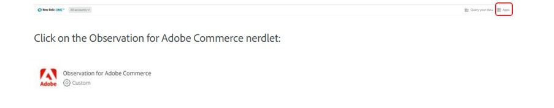

# Accès à l’[!DNL Observation for Adobe Commerce] nerdlet

Pour utiliser l’applet de commande [!DNL New Relic Observation for Adobe Commerce], vérifiez que vous avez accès à [!DNL New Relic].

[Gestion des comptes New Relic](https://experienceleague.adobe.com/en/docs/commerce-on-cloud/user-guide/monitor/new-relic/account-management)

Ensuite, sur la page d’accueil de [!DNL New Relic], sélectionnez l’élément de menu Applications .

