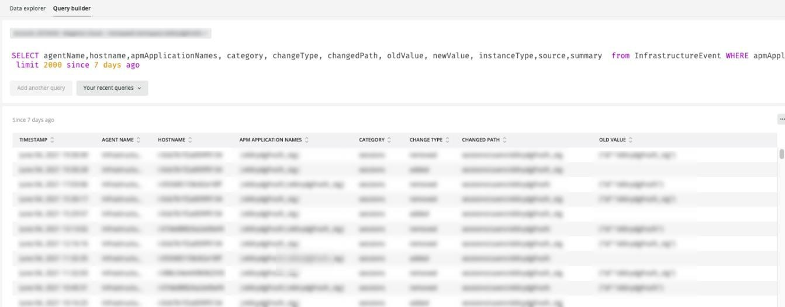

# Onglet [!UICONTROL Alerts]

L’onglet [!UICONTROL Alerts] fournit une gamme d’alertes, y compris les alertes critiques d’ouverture et de fermeture.

## [!UICONTROL Open Alert Details]

L’image **[!UICONTROL Open Alert Details]** affiche un nombre des alertes critiques ouvertes pendant la période sélectionnée. Les alertes comprennent les alertes créées par l’Adobe et les alertes créées par le partenaire ou le marchand.

## [!UICONTROL Closed Critical Alerts]

L’image **[!UICONTROL Closed Critical Alerts]** présente un nombre d’alertes critiques fermées pendant la période sélectionnée. Les alertes comprennent les alertes créées par l’Adobe et les alertes créées par le partenaire ou le marchand.

## [!UICONTROL Critical Alert Details]

L’image **[!UICONTROL Critical Alert Details]** présente un décompte des détails de l’alerte critique pendant la période sélectionnée, y compris l’horodatage, le nom de la condition et si l’événement d’alerte est ouvert ou fermé.

## [!UICONTROL Infrastructure Alert Details]

L’image **[!UICONTROL Infrastructure Alert Details]** affiche les applications, les hôtes et autres événements d’infrastructure pendant la période sélectionnée.
