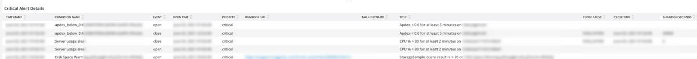

# Onglet [!UICONTROL Alerts]

L’onglet [!UICONTROL Alerts] fournit un éventail d’alertes, y compris les alertes critiques d’ouverture et de fermeture.

## [!UICONTROL Open Alert Details]

La période **[!UICONTROL Open Alert Details]** affiche le nombre d’alertes critiques ouvertes sur la période sélectionnée. Les alertes incluent les alertes créées par Adobe et celles créées par le partenaire ou le commerçant.

## [!UICONTROL Closed Critical Alerts]

La période **[!UICONTROL Closed Critical Alerts]** affiche le nombre d’alertes critiques fermées pendant la période sélectionnée. Les alertes incluent les alertes créées par Adobe et celles créées par le partenaire ou le commerçant.

## [!UICONTROL Critical Alert Details]

Le cadre **[!UICONTROL Critical Alert Details]** affiche le nombre de détails d’alerte critique pour la période sélectionnée, y compris la date et l’heure, le nom de la condition et le fait que l’événement d’alerte soit ouvert ou fermé.

## [!UICONTROL Infrastructure Alert Details]

La période **[!UICONTROL Infrastructure Alert Details]** affiche les applications, les hôtes et les autres événements d&#39;infrastructure sur la période sélectionnée.
