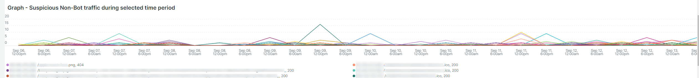

# Le [!UICONTROL bots] tab

Cet onglet contient des informations qui expliquent comment identifier si et quoi. [!DNL bots] provoquent des problèmes sur le site.

## Présentation générale de [!DNL bots]:

* A [!DNL bot] est un logiciel qui exécute des tâches automatisées répétitives. Avec l&#39;intelligence artificielle et l&#39;évolution de l&#39;apprentissage automatique, les tâches, les méthodes et les interactions de [!DNL bots] sont en train de changer. Il y a *good* [!DNL bots] qui bénéficient aux sites en les indexant et en les ajoutant aux moteurs de recherche internet. Les internautes sont ainsi guidés vers le site par les résultats des moteurs de recherche. A *good* [!DNL bot] respecte généralement les limites placées sur la variable [!DNL bot] par un `robots.txt` fichier ou paramètres dans une console de moteur de recherche. Les limites peuvent restreindre l’accès au site ou à certaines parties du site.
* Malveillant [!DNL bots] ignore le `robots.txt` ou ils peuvent paraitre un bon [!DNL bot] via le champ de l’agent utilisateur de requête des données de requête HTTP. Certaines choses malveillantes [!DNL bots] do :
   * Ajoutez la charge à un site pour refuser aux utilisateurs légitimes l’accès au site.
   * Videz et réutilisez du contenu sans autorisation.
   * Enregistrer des faux comptes pour inonder les services de messagerie ou les adresses ou les rediriger vers d’autres sites ([!DNL SPAM bots]).
   * Créer des vues falsifiées ([!DNL Viewbots]).
   * Acheter des produits ou des billets ([!DNL Focused bots]).
* Gestion [!DNL bots]
   * [!DNL Observation for Adobe Commerce] contient des vues de [!DNL bot] traffic :
      * Il affiche le total non mis en cache [!DNL bot] activité qui affiche la charge qu’une [!DNL bot] s’ajoute à un site et lorsque cette charge se produit.
      * Elle affiche la variable [!DNL bots] qui génèrent des erreurs. En règle générale, si une variable [!DNL bot] ajoute une charge qui entraîne des problèmes au site, ce qui [!DNL bot] ou l’adresse IP présente la fréquence d’erreurs la plus élevée.
      * Elle affiche [!DNL bot] noms (valeurs des champs de l’agent utilisateur de requête) et adresses IP à gérer par le biais de :
         * [!DNL Fastly] (limitation de débit ou [!DNL VCLs] qui bloquent des adresses IP, des plages ou [!DNL bots] par valeur de nom).
         * Ajouter de bonnes [!DNL bot] aux `robots.txt field` pour restreindre ou restreindre le taux d’accès au site.
         * Gestion [!DNL Bing] ou [!DNL Google bots] via la console du moteur de recherche.

## [!UICONTROL Total Bot traffic by bot name during selected time period]:

* Le **[!UICONTROL Total Bot traffic by bot name during selected time period]:** Le tableau contient le nombre agrégé de requêtes non mises en cache dans lesquelles la variable [!UICONTROL request_user_agent] contient une chaîne de [!DNL bots] dans la valeur . Il peut s’agir du nom [!DNL bot] comme la propriété [!UICONTROL request_user_agent] la valeur du champ peut être mise en file d’attente. La valeur sous [!UICONTROL Count] est la colonne la plus importante.

## [!UICONTROL Total Bot Traffic by Bot name/IP address during selected time period How to block bot traffic on Fastly level OR manage bots through your robots.txt file Best practices for Adobe Commerce robots.txt]

* Le **[!UICONTROL Total Bot Traffic by Bot name/IP address during selected time period How to block bot traffic on Fastly level OR manage bots through your robots.txt file Best practices for Adobe Commerce robots.txt]** Le tableau affiche les mêmes données que le tableau précédent, mais ajoute des adresses IP effectuant les requêtes pour le compte du [!DNL bot]. Comme malveillant [!DNL bots] parodie [!DNL bots], la ou les adresses IP doivent être vérifiées par le biais de sites web qui identifient les adresses IP abusives ou par *whois* services ou [!DNL DNS lookups]. Par exemple : [!DNL Google] publie leurs [[!DNL googlebot] Adresses IP](https://developers.google.com/search/apis/ipranges/googlebot.json) et [!DNL Microsoft] dispose d’un outil de vérification pour [[!DNL Bingbots]](https://www.bing.com/webmasters/help/Verify-Bingbot-2195837f).

## [!UICONTROL Graph - Bots with HTTP status errors during selected time period How to block bot traffic on Fastly level OR manage bots through your robots.txt file Best practices for Adobe Commerce robots.txt]

* Le **[!UICONTROL Graph - Bots with HTTP status errors during selected time period How to block bot traffic on Fastly level OR manage bots through your robots.txt file Best practices for Adobe Commerce robots.txt]** Le graphique affiche les erreurs sur [!DNL bots] qui se déclarent dans le champ de l’agent utilisateur de requête. Cela ne signifie pas nécessairement que l’erreur est provoquée par le volume de la [!DNL bot] ou tout autre trafic. Les erreurs peuvent être que la variable [!DNL bot] demande des informations qui n’existent pas ou il y a un autre problème dans la requête.
* S’il y a un pic d’erreurs sur les adresses IP en cas d’instabilité ou de panne du site, elles peuvent être suspectées d’affecter le problème du site.

## [!UICONTROL Table - IPs that do not identify as bots with HTTP status errors during selected time period How to block bot traffic on Fastly level OR manage bots through your robots.txt file Best practices for Adobe Commerce robots.txt]

* Le **[!UICONTROL Table - IPs that do not identify as [!DNL bots] with HTTP status errors during selected time period How to block bot traffic on Fastly level OR manage bots through your robots.txt file Best practices for Adobe Commerce robots.txt]** Le tableau affiche les requêtes IP avec des codes d’état http non-200 qui NE S’identifient PAS comme [!DNL bots] dans le champ de l’agent utilisateur de requête. Ces adresses IP peuvent être des adresses IP malveillantes, en particulier si le nombre est élevé pour la période sélectionnée.
* Si le nombre de codes d’état http non 200 est faible et que les plages d’adresses IP ne sont pas similaires, les adresses peuvent ne pas contribuer aux problèmes du site.

## [!UICONTROL Table – Cache Status 'ERROR' detail table (what are these IPs doing?) How to block bot traffic on Fastly level OR manage bots through your robots.txt file Best practices for Adobe Commerce robots.txt]

* Lorsque les adresses IP génèrent une fréquence élevée d’erreurs, demandez-vous ce qu’elles font ? Le [!UICONTROL Table – Cache Status 'ERROR' detail table (what are these IPs doing?) How to block bot traffic on Fastly level OR manage bots through your robots.txt file Best practices for Adobe Commerce robots.txt] Le tableau affiche l’URL demandée avec la valeur d’état HTTP pour les requêtes ayant un état de cache. [!UICONTROL ERROR] . La fréquence est facettée par l’URL, de sorte que le nombre peut être faible. N’oubliez pas que l’adresse IP peut effectuer des milliers de demandes pendant la période sélectionnée. Il s’agit d’une vue par rapport à 2 000 demandes au cours de la période (limite d’affichage des enregistrements).

## [!UICONTROL Show 5XX status distribution across IP addresses (top 200 addresses) How to block bot traffic on Fastly level OR manage bots through your robots.txt file Best practices for Adobe Commerce robots.txt]

* Le **[!UICONTROL Show 5XX status distribution across IP addresses (top 200 addresses) How to block bot traffic on Fastly level OR manage bots through your robots.txt file Best practices for Adobe Commerce robots.txt]** cadre est puissant. Elle affiche les adresses IP qui comportent des codes d’état http 5XX au cours de la période sélectionnée. Si une adresse IP effectue un volume élevé de requêtes et que le site est affecté au point où il ne peut pas gérer le trafic, alors les adresses IP qui enregistrent la fréquence la plus élevée des requêtes auront généralement le volume d’erreurs le plus élevé. Les codes d’état http 5XX indiquent généralement un site qui a du mal à répondre aux requêtes.
* Plus la barre est grande, plus le pourcentage d’erreurs de l’adresse IP est élevé dans le nombre total d’erreurs 5xx durant cette période. Remarque : une adresse IP peut comporter plusieurs segments dans le graphique si elle comporte plusieurs codes d’état http (par exemple, les états 502 et 503 http ).
* Une distribution type serait indiquée vers la droite de la barre où les adresses IP sont égales en largeur ou il y aurait quelques barres larges avec des valeurs très faibles.
* Si vous passez la souris sur le segment à barres, le nombre d’erreurs indiquées s’affiche pendant la période sélectionnée.

## [!UICONTROL IP cache status (MISS, PASS, ERROR) and HTTP status during selected time period How to block bot traffic on Fastly level OR manage bots through your robots.txt file Best practices for Adobe Commerce robots.txt]

* Ceci **[!UICONTROL IP cache status (MISS, PASS, ERROR) and HTTP status during selected time period How to block bot traffic on Fastly level OR manage bots through your robots.txt file Best practices for Adobe Commerce robots.txt]** Le cadre affiche le nombre de codes d’état HTTPS et les requêtes non mises en cache par IP pendant la période sélectionnée. Cela indique la charge proportionnelle provenant de chaque adresse IP et le volume total. Les adresses IP présentant le plus de requêtes sont alors affichées.

## [!UICONTROL Fastly Cache Summary for selected time period]

* Si vous cliquez sur le bouton [!UICONTROL Error] dans le graphique ci-dessous, vous pouvez comparer les deux derniers graphiques. Cela peut aider à indiquer où la charge contribue aux problèmes du site.

## [!UICONTROL Graph - IPs that do not identify as bots without error during selected time period How to block bot traffic on Fastly level OR manage bots through your robots.txt file Best practices for Adobe Commerce robots.txt]

* Le **[!UICONTROL Graph - IPs that do not identify as bots without error during selected time period How to block bot traffic on Fastly level OR manage bots through your robots.txt file Best practices for Adobe Commerce robots.txt]** Le cadre affiche le champ de l’agent utilisateur de requête, l’adresse IP et le code d’état pour les demandes pour lesquelles le champ de l’agent utilisateur de requête n’indique pas de [!DNL bot]. Ce cadre peut afficher des demandes à haute fréquence provenant de n’importe quelle adresse IP, mais prêter attention aux demandes à haute fréquence, en particulier pendant une période où le site peut rencontrer des problèmes.

## [!UICONTROL Graph - Suspicious Non-Bot traffic during selected time period]

* Le **[!UICONTROL Graph - Suspicious Non-Bot traffic during selected time period]** graph recherche une valeur d’agent utilisateur de demande Go-http-client, mais sera étendue pour examiner d’autres valeurs d’agent utilisateur de demande suspectes. Cette valeur de l’agent utilisateur de requête est utilisée par les sites pour se connecter à partir de services et peut être valide, mais elle est également utilisée par malicieux. [!DNL bots].

## [!UICONTROL Graph - Bot traffic by Bot name during selected time period]

* Le **[!UICONTROL Graph - Bot traffic by Bot name during selected time period]** L’image affiche les mêmes données que le trafic total de robots par [!DNL Bot] nom au cours de la période sélectionnée dans la partie supérieure de l’onglet. Il affiche les données par le biais de la chronologie afin que vous puissiez voir quand les requêtes de la fonction [!DNL bots] sont faites et leurs distributions.

## [!UICONTROL Graph - Top 250 Bot Names and IP addresses during selected time period How to block bot traffic on Fastly level OR manage bots through your robots.txt file Best practices for Adobe Commerce robots.txt]

* Le **[!UICONTROL Graph - Top 250 Bot Names and IP addresses during selected time period How to block bot traffic on Fastly level OR manage bots through your robots.txt file Best practices for Adobe Commerce robots.txt]** Le cadre affiche les mêmes données que le total [!DNL Bot] Trafic par nom de robot/adresse IP lors de la période sélectionnée dans la partie supérieure de l’onglet. Il affiche les données via la chronologie et les facette par adresse IP. Cela indique quand les requêtes de la fonction [!DNL bots] sont effectuées, l’adresse IP qui effectue des requêtes et la distribution des requêtes.

## [!UICONTROL Blocked Bot name / IP addresses (in Fastly) during selected time period. This graph displays bot traffic and IPs that were returned a 403 Forbidden HTTP Status code]

* Le **[!UICONTROL IP address in the Graph - Top 250 Bot Names and IP addresses during selected time period]** Le graphique a été bloqué. Ce graphique montre comment toutes les demandes sont bloquées dans [!DNL Fastly] à venir.

## [!UICONTROL Blocked non-Bot name / IP addresses (in Fastly) during selected time period. This graph displays non-bot traffic and IPs that were returned a 403 Forbidden HTTP Status code]

* Le **[!UICONTROL Blocked non-Bot name / IP addresses (in Fastly) during selected time period graph displays non-bot traffic and IPs that were returned a 403 Forbidden HTTP Status code]** frame affiche les adresses IP qui ne sont pas identifiées comme [!DNL bot] qui ont été bloqués [!DNL Fastly].

## [!UICONTROL This table shows the number of user agents per IP address, number of successful, unsuccessful and blocked requests:]

* Malveillant [!DNL bots] souvent parodié [!DNL bots] par l’intermédiaire de la valeur de la variable [!UICONTROL Request User Agent] champ . Ce tableau indique le nombre de valeurs uniques de l’adresse IP dans ce champ. Plus la valeur de la variable [!UICONTROL Request User Agent] , plus l’adresse IP est suspicieuse.

## [!UICONTROL IP with non-200 status errors – without 403 status]

* Le **[!UICONTROL IP with non-200 status errors – without 403 status]** frame affiche la distribution sur la période sélectionnée des adresses IP avec des codes d’état HTTP autres que 200. Lorsque des valeurs plus élevées s’affichent sur une seule adresse IP ou un groupe d’adresses IP, elles doivent faire l’objet d’une enquête plus approfondie.

## [!UICONTROL IP with 403 status codes:]

* Le **[!UICONTROL IP with 403 status codes]** frame affiche les requêtes non mises en cache sans [!UICONTROL cache_status=ERROR] ayant un état HTTP 403. Cela peut indiquer que le serveur d’origine est la source du 403 (non autorisé) plutôt qu’un bloc de [!DNL Fastly].

## [!UICONTROL Top 5 with non-200 status codes showing cache_status:]

* Le **[!UICONTROL Top 5 with non-200 status codes showing cache_status:]** Le tableau affiche au niveau de l’adresse IP/de l’état le nombre de chaque avec la variable [!UICONTROL cache_status] .

## [!UICONTROL Pageview Latency will show as spikes on this graph:]

* Le **[!UICONTROL Pageview Latency will show as spikes on this graph:]** Le cadre affiche la latence du chargement de la page/de la réponse de l’API qui peut être conforme à la variable [!DNL bot] trafic.
