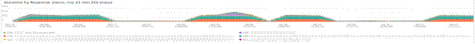

# Le [!UICONTROL CDN] tab

Cet onglet contient des informations relatives à la variable [!DNL content delivery network (CDN)]. Dans le cas de Adobe Commerce Cloud, il s’agit de la variable [!DNL Fastly] service.

## [!UICONTROL HIT rate]

Le **[!UICONTROL HIT rate]** frame affiche le nombre de requêtes pouvant être mises en cache qui ont entraîné [!UICONTROL HITS] à la dernière minute. Cela indique une mise en cache réussie. La flèche vers la droite affiche le pourcentage au-dessus ou en dessous à la même heure il y a une semaine.

## [!UICONTROL HIT Processing]

Ceci **[!UICONTROL HIT processing]** indique le nombre de requêtes pouvant être mises en cache qui ont entraîné [!UICONTROL HITS] pendant la semaine.

## [!UICONTROL MISS rate]

Ceci **[!UICONTROL MISS rate]** indique le nombre d’échecs de requêtes pouvant être mises en cache à la dernière minute. Une erreur se produit lorsque la requête n’est pas mise en cache et que la requête doit être transmise au serveur d’origine pour diffuser le contenu. La valeur à droite est la comparaison entre augmentation/diminution et nombre de minutes par minute une semaine auparavant.

## [!UICONTROL MISS time]

## [!UICONTROL HIT Ratio]

## [!UICONTROL Error Percentage]

Le **[!UICONTROL Error Percentage]** affiche la valeur du pourcentage ERROR des requêtes et affiche l’augmentation/diminution relative par rapport à la même période une semaine auparavant.

## [!UICONTROL Total Requests]

## [!UICONTROL ERROR rate]

## [!UICONTROL Fastly Cache Average Response for selected time period in seconds]

Ce cadre affiche la durée en secondes des requêtes pouvant être mises en cache, ce qui signifie que si un événement `cache_response` est un [!UICONTROL MISS], il affiche la moyenne des réponses mises en cache manquées pour le temps sélectionné.

## [!UICONTROL Fastly Cache Average Response for selected time period in seconds, faceted by POP]

## [!UICONTROL Total Bandwidth (All POPs) during the selected timeframe, compared with 1 week ago (% increase/decrease)]

## [!UICONTROL Requests – Since selected timeframe compared with one week ago]

Ce cadre est similaire à la zone de résumé pour [!UICONTROL Total Requests] dans la partie supérieure, mais affiche le nombre de requêtes des semaines précédentes. Il s’agit de toutes les requêtes, et pas seulement des requêtes pouvant être mises en cache (où `is_cacheable` est vrai).

## [!UICONTROL Response Count]

## [!UICONTROL Bandwidth by POP]

## [!UICONTROL Top 5 URLs (5xx or 3xx status codes)]

Le **[!UICONTROL Top 5 URLs]** affiche les 5 premières URL qui rencontrent des réponses d’erreur 5xx ou 3xx. En raison de la contrainte d’espace, vous devrez placer le pointeur de la souris sur l’URL pour afficher le code d’erreur spécifique associé à cette URL. (exemple dans la zone rouge de la figure ci-dessus).

## [!UICONTROL Top 25 URLs (200 status)]

Le **[!UICONTROL Top 25 URLs]** Le cadre affiche les URL qui ont renvoyé un état 200 par nombre au cours de la période sélectionnée.

## [!UICONTROL Duration by Response Status]

Le **[!UICONTROL Duration by Response Status]** Le graphique affiche les réponses d’erreur par nombre au cours de la période sélectionnée, facettées par le code d’état d’erreur.

## [!UICONTROL Duration by Response Status, top 25 urls]

Le **[!UICONTROL Duration by Response Status, top 25 URLs]** Le graphique affiche les 25 premières URL selon la durée de la réponse en secondes. Il se peut que vous deviez placer le pointeur de la souris sur l’URL pour afficher l’intégralité du chemin. En outre, pour supprimer toutes les URL, sauf une, cliquez sur cette URL. Vous pouvez ensuite réajouter d’autres URL en cliquant dessus individuellement. Si vous souhaitez supprimer des URL individuelles, vous pouvez maintenir la touche enfoncée et cliquer sur chaque URL pour la supprimer du graphique.

## [!UICONTROL Duration by Response Status, top 25 non-200 status]

Le **[!UICONTROL Duration by Response Status, top 25 non-200 status]** Le graphique est similaire au dernier, sauf que l’accent est mis sur les codes d’état non-200 ou les codes d’état d’erreur. Il affiche le code d’erreur, puis l’URL. Il se peut que vous deviez placer le pointeur de la souris sur l’URL pour afficher l’intégralité du chemin. En outre, pour supprimer toutes les URL, sauf une, cliquez sur cette URL. Vous pouvez ensuite réajouter d’autres URL en cliquant dessus individuellement. Si vous souhaitez supprimer des URL individuelles, vous pouvez maintenir la touche enfoncée et cliquer sur chaque URL pour la supprimer du graphique.

## [!UICONTROL Error Count by POP timeline]

Le **[!UICONTROL Error Count by POP timeline]** Le graphique affiche le nombre d’états d’erreur le long de la chronologie sélectionnée, facettée par le code d’erreur.

## [!UICONTROL Duration by Response status, top 25 client IP, non-200 status]

Le **[!UICONTROL Duration by Response status, top 25 client IP, non 200 status]** Le graphique présente les adresses IP selon la durée moyenne pendant la période sélectionnée, où il y a eu des codes d’erreur d’état.

## [!UICONTROL IP Frequency]

Le **[!UICONTROL IP Frequency]** frame comptabilise les états (&#39;MISS&#39; et &#39;PASS&#39;) pour chaque IP de la variable [!DNL Fastly] journaux. Les requêtes Web avec ces états atteignent le serveur d’origine et ajoutent de la charge au serveur. Il affiche les vingt premières adresses en fréquence. Ce cadre peut être utilisé pour détecter les attaques IP ou les sources de charge importante sur un site web. Ce graphique est également présent dans l’onglet Résumé et est placé ici pour faciliter la comparaison avec plus de détails sur la variable [!DNL Fastly] les informations du journal affichées sur cet onglet.
