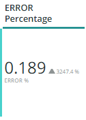
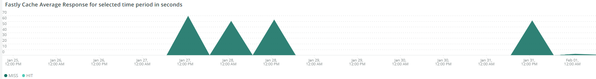

# Onglet [!UICONTROL CDN]

Cet onglet contient des informations sur le [!DNL content delivery network (CDN)]. Dans le cas d’Adobe Commerce Cloud, il s’agit du service [!DNL Fastly].

## [!UICONTROL HIT rate]

Le cadre **[!UICONTROL HIT rate]** affiche le nombre de requêtes pouvant être mises en cache qui ont donné lieu à des [!UICONTROL HITS] à la dernière minute. Indique la mise en cache réussie. La flèche vers la droite affiche le pourcentage au-dessus ou au-dessous de la même heure il y a une semaine.

## [!UICONTROL HIT Processing]

Cette zone de **[!UICONTROL HIT processing]** indique le nombre de demandes pouvant être mises en cache qui ont donné lieu à des [!UICONTROL HITS] au cours de la semaine.

## [!UICONTROL MISS rate]

Cette zone de **[!UICONTROL MISS rate]** indique le nombre de demandes pouvant être mises en cache manquantes à la dernière minute. Un échec survient lorsque la requête n’est pas mise en cache et doit être transmise au serveur d’origine pour servir le contenu. La valeur à droite est la comparaison de l’augmentation/la diminution au nombre de minutes par minute une semaine avant.

## [!UICONTROL MISS time]

## [!UICONTROL HIT Ratio]

## [!UICONTROL Error Percentage]

La zone de **[!UICONTROL Error Percentage]** affiche la valeur du pourcentage ERREUR des demandes et indique l’augmentation/la diminution relative par rapport à la même période une semaine auparavant.

## [!UICONTROL Total Requests]

## [!UICONTROL ERROR rate]

## [!UICONTROL Fastly Cache Average Response for selected time period in seconds]

Ce cadre affiche la durée en secondes des requêtes pouvant être mises en cache, ce qui signifie que si un `cache_response` est un [!UICONTROL MISS], il affiche la moyenne des réponses mises en cache manquantes pour la durée sélectionnée.

## [!UICONTROL Fastly Cache Average Response for selected time period in seconds, faceted by POP]

*POP* dans ce contexte fait référence à un point de présence (POP) configuré pour fonctionner en tant que pool pour le stockage du cache. Voir [ Points de présence ](https://developer.fastly.com/learning/concepts/pop/).

## [!UICONTROL Total Bandwidth (All POPs) during the selected timeframe, compared with 1 week ago (% increase/decrease)]

## [!UICONTROL Requests – Since selected timeframe compared with one week ago]

Ce cadre est similaire à la zone de résumé pour les [!UICONTROL Total Requests] en haut, à ceci près qu’il affiche le nombre de demandes des semaines précédentes. Il s’agit toutes des requêtes, et pas seulement des requêtes pouvant être mises en cache (où `is_cacheable` est vrai).

## [!UICONTROL Response Count]

## [!UICONTROL Bandwidth by POP]

## [!UICONTROL Top 5 URLs (5xx or 3xx status codes)]

La vue **[!UICONTROL Top 5 URLs]** affiche les 5 principales URL qui rencontrent des réponses d’erreur 5xx ou 3xx. En raison de la contrainte d’espace, vous devez placer le pointeur de la souris sur l’URL pour afficher le code d’erreur spécifique associé à cette URL. (exemple dans le cadre rouge de la figure ci-dessus).

## [!UICONTROL Top 25 URLs (200 status)]

Le cadre **[!UICONTROL Top 25 URLs]** affiche les URL qui ont renvoyé un statut 200 par nombre au cours de la période sélectionnée.

## [!UICONTROL Duration by Response Status]

Le graphique **[!UICONTROL Duration by Response Status]** affiche les réponses d’erreur par nombre au cours de la période sélectionnée, à la facette du code de statut d’erreur.

## [!UICONTROL Duration by Response Status, top 25 urls]

Le graphique **[!UICONTROL Duration by Response Status, top 25 URLs]** présente les 25 principales URL en fonction de la durée de réponse en secondes. Vous devrez peut-être placer le pointeur de la souris sur l’URL pour afficher le chemin d’accès complet. En outre, pour supprimer toutes les URL sauf une, cliquez sur cette URL. Vous pouvez ensuite ajouter d’autres URL en cliquant dessus individuellement. Si vous souhaitez supprimer des URL individuelles, vous pouvez maintenir la touche enfoncée et cliquer sur chaque URL pour les supprimer du graphique.

## [!UICONTROL Duration by Response Status, top 25 non-200 status]

Le graphique **[!UICONTROL Duration by Response Status, top 25 non-200 status]** est similaire au dernier, à la différence que l’accent est mis sur les codes d’état non 200 ou les codes d’état d’erreur. Il affiche le code d’erreur, puis l’URL. Vous devrez peut-être placer le pointeur de la souris sur l’URL pour afficher le chemin d’accès complet. En outre, pour supprimer toutes les URL sauf une, cliquez sur cette URL. Vous pouvez ensuite ajouter d’autres URL en cliquant dessus individuellement. Si vous souhaitez supprimer des URL individuelles, vous pouvez maintenir la touche enfoncée et cliquer sur chaque URL pour les supprimer du graphique.

## [!UICONTROL Error Count by POP timeline]

Le graphique **[!UICONTROL Error Count by POP timeline]** affiche le nombre des statuts d’erreur le long de la chronologie sélectionnée, avec en facette le code d’erreur.

## [!UICONTROL Duration by Response status, top 25 client IP, non-200 status]

Le graphique **[!UICONTROL Duration by Response status, top 25 client IP, non 200 status]** montre les adresses IP en fonction de la durée moyenne sur la période sélectionnée où il y avait des codes d’erreur de statut.

## [!UICONTROL IP Frequency]

La trame **[!UICONTROL IP Frequency]** compte les statuts (&#39;MISS&#39; et &#39;PASS&#39;) pour chaque IP des logs de [!DNL Fastly]. Les requêtes web avec ces statuts atteignent le serveur d’origine et ajoutent de la charge au serveur. Il affiche les vingt premières adresses en fréquence. Cette trame peut être utilisée pour détecter des attaques IP ou des sources de charge importante sur un site web. Ce graphique est également présent dans l’onglet Résumé et est placé ici pour faciliter la comparaison avec d’autres détails sur les informations du journal de [!DNL Fastly] affichées dans cet onglet.
