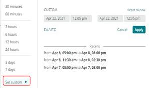

# Choisir les onglets [!UICONTROL focus]

La puissance de [!DNL Observation for Adobe Commerce] provient de l’alignement d’un énorme volume de vues de données différentes sur la même chronologie. [!DNL Observation for Adobe Commerce] pouvez présenter aux agents [!DNL New Relic] un échantillon de données collectées et une vue visuelle des journaux système et des applications. Si vous pensez à résoudre des problèmes complexes, il s’agit toujours de diviser les données en deux. Lorsque vous examinez un problème sur une chronologie, la première question est : « Quand cela s&#39;est-il produit ? » Tout ce qui s&#39;est passé avant ce moment est une préoccupation immédiate. Si vous connaissez l’heure exacte à laquelle le problème s’est produit sur la chronologie, vous pouvez sélectionner une chronologie juste avant le problème. Vous ne connaissez peut-être pas les détails du problème, à part que votre site est en panne ou lent. Avec Adobe Commerce, les suspects potentiels incluent les services de composants, les niveaux de ressources et le nombre de processus en cours d’exécution.

Les onglets **[!UICONTROL focus]** affichent des informations qui peuvent vous aider à vous concentrer sur les domaines à l’origine de votre problème ou y contribuant. Vous pouvez également ajouter en permanence des signaux de données aux [!DNL Observation for Adobe Commerce]. Les signaux de données peuvent être [!DNL New Relic] données collectées ou le nombre de phases critiques, ou des messages d’erreur provenant des journaux. Comme les messages d’erreur sont identifiés comme étant liés à des problèmes de site, ils peuvent être ajoutés aux requêtes [!DNL Observation for Adobe Commerce] pour améliorer l’affichage des informations critiques.

