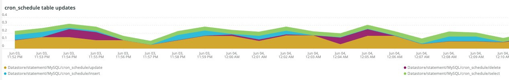

# Le [!DNL Cron] tab

Cet onglet permet d’isoler rapidement les problèmes et les causes de [!DNL cron] problèmes.

## [!UICONTROL Cron transaction duration in seconds]

Le **[!UICONTROL Cron transaction duration in seconds]** affichage des images [!DNL crons] durée de la transaction en secondes. Cela affichera les transactions qui ont de longs exécutions. Un examen plus approfondi du modèle de gestion des actifs numériques (APM) donnera plus de détails sur la requête que la transaction/opération peut exécuter.

## [!UICONTROL MySQL Non-Sleeping Threads by Node]

Le **[!UICONTROL MySQL Non-Sleeping Threads by Node]** Le cadre affiche les threads MySQL non endormis par noeud pendant la période sélectionnée.

## [!UICONTROL SQL Trace count by path]

Le **[!UICONTROL SQL Trace count by path]** frame examine le nombre de traces MySQL par chemin, ce qui peut aider à suivre les instructions SQL sur une période sélectionnée.

## [!UICONTROL Cron database call]

Le **[!UICONTROL Cron database call]** frame examine le nombre de [!DNL crons] appel à la base de données pendant une période sélectionnée.

## [!UICONTROL Cron schedule table locks]

Le **[!UICONTROL Cron schedule table locks]** images [!DNL cron] le tableau planning se verrouille sur une période sélectionnée.

## [!UICONTROL Cron schedule clean cron fired]

Le **[!UICONTROL Cron schedule clean cron fired]** frame examine le nombre de [!DNL crons] nettoyé pendant une période sélectionnée. Si aucune donnée n’est affichée dans ce cadre, cela peut indiquer un problème avec [!DNL crons] s’exécutant correctement. Si la variable [!DNL cron] le planning de traitement n&#39;est pas nettoyé, [!DNL crons] ne s’exécute pas de manière optimale et peut prendre plus de temps à s’exécuter.

## [!UICONTROL Cron schedule clean records details table]

Le **[!UICONTROL Cron schedule clean records details table]** fournit des détails sur la tâche de nettoyage des enregistrements de la `cron_schedule` tableau pendant une période sélectionnée.

## [!UICONTROL cron_schedule table updates]

Le **[!UICONTROL cron_schedule table updates]** frame examine le nombre de [!DNL cron] les mises à jour du tableau planifié pendant une période sélectionnée. Une activité élevée lors de la suppression ou de la mise à jour de ce tableau peut indiquer un problème avec [!DNL crons]. En outre, [!DNL crons] mettre à jour cette table lorsqu’elle est en cours d’exécution et qu’elle est terminée. Par conséquent, s’il n’y a aucune activité sur cette table et qu’il y a [!DNL crons] configuré, il peut y avoir un problème avec [!DNL crons].

## [!UICONTROL Datastore Operations Tables]

Le **[!UICONTROL Datastore Operations Tables]** examine les opérations de table de base de données, notamment `SELECT`, `DELETE`, et `UPDATE` sur une période sélectionnée. Ce cadre affiche les tables de la base avec la fréquence d&#39;opération la plus élevée par rapport à elles.
