# Onglet [!UICONTROL Elasticsearch]

## [!UICONTROL Cluster Status Summary]:

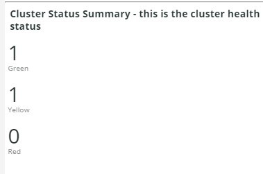

Sur la période sélectionnée, la période **[!UICONTROL Cluster Status Summary]** affiche les statuts de couleur que le cluster de [!DNL Elasticsearch] a traversés. Dans cet exemple, pendant la période sélectionnée, le cluster a eu l’état Vert une fois et l’état Jaune une fois pendant la période sélectionnée.

## [!UICONTROL Active Primary Shards]

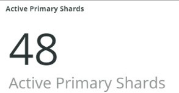

Le cadre **[!UICONTROL Active Primary Shards]** affiche les différents nombres en fonction du nombre de partitions principales actives pour le service de [!DNL Elasticsearch] du compte sélectionné.

De [!DNL Elasticsearch] : Le Guide définitif [2.x] :

« Dans [Indices pouvant être mis à jour dynamiquement](https://www.elastic.co/guide/en/elasticsearch/guide/2.x/dynamic-indices.html), nous avons expliqué qu’une partition est un index Lucene et qu’un index [!DNL Elasticsearch] est une collection de partitions. Votre application parle à un index et achemine [!DNL Elasticsearch] vos requêtes vers les partitions appropriées. Une partition est l&#39;unité d&#39;échelle. Le plus petit index que vous pouvez avoir est un index avec une seule partition. Cela peut être plus que suffisant pour vos besoins : une seule partition peut contenir beaucoup de données, mais cela limite votre capacité à effectuer une mise à l’échelle. »

Lorsqu’un index est créé, plusieurs partitions sont créées avec cet index. Par défaut, cinq partitions principales sont attribuées à chaque nouvel index, ce qui signifie qu’un index peut être réparti sur cinq nœuds (une partition par nœud). Il existe également des répliques de partitions. Ils sont principalement destinés au basculement. Les partitions de Secondaire peuvent servir aux requêtes de lecture.

## [!UICONTROL Active Shards in Cluster]

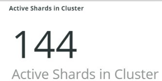

L’image **[!UICONTROL Active Shards in Cluster]** affiche le nombre total de partitions principales et répliquées dans un cluster [!DNL Elasticsearch].

## [!UICONTROL Index health - this will show the index name and color status]

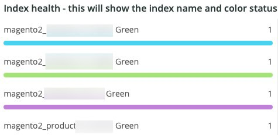

Ce cadre affiche le nom de l’index et le nombre de statuts de couleur de l’index. En faisant défiler le tableau vers le bas, vous verrez le même nom d’index avec les statuts de couleur jaune et rouge. Le nombre qui suit le nom de l’index 27 est le nombre de la couleur de statut. S’il s’agit de zéro, aucune instance de l’index n’était dans ce statut de couleur pendant les périodes sélectionnées.

## [!UICONTROL Elasticsearch Status by node information]

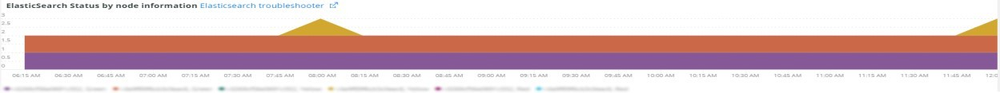

Le cadre **[!UICONTROL Elasticsearch Status by node information]** affiche l’état du cluster [!DNL Elasticsearch] par couleur et par nœud. Cela permet d’indiquer quel nœud du cluster [!DNL Elasticsearch] renvoie quel statut au cours de la période sélectionnée.

## [!UICONTROL Elasticsearch index information]

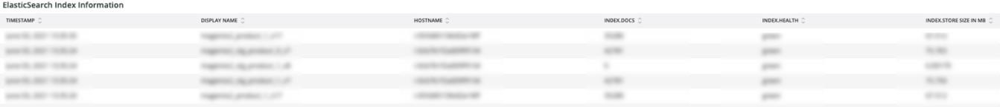

Le tableau **[!UICONTROL Elasticsearch index information]** indique le nom de l’index, le nœud sur lequel il se trouve, le nombre de documents indexés, l’intégrité de l’index et la taille de l’index en Mo à un moment donné.

## [!UICONTROL Elasticsearch process CPU %]

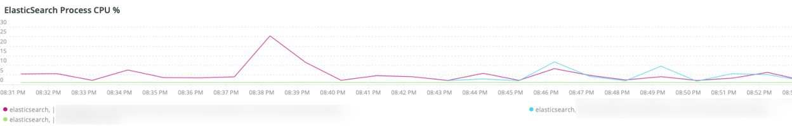

L’image **[!UICONTROL Elasticsearch process CPU %]** affiche le pourcentage de CPU de processus par le processus [!DNL Elasticsearch] sur la période sélectionnée.

## [!UICONTROL Elasticsearch Memory garbage collection]

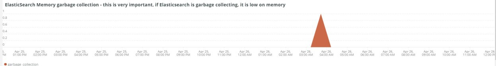

[!DNL Elasticsearch] est un processus Java. S’il manque de mémoire allouée, il lance le nettoyage pour libérer de la mémoire. Si le nettoyage est fréquent, cela indique qu’il peut y avoir trop d’index ou de partitions pour la mémoire allouée. Il peut y avoir une opportunité de nettoyer les index et les partitions ou [!DNL Elasticsearch] peut avoir besoin de plus de mémoire.

## [!UICONTROL Elasticsearch Index information]

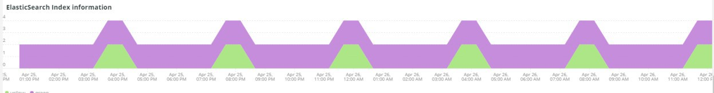

L’intégrité de l’index peut changer à mesure que les index sont créés et mis à jour.

## [!UICONTROL Elasticsearch Index Size]

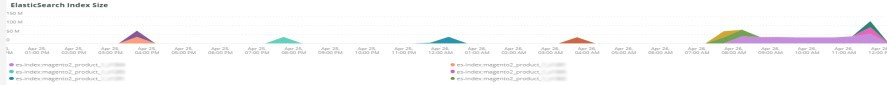

Le cadre **[!UICONTROL Elasticsearch Index Size]** indique le nom et la taille de l’index sur la période sélectionnée. Cela peut indiquer des problèmes liés à l’indexation d’un site.

## [!UICONTROL Elasticsearch Errors]

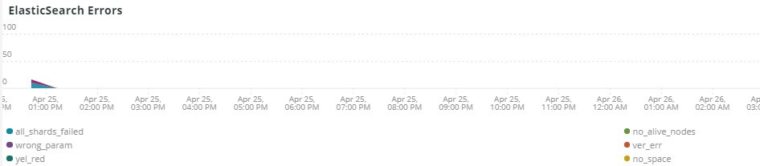

L’image **[!UICONTROL Elasticsearch Errors]** affiche des erreurs avec des [!DNL Elasticsearch] telles que le manque d’espace, le passage du statut Jaune au statut Rouge, lorsque toutes les partitions échouent, lorsqu’il existe des problèmes de paramètres avec les recherches, des erreurs de version et lorsque tous les nœuds sont indisponibles.

## [!UICONTROL Elasticsearch Unassigned Shards]:

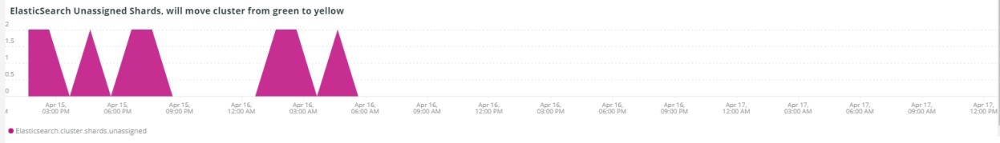

Les partitions non affectées font passer un cluster de l’état Vert à l’état Jaune.
