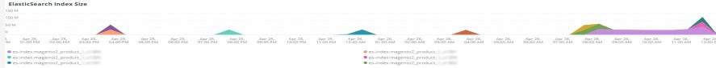

# Le [!UICONTROL Elasticsearch] tab

## [!UICONTROL Cluster Status Summary]:

Au cours de la période sélectionnée, la variable **[!UICONTROL Cluster Status Summary]** Le cadre affiche les états de couleur que la variable [!DNL Elasticsearch] le groupe est passé. Dans cet exemple, au cours de la période sélectionnée, la grappe était à l’état Vert une fois et à l’état Jaune une fois pendant la période sélectionnée.

## [!UICONTROL Active Primary Shards]

Le **[!UICONTROL Active Primary Shards]** Le cadre affiche les différents nombres en fonction du nombre de principaux et Principaux éclats pour le compte sélectionné. [!DNL Elasticsearch] service.

De [!DNL Elasticsearch]: Guide définitif [2.x]:

&quot;Dans [Indices pouvant être mis à jour dynamiquement](https://www.elastic.co/guide/en/elasticsearch/guide/2.x/dynamic-indices.html), nous avons expliqué qu’une partition est un index Lucene et qu’une [!DNL Elasticsearch] index est une collection de shards. Votre application parle à un index, et [!DNL Elasticsearch] achemine vos requêtes vers les éclats appropriés. Un éclat est l&#39;unité d&#39;échelle. Le plus petit index que vous pouvez avoir est un avec une seule partition. Cela peut être plus que suffisant pour vos besoins — un seul partage peut contenir beaucoup de données — mais cela limite votre capacité à évoluer.&quot;

Lorsqu’un index est créé, plusieurs shards sont créés avec cet index. Par défaut, cinq Principaux éclats sont attribués à chaque nouvel index, ce qui signifie qu’un index peut être réparti sur cinq noeuds (un partage par noeud). Il existe également des éclats de répliques. Il s’agit principalement du basculement. Les Secondaires peuvent servir des requêtes de lecture.

## [!UICONTROL Active Shards in Cluster]

Le **[!UICONTROL Active Shards in Cluster]** L’image affiche le nombre total de éclats Principal et de réplication dans une [!DNL Elasticsearch] grappe.

## [!UICONTROL Index health - this will show the index name and color status]

Cette image affiche le nom de l’index et le nombre d’états de la couleur de l’index. En faisant défiler le tableau vers le bas, vous verrez le même nom d’index avec les états de couleur Jaune et Rouge. Le nombre qui suit le nom de l’index 27 est le nombre de la couleur de l’état. S’il est égal à zéro, aucune instance de l’index ne se trouvait dans cet état de couleur pendant les périodes sélectionnées.

## [!UICONTROL Elasticsearch Status by node information]

Le **[!UICONTROL Elasticsearch Status by node information]** affiche la [!DNL Elasticsearch] état de la grappe par couleur et par noeud. Cela permet d’indiquer le noeud dans la variable [!DNL Elasticsearch] la grappe renvoie l’état au cours de la période sélectionnée.

## [!UICONTROL Elasticsearch index information]

Le **[!UICONTROL Elasticsearch index information]** Le tableau indique le nom de l’index, le noeud sur lequel il se trouve, le nombre de documents indexés, l’intégrité de l’index et la taille de l’index en Mo à un moment donné.

## [!UICONTROL Elasticsearch process CPU %]

Le **[!UICONTROL Elasticsearch process CPU %]** Le cadre affiche le pourcentage du processeur de processus par le [!DNL Elasticsearch] traiter sur la période sélectionnée.

## [!UICONTROL Elasticsearch Memory garbage collection]

[!DNL Elasticsearch] est un processus Java. Si la mémoire allouée est insuffisante, il déclenche le nettoyage de la mémoire pour libérer de la mémoire. Si le nettoyage de la mémoire est fréquent, cela indique qu’il peut y avoir trop d’index ou de partitions pour la mémoire allouée. Il peut y avoir une opportunité de nettoyer les indices et les éclats ou [!DNL Elasticsearch] peut nécessiter plus de mémoire.

## [!UICONTROL Elasticsearch Index information]

À mesure que les index sont créés et mis à jour, l’intégrité de l’index peut changer.

## [!UICONTROL Elasticsearch Index Size]

Le **[!UICONTROL Elasticsearch Index Size]** frame indique le nom et la taille de l’index pendant la période sélectionnée. Cela peut indiquer des problèmes liés à l’indexation d’un site.

## [!UICONTROL Elasticsearch Errors]

Le **[!UICONTROL Elasticsearch Errors]** frame affiche des erreurs avec [!DNL Elasticsearch] comme manquer d’espace, passer de l’état Jaune à l’état Rouge, lorsque tous les éclats échouent, en cas de problèmes de paramètres avec des recherches, des erreurs de version et lorsque tous les noeuds sont indisponibles.

## [!UICONTROL Elasticsearch Unassigned Shards]:

Les éclats non attribués entraînent le passage d’un cluster de l’état Vert à l’état Jaune.
