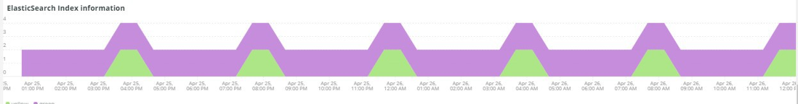

# Onglet [!UICONTROL Elasticsearch]

## [!UICONTROL Cluster Status Summary] :

Au cours de la période sélectionnée, l’image **[!UICONTROL Cluster Status Summary]** affiche les états de couleur que la grappe [!DNL Elasticsearch] a subis. Dans cet exemple, au cours de la période sélectionnée, la grappe était à l’état Vert une fois et à l’état Jaune une fois pendant la période sélectionnée.

## [!UICONTROL Active Primary Shards]

L’image **[!UICONTROL Active Primary Shards]** affiche les nombres différents en fonction du nombre de partages principaux actifs pour le service [!DNL Elasticsearch] du compte sélectionné.

De [!DNL Elasticsearch] : Le Guide définitif [2.x] :

&quot;Dans [Index à mise à jour dynamique](https://www.elastic.co/guide/en/elasticsearch/guide/2.x/dynamic-indices.html), nous avons expliqué qu’un partage est un index Lucene et qu’un index [!DNL Elasticsearch] est un ensemble de partitions. Votre application parle à un index et [!DNL Elasticsearch] achemine vos requêtes vers les éclats appropriés. Un éclat est l&#39;unité d&#39;échelle. Le plus petit index que vous pouvez avoir est un avec une seule partition. Cela peut être plus que suffisant pour vos besoins — un seul partage peut contenir beaucoup de données — mais cela limite votre capacité à évoluer.&quot;

Lorsqu’un index est créé, plusieurs shards sont créés avec cet index. Par défaut, cinq éclats principaux sont attribués à chaque nouvel index, ce qui signifie qu’un index peut être réparti sur cinq noeuds (un partage par noeud). Il existe également des éclats de répliques. Il s’agit principalement du basculement. Les shards de Secondaire peuvent servir des requêtes de lecture.

## [!UICONTROL Active Shards in Cluster]

L’image **[!UICONTROL Active Shards in Cluster]** indique le nombre total de partitions principales et de réplication dans une grappe [!DNL Elasticsearch].

## [!UICONTROL Index health - this will show the index name and color status]

Cette image affiche le nom de l’index et le nombre d’états de la couleur de l’index. En faisant défiler le tableau vers le bas, vous verrez le même nom d’index avec les états de couleur Jaune et Rouge. Le nombre qui suit le nom de l’index 27 est le nombre de la couleur de l’état. S’il est égal à zéro, aucune instance de l’index ne se trouvait dans cet état de couleur pendant les périodes sélectionnées.

## [!UICONTROL Elasticsearch Status by node information]

L’image **[!UICONTROL Elasticsearch Status by node information]** affiche l’état de la grappe [!DNL Elasticsearch] par couleur et par noeud. Cela permet d’indiquer quel noeud de la grappe [!DNL Elasticsearch] renvoie l’état au cours de la période sélectionnée.

## [!UICONTROL Elasticsearch index information]

La table **[!UICONTROL Elasticsearch index information]** indique le nom de l’index, le noeud sur lequel il se trouve, le nombre de documents indexés, l’intégrité de l’index et la taille de l’index en Mo à un moment donné.

## [!UICONTROL Elasticsearch process CPU %]

L’image **[!UICONTROL Elasticsearch process CPU %]** affiche le pourcentage du processeur du processus par le processus [!DNL Elasticsearch] sur la période sélectionnée.

## [!UICONTROL Elasticsearch Memory garbage collection]

[!DNL Elasticsearch] est un processus Java. Si la mémoire allouée est insuffisante, il déclenche le nettoyage de la mémoire pour libérer de la mémoire. Si le nettoyage de la mémoire est fréquent, cela indique qu’il peut y avoir trop d’index ou de partitions pour la mémoire allouée. Il peut y avoir une opportunité de nettoyer les indices et les éclats ou [!DNL Elasticsearch] peut avoir besoin de plus de mémoire.

## [!UICONTROL Elasticsearch Index information]

À mesure que les index sont créés et mis à jour, l’intégrité de l’index peut changer.

## [!UICONTROL Elasticsearch Index Size]

L’image **[!UICONTROL Elasticsearch Index Size]** indique le nom et la taille de l’index pendant la période sélectionnée. Cela peut indiquer des problèmes liés à l’indexation d’un site.

## [!UICONTROL Elasticsearch Errors]

L’image **[!UICONTROL Elasticsearch Errors]** affiche des erreurs avec [!DNL Elasticsearch], telles que le manque d’espace, le passage de l’état Jaune à l’état Rouge, lorsque tous les éclats échouent, en cas de problèmes de paramètres avec des recherches, des erreurs de version et lorsque tous les noeuds sont indisponibles.

## [!UICONTROL Elasticsearch Unassigned Shards] :

Les éclats non attribués entraînent le passage d’un cluster de l’état Vert à l’état Jaune.
