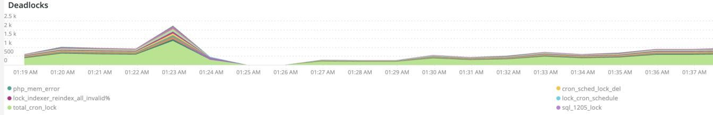

# La variable [!UICONTROL MySQL] tab

## [!UICONTROL MySQL% free storage by node]

De nombreux problèmes sont causés par le manque de stockage de MySQL dans le stockage affecté à MySQL (`datadir` Paramètre de configuration MySQL, la valeur par défaut est `/data/mysql`) ou la variable `tmpdir` manque d&#39;espace. Par défaut `tmpdir` (paramètre MySQL) est `/tmp`. La variable **[!UICONTROL MySQL% free storage by node]** regarde la `/, /tmp` (s’il est défini comme un montage distinct) et la variable `/data/mysql` pourcentage de stockage gratuit. À partir de la version 5.7 de MySQL (MariaDB version 10.2), sans compression `tmp` Les tableaux sont écrits dans une `tmp` tablespace dans le `/data/mysql` dans le fichier (ibtmp1). Par défaut, ce fichier se développe automatiquement sans limite. Comme il s’agit d’un tablespace, sa taille ne diminue pas et il est réinitialisé à 12 Mo au redémarrage de MySQL.

## [!UICONTROL MySQL Connections by Node]

La variable **[!UICONTROL MySQL Connections by Node]** frame indique les périodes de panne des noeuds de base de données ou un grand nombre de connexions.

## [!UICONTROL MySQL Node Summary]

La variable **[!UICONTROL MySQL Node Summary]** Le tableau affiche les détails du noeud de base de données, tels que la version logicielle et le type d’instance (taille).

## [!UICONTROL Galera Number of Nodes in cluster]

La variable **[!UICONTROL Galera Number of Nodes in cluster]** frame affiche les informations des journaux MySQL. Lorsque les noeuds se rejoignent et quittent une grappe, seuls les messages relatifs à la période sélectionnée s’affichent. Si un noeud quitte la grappe avant la période, aucun message n’existera pendant cette période. Si vous pensez que la base de données manque peut-être d’un noeud, définissez la période sur une période plus longue pour voir si des informations supplémentaires s’affichent. S’il existe des informations au cours de la période qui indiquent moins que tous les noeuds de la variable [!DNL Galera] développez la grappe, développez la période pour voir si vous pouvez déterminer quand le noeud a quitté la grappe.

## [!UICONTROL MySQL shutdowns and starts]

La variable **[!UICONTROL MySQL shutdowns and starts]** frame détecte lorsqu’un noeud est arrêté. La variable [!DNL Galera] Les noeuds seront expulsés et seront expulsés de la propriété [!DNL Galera] noeud . Cela entraîne généralement un redémarrage du service MySQL.

## [!UICONTROL Galera log]

La variable **[!UICONTROL Galera log]** frame affiche le nombre de signaux spécifiques provenant des journaux MySQL concernant [!DNL Galera] les noeuds, leurs états et les modifications d’état de la variable [!DNL Galera] grappe.

* &quot;%1047 WSREP n’a pas encore préparé le noeud pour l’application use%&quot;) comme &quot;node_not_prep_for_use&quot;
* &#39;%\[ERROR\] WSREP : échec de la lecture à partir de : wsrep_sst_xtrabackup-v2%&#39;) en tant que &#39;xtrabackup_read_fail&#39;
* &#39;%\[ERROR\] WSREP : processus terminé avec erreur : wsrep_sst_xtrabackup-v2 %&#39;) comme &#39;xtrabackup_compl_w_err&#39;
* &#39;%\[ERROR\] WSREP: rbr write fail%&#39;) comme &#39;rbr_write_fail&#39;
* &quot;%self-leave%&quot;) sous la forme &quot;usp_node&quot;
* &#39;%members = 3/3 (joint/total)%&#39;) as&#39;3of3&#39;
* &#39;%members = 2/3 (joint/total)%&#39;) as&#39;2of3&#39;
* &#39;%members = 2/2%) comme &quot;2of2&quot;
* &#39;%members = 1/2%&#39;) comme &quot;1of2&quot;
* &#39;%members = 1/3%&#39;) comme &quot;1of3&quot;
* &#39;%members = 1/1%) as &#39;1of1&#39;
* &#39;%\[Remarque\] /usr/sbin/mysqld (mysqld 10.%&#39;) as&#39;sql_restart&#39;
* &#39;%Quorum : aucun noeud avec l’état complet :%&#39;) comme &#39;no_node_count&#39;
* &#39;%WSREP: Member 0%&#39;) comme &#39;mem_0&#39;
* ’%WSREP: Member 1.0%’) as ’mem_1’
* &#39;%WSREP: Member 2%&#39;) as&#39;mem2&#39;
* &#39;%WSREP : synchronisé avec le groupe, prêt pour les connexions%&#39;) comme &quot;prêt&quot;
* &#39;%/usr/sbin/mysqld, Version:%&#39;) comme &#39;mysql_restart_mysql.ralenti&#39;
* &#39;%\[Remarque\] WSREP : nouvelle vue de grappe : état global :%&#39;) comme &#39;galera_cluster_view_chng&#39;

## [!UICONTROL Galera Log by Host]

La variable **[!UICONTROL Galera Log by Host]** est identique au **[!UICONTROL Galera log]** , mais il est divisé par noeud pour faciliter le dépannage.

## [!UICONTROL Database performance]

La variable **[!UICONTROL Database performance]** cadre affiche les performances de la base de données lors de requêtes spécifiques. Vous pouvez afficher chaque mesure en cliquant dessus dans les icônes colorées situées sous le graphique. Nombre des mesures mentionnées dans la section [Surveillance des performances de la base de données MySQL avec New Relic](https://newrelic.com/blog/how-to-relic/how-to-monitor-mysql) se trouvent dans ce cadre.

* average(query.queryPerSecond)
* average(query.lentQueriesPerSecond)
* average(db.createdTmpDiskTablesPerSecond)
* average(db.createdTmpFilesPerSecond)
* average(db.tablesLocksWaitedPerSecond)
* average(db.innodb.rowLockTimeAvg)
* average(db.innodb.rowLockWaitsPerSecond)

## [!UICONTROL Transaction Database Call Count]

La variable **[!UICONTROL Transaction Database Call Count]** frame indique le nombre d’appels de base de données effectués par chaque facette des transactions. Cela semble être axé sur les lignes et non sur les déclarations.

## [!UICONTROL Cron_schedule table updates]

La variable **[!UICONTROL Cron_schedule table updates]** frame affiche la durée maximale des mises à jour de la base de données dans la table cron_schedule pour la période sélectionnée.

## [!UICONTROL Slow Query Traces]

La variable **[!UICONTROL Slow Query Traces]** frame affiche le tableau et le type de requête où il existe des traces de requête lentes. Une trace de requête lente est créée pour les transactions de requête qui prennent plus de cinq secondes. Les requêtes de mise à jour sont importantes pour ce cadre. Si un tableau est mis à jour par `UPDATE`, `DELETE`, et `INSERT` , ils peuvent verrouiller des tables pendant une période donnée.

Même `SELECT` Les instructions peuvent verrouiller des lignes si elles sont utilisées avec FOR UPDATE.

## [!UICONTROL Datastore Operations tables]

## [!UICONTROL Cron table change]

La variable **[!UICONTROL Cron table change]** frame recherche les messages d’erreur &quot;impossible d’acquérir lock for cron job:&quot;, ainsi qu’une erreur de mémoire PHP spécifique et des verrous impliquant le bloc `cron_schedule` table. Si la variable `cron_schedule` est verrouillée (par exemple, par un `DELETE` s’exécutant contre), elle bloquera l’exécution d’autres crons.

## [!UICONTROL Deadlocks]

La variable **[!UICONTROL Deadlocks]** frame examine les chaînes suivantes analysées à partir des journaux MySQL :

* &#39;%PHP Erreur fatale : taille de mémoire autorisée de%&#39;) en tant que php_mem_error
* ’%get lock; try redémarrer la transaction, la requête était : DELETE À PARTIR de \`cron_schedule%&#39;) comme cron_sched_lock_del
* &#39;% lock pour la tâche cron : indexer_reindex_all_invalid%&#39;) comme &#39;lock_indexer_reindex_all_invalid%&#39;
* &#39;% lock pour la tâche cron : cron_schedule%&#39;) comme &#39;lock_cron_schedule&#39;
* &#39;% lock pour la tâche cron:%&#39;) comme &#39;total_cron_lock&#39;
* &quot;%Erreur générale : délai d’attente du verrouillage 1205 dépassé%&quot;) comme &quot;sql_1205_lock&quot;
* &#39;%ERROR 1213 (40001) : cadenas trouvé lors de la tentative de verrouillage%&#39;) en tant que &#39;sql_1213_lock&#39;
* &#39;%SQLSTATE[40001]: échec de la sérialisation : 1213 (cadenas trouvé%) en tant que &#39;sql_1213_lock2&#39;
* &#39;% lock pour la tâche cron : indexer_update_all_views%&#39;) comme &#39;lock_indexer_update_all_views&#39;
* &#39;% lock pour la tâche cron : sales_grid_order_facture_async_insert%&#39;) en tant que &#39;lock_sales_grid_order_facture_async_insert&#39;,
* &#39;% lock pour la tâche cron : staging_remove_update%&#39;) en tant que &#39;lock_staging_remove_updated&#39;
* &quot;% de verrouillage pour la tâche cron : sales_grid_order_shipping_async_insert%&quot;) comme &quot;lock_sales_grid_order_shipping_async_insert&quot;
* &#39;% lock pour la tâche cron : amazon_payments_process_queue_remboursements%&#39;) as &#39;lock_amazon_payments_process_queue_remboursements&#39;
* &quot;% de verrouillage pour la tâche cron : sales_send_order_shipping_emails%&quot;) comme &quot;lock_sales_send_order_shipping_emails&quot;
* &quot;% de verrouillage pour la tâche cron : staging_synchronize_entities_period%&quot;) comme &quot;lock_staging_synchronize_entities_period&quot;
* &#39;% lock pour la tâche cron : indexer_clean_all_changelogs%&#39;) comme &#39;lock_indexer_clean_all_changelogs&#39;
* &#39;% lock pour la tâche cron : magento_targetrule_index_reindex%&#39;) comme &#39;lock_magento_targetrule_index_reindex&#39;
* &quot;% de verrouillage pour la tâche cron : newsletter_send_all%&quot;) comme &quot;lock_newsletter_send_all&quot;
* &quot;% de verrouillage pour la tâche cron : newsletter_send_all%&quot;) comme &quot;lock_newsletter_send_all&quot;
* &#39;% de verrouillage pour la tâche cron : sales_send_order_emails%&#39;) comme &#39;lock_sales_send_order_emails&#39;
* &#39;% de verrouillage pour la tâche cron : sales_send_order_creditmemo_emails%&#39;) comme &#39;lock_sales_send_order_creditmemo_emails&#39;
* &#39;% de verrouillage pour la tâche cron : sales_grid_order_creditmemo_async_insert%&#39;) comme &#39;lock_sales_grid_order_creditmemo_async_insert&#39;
* &#39;% lock pour la tâche cron : bulk_cleanup%&#39;) as &#39;lock_bulk_cleanup&#39;
* &quot;% de verrouillage pour la tâche cron : flush_preview_quotas%&quot;) en tant que &quot;lock_flush_preview_quotas&quot;
* &quot;% de verrouillage pour la tâche cron : sales_send_order_factures_emails%&quot;) comme &quot;lock_sales_send_order_factures_emails&quot;
* &quot;% de verrouillage pour la tâche cron : sales_send_order_factures_emails%&quot;) comme &quot;lock_sales_send_order_factures_emails&quot;
* &#39;% de verrouillage pour la tâche cron : captcha_delete_expirée_images%&#39;) comme &#39;lock_captcha_delete_expirée_images&#39;
* &#39;% lock pour la tâche cron : magento_newrelicreporting_cron%&#39;) comme &#39;lock_magento_newrelicreporting_cron&#39;
* &quot;% de verrouillage pour la tâche cron : obsolète_authentication_failures_cleanup%&quot;) en tant que &quot;lock_outdate_authentication_failures_cleanup&quot;
* &#39;% lock pour la tâche cron : send_notification%&#39;) comme &#39;lock_send_notification&#39;
* &quot;% pour la tâche cron : magento_giftcardaccount_generage_codes_pool%&quot;) comme &quot;lock_magento_giftcardaccount_generage_codes_pool&quot;
* &quot;% de verrouillage pour la tâche cron : catalog_product_frontend_actions_flush%&quot;) comme &quot;lock_catalog_product_frontend_actions_flush&quot;
* &#39;% lock pour la tâche cron : mysqlmq_clean_messages%&#39;) comme &#39;mysqlmq_clean_messages&#39;
* &quot;% de verrouillage pour la tâche cron : catalog_product_attribute_value_synchronize%&quot;) en tant que &quot;lock_catalog_product_attribute_value_synchronize&quot;
* &quot;% de verrouillage pour la tâche cron : ddg_automatisation_importer%&quot;) en tant que &quot;lock_ddg_automatisation_importer&quot;
* &quot;% de verrouillage pour la tâche cron : ddg_automatisation_review_and_vovovotreliste%&quot;) comme &quot;lock_ddg_automatisation_review_and_vovotreliste&quot;
* &#39;% de verrouillage pour la tâche cron : captcha_delete_old_tries%&#39;) comme &#39;lock_captcha_delete_old_tries&#39;
* &quot;% de verrouillage pour la tâche cron : catalog_product_obsolète_price_values_cleanup%&quot;) en tant que &quot;lock_catalog_product_obsolète_price_values_cleanup&quot;
* &#39;% lock pour la tâche cron : consumer_runner%&#39;) as &#39;lock_consumer_runner&#39;
* &quot;% de verrouillage pour la tâche cron : ddg_automatisation_customer_subscriber_guest_sync%&quot;) en tant que &quot;lock_ddg_automatisation_customer_subscriber_guest_sync&quot;
* &#39;% de verrouillage pour la tâche cron : get_amazon_capture_update%&#39;) en tant que &#39;lock_get_amazon_capture_updated&#39;
* &#39;% de verrouillage pour la tâche cron : get_amazon_authorization_releases%&#39;) en tant que &#39;lock_send_get_amazon_authorization_releases&#39;
* &#39;% lock pour la tâche cron : temando_process_platform_events%&#39;) comme &#39;lock_temando_process_platform_events&#39;
* &#39;% lock pour la tâche cron : ddg_automatisation_status%&#39;) as &#39;lock_ddg_automatisation_status&#39;
* &#39;% lock pour la tâche cron : ddg_automatisation_status%&#39;) as &#39;lock_ddg_automatisation_status&#39;
* &#39;% de verrouillage pour la tâche cron : sales_clean_orders%&#39;) en tant que &#39;lock_sales_clean_orders&#39;
* &quot;% de verrouillage pour la tâche cron : catalog_index_refresh_price%&quot;) comme &quot;lock_catalog_index_refresh_price&quot;
* &#39;% de verrouillage pour la tâche cron : magento_récompense_balance_warning_notification%&#39;) comme &#39;lock_magento_récompento_balance_warning_notification&#39;
* &#39;% lock pour la tâche cron : analytics_update%&#39;) en tant que &#39;lock_analytics_update&#39;
* &#39;% lock pour la tâche cron : messagequeue_clean_outdate_locks%&#39;) as &#39;lock_messagequeue_clean_outdate_locks&#39;
* &#39;% lock pour la tâche cron : messagequeue_clean_outdate_locks%&#39;) as &#39;lock_messagequeue_clean_outdate_locks&#39;
* &#39;% lock pour la tâche cron : staging_apply_version%&#39;) as &#39;lock_staging_apply_version&#39;
* &quot;% de verrouillage pour la tâche cron : magento_récompense_expire_points%&quot;) comme &quot;lock_magento_récompento_expire_points&quot;
* &quot;% de verrouillage pour la tâche cron : yotpo_yotpo_orders_sync%&quot;) comme &quot;lock_yotpo_yotpo_orders_sync&quot;
* &quot;% de verrouillage pour la tâche cron : catalog_event_status_checker%&quot;) comme &quot;lock_catalog_event_status_checker&quot;
* &quot;% de verrouillage pour la tâche cron : ddg_automatisation_campaign%&quot;) comme &quot;lock_ddg_automatisation_campaign&quot;
* &quot;% lock pour la tâche cron : visitor_clean%&quot;) comme &quot;lock_visitor_clean&quot;
* &#39;% lock pour la tâche cron : connector_verify_website%&#39;) as &#39;lock_connector_verify_website&#39;
* &quot;% de verrouillage pour la tâche cron : ddg_automatisation_email_templates%&quot;) comme &quot;lock_ddg_automatisation_email_templates&quot;
* &quot;% de verrouillage pour la tâche cron : aggregate_sales_report_order_data%&quot;) comme &quot;lock_aggregate_sales_report_order_data&quot;
* &#39;% lock pour la tâche cron : ddg_automatisation_catalog_sync%&#39;) en tant que &#39;lock_ddg_automatisation

## [!UICONTROL DB Statistics]

La variable **[!UICONTROL DB Statistics]** frame affiche des suppressions, écritures, lignes lues, mises à jour et requêtes lentes par seconde.

## [!UICONTROL Request frequency]

## [!UICONTROL Database Errors]

La variable **[!UICONTROL Database Errors]** cadre affiche une grande variété de base de données [avertissements et erreurs](https://mariadb.com/kb/en/mariadb-error-codes/):

* La taille de mémoire allouée à la table temporaire est de plus de 20 % de innodb_buffer_pool_size% en tant que &#39;temp_tbl_buff_pool&#39;
* &#39;%\[ERROR\] WSREP: rbr write fail%&#39;) comme &#39;rbr_write_fail&#39;
* &#39;%mysqld : disque plein%&#39;) comme &#39;disque_plein&#39;
* &quot;%Error number 28%&quot;) as &#39;err_28&#39;
* &quot;%rollback%&quot;) comme &quot;rollback&quot;
* &quot;%Contrainte de clé étrangère échoue pour table%&quot;) en tant que &quot;contrainte_clé_étrangère&quot;
* &#39;%Error_code: 114%&#39;) as &#39;sql_1114_full&#39;%CRITICAL: SQLSTATE[HY00] [2006] Le serveur MySQL a disparu&quot;) comme &quot;sql_gone&quot;
* &#39;%SQLSTATE[HY00] [1040] Trop de connexions%) comme &#39;sql_1040&#39;
* &#39;%CRITICAL: SQLSTATE[HY00] [2002]%&#39;) comme &quot;sql_2002&quot;
* &#39;%SQLSTATE[08S01]:%) comme &quot;sql_1047&quot;
* &#39;%[Avertissement] Abandon de la connexion%) en tant que &quot;aborted_conn&quot;
* &#39;%SQLSTATE[23 000]: violation de contrainte d’intégrité :%) en tant que &#39;sql_23000&#39;
* &quot;%1205 Verrouillage Délai d’attente d’attente %&quot;) en tant que &quot;sql_1205&quot;
* &#39;%SQLSTATE[HY00] [1049] Base de données inconnue%) comme &#39;sql_1049&#39;
* &#39;%SQLSTATE[42S02]: table de base ou vue introuvable :%) en tant que &#39;sql_42S02&#39;
* &#39;%Erreur générale : 114%&#39;) en tant que &#39;sql_1114&#39;
* &#39;%SQLSTATE[40001]%&#39;) comme &quot;sql_1213&quot;
* &#39;%SQLSTATE[42S22]: colonne introuvable : 1054 (colonne inconnue %) en tant que &quot;sq1_1054&quot;
* &#39;%SQLSTATE[42000]: erreur de syntaxe ou violation d’accès :%&#39;) as&#39;sql_42000&#39;
* &#39;%SQLSTATE[21 000]: violation de cardinalité :%) comme &#39;sql_1241&#39;
* &#39;%SQLSTATE[2003]:%) comme &quot;sql_22003&quot;
* &#39;%SQLSTATE[HY00] [9 000] Client avec l’adresse IP%) comme &quot;sql_9000&quot;
* &#39;%SQLSTATE[HY00]: Erreur générale : 2014%) en tant que &#39;sql_2014&#39;
* &quot;%1927 La connexion a été tuée%&quot;) en tant que &quot;sql_1927&quot;
* &#39;%1062 \[ERROR\] InnoDB:%&#39;) en tant que &#39;sql_1062_e&#39;
* &#39;&#39;%[Remarque] WSREP : vidage de la carte mémoire sur le disque..%) en tant que &quot;mem_map_flush&quot;.
* &#39;%Code d’erreur interne MariaDB : 1146%&#39;) en tant que &#39;sql_1146&#39;
* &#39;%Code d’erreur interne MariaDB : 1062%&#39;) comme &#39;sql_1062&#39; * ’%1062 [Avertissement] InnoDB :%) comme &#39;sql_1062_w&#39;
* &#39;%Code d’erreur interne MariaDB : 1064%&#39;) en tant que &#39;sql_1064&#39;
* &#39;%InnoDB : échec de l’affirmation dans le fichier%&#39;) en tant que &#39;assertion_err&#39;
* &#39;%mysqld_safe Nombre de processus en cours d’exécution : 0 %&#39;) en tant que &#39;mysql_oom&#39;
* &#39;%\[ERROR\] mysqld a reçu signal%&#39;) comme &#39;mysql_sigterm&#39;
* &quot;%1452 Impossible d’ajouter%&quot;) comme &quot;sql_1452&quot;
* &#39;%ERROR 1698%&#39;) en tant que &#39;sql_1698&#39;
* &#39;%SQLSTATE[HY00]: Erreur générale : 3 %) sous la forme &quot;cnt_write_tmp&quot;
* &#39;%Erreur générale : 1 %&#39;) en tant que &#39;sql_syntaxe&#39;
* &#39;%42S22%&#39;) en tant que &#39;sql_42S22&#39;
* ’%InnoDB: erreur (clé en double)%) en tant que ’innodb_dup_key’ DES HORODATAGES DU journal

## [!UICONTROL DB Error Table]

La variable **[!UICONTROL DB Error Table]** Le cadre affiche les mêmes informations que le **[!UICONTROL Database Errors]** , mais vous pouvez le voir par noeud et dans un format de tableau. Voir [Codes d’erreur MariaDB](https://mariadb.com/kb/en/mariadb-error-codes/) pour plus d’informations.

## [!UICONTROL Database Traces]

La variable **[!UICONTROL Database Traces]** affiche les traces de la base de données par type dans la chronologie sélectionnée.

## [!UICONTROL Database processes]

La variable **[!UICONTROL Database processes]** frame affiche les processus de base de données, les environnements et les identifiants de noeud.

## [!UICONTROL MySQL Non-Sleeping Threads by Node]

La variable **[!UICONTROL MySQL Non-Sleeping Threads by Node]** affiche les threads de connexion à la base de données. Ce cadre affiche les threads actifs.

## [!UICONTROL MySQL Running and Sleeping Threads by environment]

La variable **[!UICONTROL MySQL Running and Sleeping Threads by environment]** frame affiche les connexions actives et en veille à la base de données. S&#39;il y a des connexions à la base de données où des requêtes lentes sont mises en veille, il y aura des connexions de sommeil. Les connexions persistantes peuvent être des requêtes de base de données bloquées par des lignes ou des tables verrouillées. Ces connexions endormies maintiennent aussi des connexions de travail PHP.

## [!UICONTROL MySQL mem used by node]

La variable **[!UICONTROL MySQL mem used by node]** frame affiche l’utilisation de la mémoire par les noeuds par MySQL. Sur les sites plus volumineux, cette image peut être composée de barres continues avec une valeur en Go de mémoire utilisée.

## [!UICONTROL Database mysql-slow.log]

La variable **[!UICONTROL Database mysql-slow.log]** Le cadre affiche les types d’instructions de requête qui se trouvaient dans la variable `mysql-slow.log` sur la période sélectionnée.
