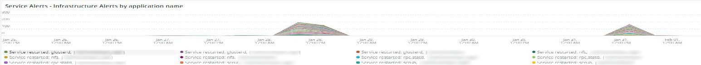
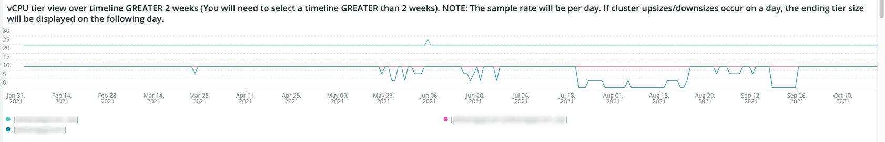
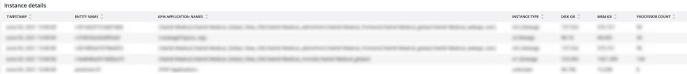
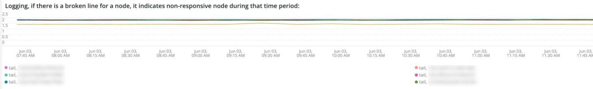

# Onglet [!DNL Infra]

L’onglet **[!DNL Infra]** isole les problèmes et les causes des problèmes d’infrastructure. Vous trouverez plus loin la description des images visibles dans l’onglet.

## [!UICONTROL Service Alerts – Infrastructure Alerts by Application name]

Le graphique **[!UICONTROL Service Alerts – Infrastructure Alerts by Application name]** affiche les alertes de service collectées par l’agent d’infrastructure [!DNL New Relic]. Elle affiche les redémarrages du service, dont beaucoup sont associés aux déploiements.

## [!UICONTROL Inode usage by mount]

L’image **[!UICONTROL Inode usage by mount]** affiche [!DNL inode] utilisation par montage sur la période sélectionnée. Même s’il peut y avoir beaucoup de stockage disponible, si un nœud est à court de [!DNL inodes], il affichera un manque de stockage disponible. La suppression de fichiers (en particulier les petits fichiers) libère de l’espace et [!DNL inodes] rend disponible.

## [!UICONTROL vCPU tier view over timeline GREATER 2 weeks]

La période **[!UICONTROL vCPU tier view over timeline GREATER 2 weeks]** affiche la vue de niveau processeur virtuel sur la période sélectionnée de plus de deux semaines. Cette image examine le nombre de vCPU affectées au nom d’application [!DNL New Relic] affiché.

## [!UICONTROL vCPU tier view over timeline]

L’image **[!UICONTROL vCPU tier view over timeline]** affiche la vue de niveau processeur virtuel sur la période sélectionnée de plus de 24 heures. Cette image examine le nombre de vCPU affectées au nom d’application [!DNL New Relic] affiché. Elle affiche à la fois les tailles supérieures et inférieures des clusters.

## [!UICONTROL vCPU tier view over timeline BY NODE]

L’image **[!UICONTROL vCPU tier view over timeline BY NODE]** affiche les vues de niveau processeur virtuel sur la période sélectionnée par nœud. Cette image est utile pour détecter la perte de nœud(s) ou lorsque les nœuds sont surdimensionnés ou réduits. La vue au niveau du processeur virtuel sur la chronologie BY NODE doit afficher une chronologie INFÉRIEURE à 24 heures.

## [!UICONTROL Instance details]

Le tableau **[!UICONTROL Instance details]** affiche les détails des instances de chaque application [!DNL New Relic].

## [!UICONTROL Logging, if there is a broken line for a node, it indicates non-responsive node during that time period]

L’image **[!UICONTROL Logging, if there is a broken line for a node, it indicates non-responsive node during that time period]** affiche les nœuds qui ne répondent pas sur une période donnée.
