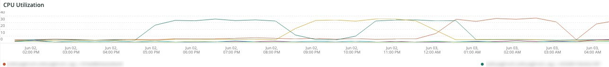

# Onglet [!DNL QuickView]

L’onglet **[!UICONTROL QuickView]** décrit les différents types d’alertes que vous pouvez voir, y compris celles concernant une faible cadence de disque et une utilisation insuffisante du serveur. On décrit en outre les cadres de la languette.

## [!UICONTROL Alerts]

Le cadre **[!UICONTROL Alerts]** affiche différentes alertes, y compris des avertissements d’espace disque et des alertes d’utilisation du serveur pendant une période sélectionnée. Ce cadre examine les opérations des tables de base de données, y compris les `SELECT`, les `DELETE` et les `UPDATE` sur une période sélectionnée.

## [!UICONTROL Upsize / Downsize by node]

Le cadre **[!UICONTROL Upsize / Downsize by node]** affiche les hausses et les baisses de taille par nœud sur une période sélectionnée. Permet d’évaluer s’il y a eu un changement de taille du cluster au cours de la période sélectionnée.

## [!UICONTROL CPU Utilization]

Le cadre **[!UICONTROL CPU Utilization]** affiche l’utilisation du CPU par les nœuds sur la période sélectionnée.
