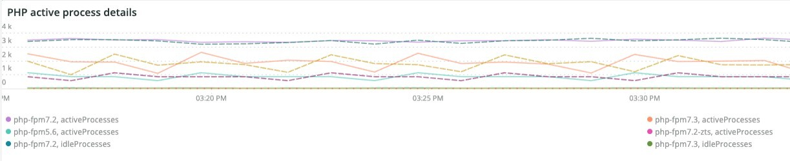
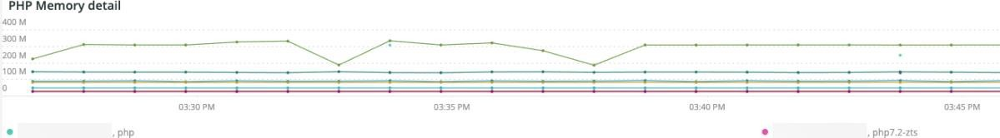

# Le [!UICONTROL PHP] tab

Le **PHP** L’onglet présente les problèmes de processus PHP pour fournir une analyse plus approfondie des problèmes PHP.

## [!UICONTROL PHP active process details]

Le **[!UICONTROL PHP active process details]** frame affiche les processus PHP, y compris php-fpm, pendant la période sélectionnée.

## [!UICONTROL PHP process load (# of PHP processes and % of CPU load)]

Le **[!UICONTROL PHP process load (# of PHP processes and % of CPU load)]** image affiche la charge du processeur des processus PHP-FPM pendant la période sélectionnée.

## [!UICONTROL PHP Memory detail]

Le **[!UICONTROL PHP Memory detail]** frame affiche l’utilisation de la mémoire des processus PHP pendant la période sélectionnée.

## [!UICONTROL PHP CPU Utilization]

Le **[!UICONTROL PHP CPU Utilization]** image affiche le pourcentage d’utilisation du processeur des processus PHP sur la période sélectionnée.

## [!UICONTROL PHP Process states]

Le **[!UICONTROL PHP Process states]** frame affiche les états du processus PHP pendant la période sélectionnée. Il s’affiche lorsque les processus PHP s’arrêtent et redémarrent. Attention aux processus PHP terminés qui n’affichent pas de redémarrages.

* &#39;%REMARQUE : Arrêt en cours ...%&#39;) comme &quot;php_term&quot;
* &#39;% AVIS : sortie, adieu !%&#39;) comme &quot;php_exit&quot;
* &#39;% AVIS : fpm est en cours d’exécution, pid%) comme &quot;fpm_start&quot;
* &#39;%REMARQUE : Prêt à gérer les connexions%) comme &quot;php_ready&quot;

## [!UICONTROL PHP Errors]

Le **[!UICONTROL PHP Errors]** frame affiche le nombre d’erreurs de traitement PHP pendant la période sélectionnée. Les messages d’erreur analysés et affichés incluent :

* &#39;%worker_connections n’est pas suffisant%&#39;) comme &#39;worker&#39;
* &#39;%PHP Erreur fatale : Taille de mémoire autorisée !%&#39;) comme &quot;mem_size&quot;
* &#39;%exited sur le signal 11 (SIGSEGV)%&#39;) en tant que &#39;sig_11&#39;
* &#39;%exited sur le signal 7 (SIGBUS%&#39;) en tant que &#39;sig_7&#39;
* &#39;%augmentation pm.start_servers%&#39;) en tant que &#39;pmstart_servers&#39;
* &#39;%max_children%&#39;) comme &#39;max_children_cnt&#39;
* &#39;%PHP Erreur fatale : Taille de mémoire autorisée de %) comme &quot;mem_exhst_coun&quot;
* &quot;%Impossible d’allouer de la mémoire pour pool%&quot;) en tant que &quot;opc_mem_count&quot;
* &#39;%Warning Interned string buffer overflow%&#39;) as &#39;opc_str_buf&#39;
* &#39;%Chaîne non autorisée offsetl%&#39;) comme &#39;opc_sv_comments&#39;
* &#39;%PHP Erreur fatale : RedisException non intercepté : erreur de lecture sur connection%) en tant que &quot;php_exc&quot;

## [!UICONTROL PHP processes count]

Le **[!UICONTROL PHP processes count]** frame affiche un nombre de processus PHP sur la période sélectionnée.

## [!UICONTROL Database Errors]

Le **[!UICONTROL Database Errors]** cadre affiche les erreurs de la base de données pendant la période sélectionnée. Les erreurs analysées sont les suivantes :

* &quot;%Taille de mémoire allouée à la table temporaire est supérieure à 20 % de innodb_buffer_pool_size%&quot;) en tant que &quot;temp_tbl_buff_pool&quot;
* &#39;%\[ERROR\] WSREP: rbr write fail%) as &#39;rbr_write_fail&#39;
* &#39;%mysqld: Disk full%) as &#39;disk_full&#39;
* &quot;%Error number 28%&quot;) as &#39;err_28&#39;
* &quot;%rollback%&quot;) comme &quot;rollback&quot;
* &quot;%Contrainte de clé étrangère échoue pour table%&quot;) en tant que &quot;contrainte_clé_étrangère&quot;
* ’%Error_code: 1114%) en tant que &#39;sql_1114_full&#39;
* &#39;%CRITICAL: SQLSTATE[HY000] [2006] Le serveur MySQL a disparu&quot;) comme &quot;sql_gone&quot;
* &#39;%SQLSTATE[HY000] [1040] Trop de connexions%) comme &#39;sql_1040&#39;
* &#39;%CRITICAL: SQLSTATE[HY000] [2002]%&#39;) comme &quot;sql_2002&quot;
* &#39;%SQLSTATE[08S01]:%) comme &quot;sql_1047&quot;
* &#39;%[Avertissement] Abandon de la connexion%) en tant que &quot;aborted_conn&quot;
* &#39;%SQLSTATE[23 000]: Violation de contrainte d’intégrité :%) en tant que &quot;sql_23000&quot;
* &quot;%1205 Verrouillage Délai d’attente d’attente %&quot;) en tant que &quot;sql_1205&quot;
* &#39;%SQLSTATE[HY000] [1049] Base de données inconnue%) en tant que &#39;sql_1049&#39;
* &#39;%SQLSTATE[42S02]: Table ou vue de base introuvable :%) en tant que &#39;sql_42S02&#39;
* &#39;%General error: 1114%) en tant que &#39;sql_1114&#39;
* &#39;%SQLSTATE[40001]%&#39;) comme &quot;sql_1213&quot;
* &#39;%SQLSTATE[42S22]: Colonne introuvable : 1054 Unknown column%) as &#39;sq1_1054&#39;
* &#39;%SQLSTATE[42000]: Erreur de syntaxe ou violation d’accès :%) en tant que &#39;sql_42000&#39;
* &#39;%SQLSTATE[21 000]: Violation de cardinalité :%) comme &#39;sql_1241&#39;
* &#39;%SQLSTATE[2003]:%) comme &quot;sql_22003&quot;
* &#39;%SQLSTATE[HY000] [9 000] Client avec l’adresse IP%) comme &quot;sql_9000&quot;
* &#39;%SQLSTATE[HY000]: Erreur générale : 2014%) en tant que &quot;sql_2014&quot;
* &quot;%1927 La connexion a été tuée%&quot;) en tant que &quot;sql_1927&quot;
* &#39;%1062 \[ERROR\] InnoDB:%&#39;) en tant que &#39;sql_1062_e&#39;
* &#39;%[Remarque] WSREP : Purge de la carte mémoire sur le disque...%) comme &quot;mem_map_flush&quot;
* Code d’erreur ‘%Internal MariaDB : 1146%) en tant que &#39;sql_1146&#39;
* Code d’erreur ‘%Internal MariaDB : 1062%) comme &quot;sql_1062&quot; * ’%1062 [Avertissement] InnoDB:%) en tant que &#39;sql_1062_w&#39;
* Code d’erreur ‘%Internal MariaDB : 1064%) comme &quot;sql_1064&quot;
* ’%InnoDB: Échec de l’affirmation dans le fichier%) en tant que &quot;assertion_err&quot;
* ’%mysqld_safe Nombre de processus en cours d’exécution : 0%) comme &quot;mysql_oom&quot;
* &#39;%\[ERROR\] mysqld a reçu signal%&#39;) comme &#39;mysql_sigterm&#39;
* &quot;%1452 Impossible d’ajouter%&quot;) en tant que &quot;sql_1452&quot;
* &#39;%ERROR 1698%&#39;) en tant que &#39;sql_1698&#39;
* &#39;%SQLSTATE[HY000]: Erreur générale : 3 %) comme &quot;cnt_write_tmp&quot;
* &#39;%General error: 1 %&#39;) comme &#39;sql_syntaxe&#39;
* &#39;%42S22%&#39;) en tant que &#39;sql_42S22&#39;
* ’%InnoDB: Erreur (clé en double)%) en tant que &#39;innodb_dup_key&#39;

## [!UICONTROL Database traces]

Le **[!UICONTROL Database traces]** frame affiche les informations de suivi de la base de données. Ce cadre s’aligne sur la vue Synthèse des transactions de l’APM pour la chronologie sélectionnée.

## [!UICONTROL Database mysql-slow.log]

Le **[!UICONTROL Database mysql-slow.log]** Le cadre affiche les types d’instructions de requête qui se trouvaient dans la variable `mysql-slow.log` sur la période sélectionnée.
