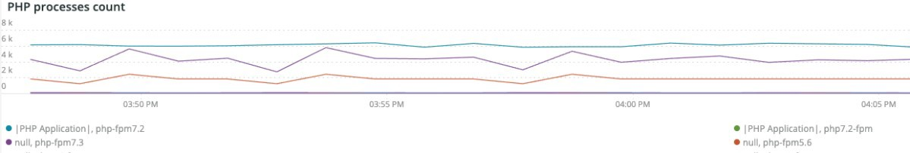

# Onglet [!UICONTROL PHP]

L&#39;onglet **PHP** montre les problèmes de processus PHP pour fournir une analyse plus approfondie des problèmes PHP.

## [!UICONTROL PHP active process details]

Le cadre **[!UICONTROL PHP active process details]** montre les processus PHP, y compris php-fpm, sur la période sélectionnée.

## [!UICONTROL PHP process load (# of PHP processes and % of CPU load)]

Le cadre **[!UICONTROL PHP process load (# of PHP processes and % of CPU load)]** montre la charge de CPU des processus PHP-FPM sur la période sélectionnée.

## [!UICONTROL PHP Memory detail]

L&#39;image **[!UICONTROL PHP Memory detail]** montre l&#39;utilisation de la mémoire des processus PHP sur la période sélectionnée.

## [!UICONTROL PHP CPU Utilization]

Le cadre **[!UICONTROL PHP CPU Utilization]** montre le pourcentage d&#39;utilisation des processus PHP par CPU sur la période sélectionnée.

## [!UICONTROL PHP Process states]

Le cadre **[!UICONTROL PHP Process states]** montre les états du processus PHP sur la période sélectionnée. Il s&#39;affiche lorsque les processus PHP s&#39;arrêtent et redémarrent. Attention aux processus PHP terminés qui n&#39;affichent pas de redémarrage.

* &#39;%REMARQUE : arrêt en cours ...%&#39;) en tant que &#39;php_term&#39;
* &#39;% REMARQUE : sortie, bye-bye !%&#39;) comme &#39;php_exit&#39;
* &#39;% REMARQUE : fpm est en cours d&#39;exécution, pid%&#39;) as &#39;fpm_start&#39;
* &#39;%NOTICE: ready to handle connections%&#39;) as &#39;php_ready&#39;

## [!UICONTROL PHP Errors]

Le cadre **[!UICONTROL PHP Errors]** affiche le nombre d&#39;erreurs de programme de travail PHP sur la période sélectionnée. Les messages d’erreur analysés et affichés sont les suivants :

* &#39;%worker_connections are not enough%&#39;) as &#39;worker&#39;
* &#39;%Erreur fatale PHP : taille de la mémoire autorisée !%&#39;) as &#39;mem_size&#39;
* &#39;%exited on signal 11 (SIGSEGV)%&#39;) as &#39;sig_11&#39;
* &#39;%exited on signal 7 (SIGBUS)%&#39;) as &#39;sig_7&#39;
* &#39;%increased pm.start_servers%&#39;) as &#39;pmstart_serv&#39;
* &#39;%max_children%&#39;) comme &#39;max_children_cnt&#39;
* &#39;%PHP Erreur fatale : taille de la mémoire autorisée de%&#39;) comme &#39;mem_export_count&#39;
* &#39;%Impossible d&#39;allouer de la mémoire pour le pool%&#39;) comme &#39;opc_mem_count&#39;
* &#39;%Warning Interned string buffer overflow%&#39;) as &#39;opc_str_buf&#39;
* &#39;%Offset de chaîne non autorisé%&#39;) en tant que &#39;opc_sv_comments&#39;
* &#39;%Erreur fatale PHP : RedisException non trouvée : erreur de lecture sur la connexion%&#39;) comme &#39;php_exc&#39;

## [!UICONTROL PHP processes count]

Le cadre **[!UICONTROL PHP processes count]** montre le nombre de processus PHP sur la période sélectionnée.

## [!UICONTROL Database Errors]

La période **[!UICONTROL Database Errors]** affiche les erreurs de base de données sur la période sélectionnée. Les erreurs analysées sont les suivantes :

* &#39;%La taille de la mémoire allouée à la table temporaire est supérieure à 20 % de innodb_buffer_pool_size%&#39;) en tant que &#39;temp_tbl_buff_pool&#39;
* &#39;%\[ERROR\] WSREP : échec d’écriture rbr%&#39;) as &#39;rbr_write_fail&#39;
* &#39;%mysqld: Disque plein%&#39;) comme &#39;disk_full&#39;
* &#39;%Error number 28%&#39;) as &#39;err_28&#39;
* &#39;%rollback%&#39;) comme &#39;rollback&#39;
* &#39;%Foreign key_constraint échoue pour la table%&#39;) en tant que &#39;foreign_key_constraint&#39;
* &#39;%Error_code: 1114%&#39;) as &#39;sql_1114_full&#39;
* &#39;%CRITICAL : SQLSTATE[HY000] [2006] MySQL Server a disparu%&#39;) comme &#39;sql_gone&#39;
* &#39;%SQLSTATE[HY000] [1040] Trop de connexions%&#39;) comme &#39;sql_1040&#39;
* &#39;%CRITICAL : SQLSTATE[HY000] [2002]%&#39;) as &#39;sql_2002&#39;
* &#39;%SQLSTATE[08S01]:%&#39;) as &#39;sql_1047&#39;
* &#39;%[Warning] Abandon de la connexion%&#39;) comme &#39;aborted_conn&#39;
* &#39;%SQLSTATE[23000] : violation de contrainte d&#39;intégrité :%&#39;) as &#39;sql_23000&#39;
* &#39;%1205 Verrouiller le délai d&#39;attente%&#39;) comme &#39;sql_1205&#39;
* &#39;%SQLSTATE[HY000] [1049] Base de données inconnue%&#39;) en tant que &#39;sql_1049&#39;
* &#39;%SQLSTATE[42S02] : table ou vue de base introuvable :%&#39;) comme &#39;sql_42S02&#39;
* « %Erreur générale : 1114 % ») comme « sql_1114 »
* &#39;%SQLSTATE[40001]%&#39;) comme &#39;sql_1213&#39;
* &#39;%SQLSTATE[42S22] : colonne introuvable : 1054 colonne inconnue (%) en tant que &#39;sq1_1054&#39;
* &#39;%SQLSTATE[42000] : erreur de syntaxe ou violation d&#39;accès :%&#39;) comme &#39;sql_42000&#39;
* &#39;%SQLSTATE[21000] : violation de cardinalité :%&#39;) as &#39;sql_1241&#39;
* &#39;%SQLSTATE[22003]:%&#39;) comme &#39;sql_22003&#39;
* &#39;%SQLSTATE[HY000] [9000] Client avec adresse IP%&#39;) sous la forme &#39;sql_9000&#39;
* &#39;%SQLSTATE[HY000] : erreur générale : 2014%&#39;) en tant que &#39;sql_2014&#39;
* &#39;%1927 Connexion interrompue%&#39;) en tant que &#39;sql_1927&#39;
* &#39;%1062 \[ERROR\] InnoDB:%&#39;) as &#39;sql_1062_e&#39;
* &#39;%[Note] WSREP : vidange du mappage de mémoire sur le disque...%&#39;) en tant que &#39;mem_map_flush&#39;
* &#39;%Code d&#39;erreur interne MariaDB : 1146%&#39;) as &#39;sql_1146&#39;
* &#39;%Code d&#39;erreur interne MariaDB : 1062%&#39;) comme &#39;sql_1062&#39; * &#39;%1062 [Avertissement] InnoDB :%&#39;) comme &#39;sql_1062_w&#39;
* &#39;%Code d&#39;erreur interne MariaDB : 1064%&#39;) as &#39;sql_1064&#39;
* &#39;%InnoDB : échec de l&#39;assertion dans le fichier%&#39;) en tant que &#39;assertion_err&#39;
* &#39;%mysqld_safe Nombre de processus en cours d&#39;exécution : 0%&#39;) comme &#39;mysql_oom&#39;
* &#39;%\[ERROR\] mysqld a obtenu le signal%&#39;) en tant que &#39;mysql_sigterm&#39;
* &#39;%1452 Impossible d&#39;ajouter%&#39;) en tant que &#39;sql_1452&#39;
* &#39;%ERROR 1698%&#39;) as &#39;sql_1698&#39;
* &#39;%SQLSTATE[HY000] : erreur générale : 3%&#39;) en tant que &#39;cnt_write_tmp&#39;
* &#39;%Erreur générale : 1 %&#39;) comme &#39;sql_syntax&#39;
* &#39;%42S22%&#39;) comme &#39;sql_42S22&#39;
* &#39;%InnoDB : erreur (clé en double)%&#39;) comme &#39;innodb_dup_key&#39;

## [!UICONTROL Database traces]

Le cadre **[!UICONTROL Database traces]** affiche les informations de suivi de la base de données. Ce cadre s&#39;aligne sur la vue de synthèse des transactions APM pour la chronologie sélectionnée.

## [!UICONTROL Database mysql-slow.log]

Le cadre **[!UICONTROL Database mysql-slow.log]** affiche les types d&#39;instructions de requête qui se trouvaient dans le fichier `mysql-slow.log` pendant la période sélectionnée.
