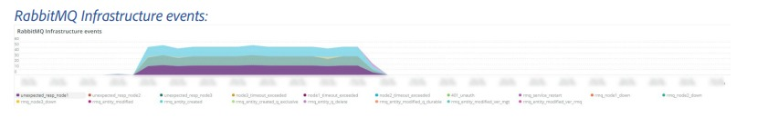
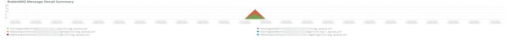

# Onglet [!UICONTROL [!DNL RabbitMQ]]

L’onglet **[!UICONTROL [!DNL RabbitMQ]]** contient des informations axées sur les signaux [!DNL RabbitMQ].

## [!UICONTROL [!DNL RabbitMQ] Infrastructure events]

Événements d’infrastructure  [!DNL RabbitMQ]

La période **[!UICONTROL [!DNL RabbitMQ] Infrastructure events]** affiche les événements d’infrastructure impliquant des [!DNL RabbitMQ] qui se sont produits au cours de la période sélectionnée :

* `%Response [error] for node [rabbit@host1]: unexpected http response from%`) comme `unexpected_resp_node1`
* `%Response [error] for node [rabbit@host2]: unexpected http response from%`) comme `unexpected_resp_node2`
* `%Response [error] for node [rabbit@host3]: unexpected http response from%`) comme `unexpected_resp_node3`
* `%Response [error] for node [rabbit@host3]: Get "http://localhost:15672/api/healthchecks/node/rabbit@host3": context deadline exceeded%`) comme `node3_timeout_exceeded`
* `%Response [error] for node [rabbit@host1]: Get "http://localhost:15672/api/healthchecks/node/rabbit@host1": context deadline exceeded%`) comme `node1_timeout_exceeded`
* `%Response [error] for node [rabbit@host2]: Get "http://localhost:15672/api/healthchecks/node/rabbit@host2": context deadline exceeded%`) comme `node2_timeout_exceeded`
* `%401 Unauthorized%`) comme `401_unauth`
* `%401 Unauthorized%`) comme `401_unauth`
* `%Service restarted: rabbitmq-server%`) comme `rmq_service_restart`
* `%Response [failed] for node [rabbit@host1]: nodedown%`) comme `rmq_node1_down`
* `%Response [failed] for node [rabbit@host2]: nodedown%`) comme `rmq_node2_down`
* `%Response [failed] for node [rabbit@host2]: nodedown%`) comme `rmq_node2_down`
* `%Entity modified: exchange/bindings.destination%`) comme `rmq_entity_modified`
* `%Entity modified: exchange/bindings.destination%`) comme `rmq_entity_modified`
* `%Entity modified: queue/exclusive%`) en tant `rmq_entity_created_q_exclusive` `%Entity modified: queue/auto_delete%`) que `rmq_entity_q_delete`
* `%Entity modified: queue/durable%`) comme `rmq_entity_modified_q_durable`
* `%Entity modified: version/management%`) comme `rmq_entity_modified_ver_mgt`
* `%Entity modified: version/management%`) comme `rmq_entity_modified_ver_mgt`

## [!UICONTROL [!DNL RabbitMQ] service start/stop signals]

![[!DNL RabbitMQ] les signaux de démarrage/arrêt du service](../../assets/tools/observation-for-adobe-commerce/rabbitmq-tab-2.jpeg)

Cette trame montre [!DNL RabbitMQ] signaux de démarrage/arrêt du service qui se sont produits pendant la période sélectionnée :

* `%RabbitMQ is asked to stop...%`) comme `rabbitmq_stop`
* `%Starting RabbitMQ%`) comme `rabbitmq_start`

## [!UICONTROL [!DNL RabbitMQ] errors]

![[!DNL RabbitMQ] des erreurs](../../assets/tools/observation-for-adobe-commerce/rabbitmq-tab-3.jpeg)

Ce cadre affiche [!DNL RabbitMQ] erreurs qui se sont produites au cours du délai sélectionné :

* `%exit with reason {case_clause,timeout} and stacktrace {rabbit_mgmt_wm_healthchecks%}` en tant que `exit_timeout`
* `%client unexpectedly closed TCP connection%`) comme `client_closed_tcp_conn`
* `%at undefined exit with reason shutdown in context shutdown_error%`) comme `undef_exit`
* `%Connection attempt from disallowed node%`) comme `disallowed_node`
* `%closing AMQP connection%`) comme `rmq_err_amqp_conn`

## [!UICONTROL [!DNL RabbitMQ] node status]

![[!DNL RabbitMQ] le statut du nœud &#x200B;](../../assets/tools/observation-for-adobe-commerce/rabbitmq-tab-4.jpeg)

* `%rabbit on node rabbit@host1 down%`) comme `rmq_node1_down`
* `%rabbit on node rabbit@host2 down%`) comme `rmq_node2_down`
* `%rabbit on node rabbit@host3 down%`) comme `rmq_node3_down`
* `%rabbit on node rabbit@host1 up%`) comme `rmq_node1_up`
* `%rabbit on node rabbit@host2 up%`) comme `rmq_node2_up`
* `%rabbit on node rabbit@host3 up%`) comme `rmq_node3_up`

## [!UICONTROL [!DNL RabbitMQ] Message High-Level Summary status by Queue]

![[!DNL RabbitMQ] statut du résumé général des messages par file d&#39;attente](../../assets/tools/observation-for-adobe-commerce/rabbitmq-tab-5.jpeg)

Le graphique **[!UICONTROL [!DNL RabbitMQ] Message High-Level Summary status by Queue]** indique le nombre de messages publiés par la file d&#39;attente de [!DNL RabbitMQ] pour la période sélectionnée.

## [!UICONTROL [!DNL RabbitMQ] Message Detail Summary]

Résumé des détails du message  [!DNL RabbitMQ]

* `%report.ERROR: Cron Job consumers_runner has an error: NOT_FOUND - no queue%`) comme `queue_err`
* `%report.ERROR: Cron Job consumers_runner has an error: NOT_FOUND - no queue%`) comme `queue_err`
* `%authenticated and granted access to vhost%`) comme `auth`
* `%closing AMQP connection%`) comme `close_conn`

## [!UICONTROL [!DNL RabbitMQ] Queue Consumption MB]

![[!DNL RabbitMQ] Mo de consommation dans la file d&#39;attente](../../assets/tools/observation-for-adobe-commerce/rabbitmq-tab-7.jpeg)

Le graphique **[!UICONTROL [!DNL RabbitMQ] Queue Consumption MB]** indique le nombre d’octets consommés par chaque file d’attente [!DNL RabbitMQ] au cours de la période sélectionnée.

## [!UICONTROL [!DNL RabbitMQ] Published Messages by Queue]

![[!DNL RabbitMQ] les messages publiés par file d&#39;attente](../../assets/tools/observation-for-adobe-commerce/rabbitmq-tab-8.jpeg)

Le graphique **[!UICONTROL [!DNL RabbitMQ] Published Messages by Queue]** indique le nombre d’octets consommés par chaque file d’attente [!DNL RabbitMQ] au cours de la période sélectionnée.

## [!UICONTROL [!DNL RabbitMQ] Published Message Throughput by Queue]

![[!DNL RabbitMQ] débit des messages publiés par file d&#39;attente](../../assets/tools/observation-for-adobe-commerce/rabbitmq-tab-9.jpeg)

Le graphique **[!UICONTROL [!DNL RabbitMQ] Published Message Throughput by Queue]** indique le nombre moyen de messages publiés par seconde par chaque file d&#39;attente [!DNL RabbitMQ] au cours de la période sélectionnée.

## [!UICONTROL [!DNL RabbitMQ] Total Message Throughput by Queue]

![[!DNL RabbitMQ] débit total des messages par file d&#39;attente](../../assets/tools/observation-for-adobe-commerce/rabbitmq-tab-10.jpeg)

Le graphique **[!UICONTROL [!DNL RabbitMQ] Total Message Throughput by Queue]** indique le nombre total moyen de messages par seconde par chaque file d’attente [!DNL RabbitMQ] au cours de la période sélectionnée.

## [!UICONTROL [!DNL RabbitMQ] Consumers by Queue]

![[!DNL RabbitMQ] des clients par file d’attente](../../assets/tools/observation-for-adobe-commerce/rabbitmq-tab-11.jpeg)

Le graphique **[!UICONTROL [!DNL RabbitMQ] Consumers by Queue]** indique le nombre total moyen de consommateurs par file d’attente [!DNL RabbitMQ] au cours de la période sélectionnée.
