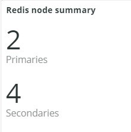

# La variable [!DNL Redis] tab

## [!UICONTROL Redis Node summary]

La variable **[!UICONTROL Redis Node summary]** est inclus dans tous les noeuds d’un environnement. L’exemple ci-dessus inclut les noeuds pour l’évaluation partagée. Il y a un primaire et deux secondaires en production et un primaire et deux secondaires en évaluation.

## [!UICONTROL Redis node detail]

La variable **[!UICONTROL Redis node detail]** frame indique l&#39;environnement, [!DNL Redis] rôle, version logicielle et taille du noeud.

## [!UICONTROL Redis node roles timeline]

La variable **[!UICONTROL Redis node roles timeline]** frame indique la perte de [!DNL Redis] service en particulier. Si une ligne s’effondre, cela indique que le rôle particulier représenté par la ligne a perdu un ou plusieurs noeuds.

## [!UICONTROL Connection to Redis]

La variable **[!UICONTROL Connection to Redis]** Le cadre affiche la valeur net.connectClients de la variable [!DNL New Relic Redis] données d’exemple. Il affiche le nombre de connexions par [!DNL New Relic] application (environnement) et noeud .

## [!UICONTROL Commands per second by node]

La variable **[!UICONTROL Commands per second by node]** Le cadre affiche la [!DNL Redis] commandes par noeud par seconde pendant la période sélectionnée.

## [!UICONTROL Redis % of memory used]

La variable **[!UICONTROL Redis % of memory used]** L’image affiche le pourcentage de la mémoire maximale utilisée par la fonction [!DNL Redis] serveurs.

## [!UICONTROL Redis used memory]

La variable **[!UICONTROL Redis used memory]** frame affiche l’utilisation du noeud de la mémoire en Go/Mo.

## [!UICONTROL Redis changes since last db save]

[!DNL Redis] est un résident de la mémoire et enregistre les informations dans le stockage. La variable **[!UICONTROL Redis changes since last db save]** frame indique le nombre de modifications apportées à la mémoire depuis que la dernière base de données a été enregistrée dans le stockage. Voir [Réinitialiser la persistance](https://redis.io/docs/manual/persistence/) pour plus d’informations sur [!DNL Redis's] persistance.

## [!UICONTROL Redis synchronization from Log]

La variable **[!UICONTROL Redis synchronization from Log]** frame se concentre sur les erreurs rencontrées lors de la [!DNL Redis] synchronisation ou erreurs survenant en raison de problèmes de synchronisation. Pour plus d’informations sur [!DNL Redis], voir [[!DNL Redis] Documentation](https://redis.io/docs/).
