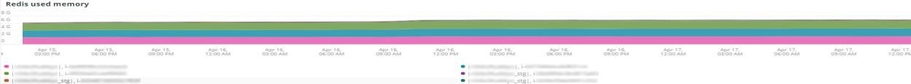
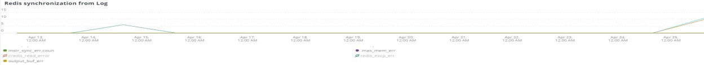

# Onglet [!DNL Redis]

## [!UICONTROL Redis Node summary]

La **[!UICONTROL Redis Node summary]** inclut tous les nœuds d’un environnement. L’exemple ci-dessus inclut les nœuds pour l’évaluation partagée. Il y a un primaire et deux secondaires sur la production et aussi un primaire et deux secondaires sur l&#39;évaluation.

## [!UICONTROL Redis node detail]

Le cadre de **[!UICONTROL Redis node detail]** indique l’environnement, le rôle de [!DNL Redis], la version du logiciel et la taille du nœud.

## [!UICONTROL Redis node roles timeline]

La trame **[!UICONTROL Redis node roles timeline]** indique la perte de service [!DNL Redis] dans des rôles particuliers. Si une ligne baisse, cela indique que le rôle particulier représenté par la ligne a perdu un ou plusieurs nœuds.

## [!UICONTROL Connection to Redis]

L’image **[!UICONTROL Connection to Redis]** affiche la valeur net.connectorClients à partir des données d’exemple [!DNL New Relic Redis]. Il affiche le nombre de connexions par application [!DNL New Relic] (environnement) et nœud.

## [!UICONTROL Commands per second by node]

L’image **[!UICONTROL Commands per second by node]** affiche les commandes [!DNL Redis] par nœud et par seconde pendant la période sélectionnée.

## [!UICONTROL Redis % of memory used]

L’image **[!UICONTROL Redis % of memory used]** affiche le pourcentage de mémoire maximale utilisé par les serveurs [!DNL Redis].

## [!UICONTROL Redis used memory]

L’image **[!UICONTROL Redis used memory]** indique l’utilisation de la mémoire par les nœuds en Go/Mo.

## [!UICONTROL Redis changes since last db save]

[!DNL Redis] est un résident de la mémoire et enregistre les informations dans le stockage . La trame **[!UICONTROL Redis changes since last db save]** indique le nombre de modifications de mémoire qui se sont produites depuis le dernier enregistrement de la base de données dans le stockage. Voir [Persistance Redis](https://redis.io/docs/latest/operate/oss_and_stack/management/persistence/) pour plus d’explications sur la persistance [!DNL Redis's].

## [!UICONTROL Redis synchronization from Log]

La trame de **[!UICONTROL Redis synchronization from Log]** se concentre sur les erreurs rencontrées lors de la synchronisation [!DNL Redis] ou sur les erreurs dues à des problèmes de synchronisation. Pour plus d’informations sur les [!DNL Redis], consultez la [[!DNL Redis] Documentation](https://redis.io/docs/).
