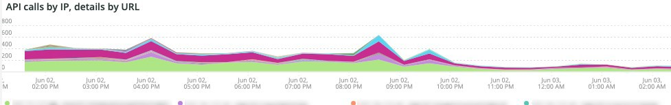

# Le [!UICONTROL Security] tab

Le **[!UICONTROL Security]** explique les problèmes de sécurité et isole leurs causes potentielles. De plus, les cadres de l’onglet sont décrits.

## [!UICONTROL API calls by IP, details by URL]

Le **[!UICONTROL API calls by IP, details by URL]** cadre affiche un certain nombre d’appels API par IP au cours d’une période sélectionnée. Ce cadre affiche l’adresse IP et l’URL de l’API auxquelles cette adresse IP a accédé.

## [!UICONTROL Forgot Password]

Le **[!UICONTROL Forgot Password]** Le cadre d’accès indique le nombre de tentatives de mot de passe oubliées au cours d’une période sélectionnée. Une activité élevée contre une adresse IP peut être une attaque sur le site.

## [!UICONTROL Create Account access]

Le **[!UICONTROL Create Account access]** Le cadre indique le nombre de nouvelles activités de compte au cours d’une période sélectionnée. Une activité élevée provenant d’une seule adresse IP peut indiquer une attaque.

## [!UICONTROL POST activities]

Le **[!UICONTROL POST activities]** affiche la `POST` activités du site, facettées sur `client_ip` de la [!DNL Fastly] journaux. Il indique également l’URL à laquelle l’adresse IP a accès.

## [!UICONTROL POST activities summary table]

Le **[!UICONTROL POST activities summary table]** Le cadre affiche le résumé `POST` activités du site, facettées sur `client_ip` de la [!DNL Fastly] journaux. Il indique également le nombre d’adresses URL auxquelles l’adresse IP accède. Le décompte correspond à la période sélectionnée.

## [!UICONTROL POST activities details table]

Le **[!UICONTROL POST activities details table]** affiche la `POST` activités pour le site à partir de la fonction [!DNL Fastly] journaux. Il affiche également tous les détails de la variable [!DNL Fastly] journal de ces requêtes. Elle est limitée aux 2000 dernières demandes.

## [!UICONTROL Guest Carts activities]

Le **[!UICONTROL Guest Carts activities]** cadre affiche le nombre d’activités du panier d’invités au cours d’une période sélectionnée, facettée par l’adresse IP et l’URL consultée. Les paniers d’invités peuvent être utilisés dans le cadre d’une attaque de carte. Ce cadre affiche le nombre total de demandes pour lesquelles les URL des paniers d’invités sont accessibles.

## [!UICONTROL API – forgot password, create account by Countries]

Le **[!UICONTROL API – forgot password, create account by Countries]** Le cadre indique le nombre de comptes créés et de demandes de réinitialisation d’un mot de passe oublié au cours d’une période sélectionnée. Il est également mis en page pour indiquer le pays d’origine de la demande. Ce cadre est axé sur le pays d’origine de la demande.

## [!UICONTROL API - forgot password, create account by Countries and IP address]

Le **[!UICONTROL API - forgot password, create account by Countries and IP address]** Le cadre indique le nombre de comptes créés et de demandes de réinitialisation d’un mot de passe oublié au cours d’une période sélectionnée. Il est facetté pour afficher également l’adresse IP, l’URL consultée et le pays d’origine de la demande. Ce cadre est axé sur le nombre d’adresses IP.

## [!UICONTROL Guest cart activities by IP]

Le **[!UICONTROL Guest cart activities by IP]** cadre affiche les activités du panier d’invités par IP sur une période sélectionnée.

## [!UICONTROL Guest cart activities by Countries]

Le **[!UICONTROL Guest cart activities by Countries]** cadre affiche les activités de panier d’invités par pays sur une période sélectionnée.

