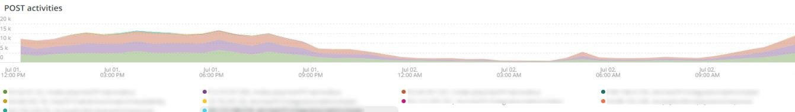

# Onglet [!UICONTROL Security]

L’onglet **[!UICONTROL Security]** explique les problèmes de sécurité et isole leurs causes potentielles. De plus, les cadres de la patte sont décrits.

## [!UICONTROL API calls by IP, details by URL]

Le cadre **[!UICONTROL API calls by IP, details by URL]** affiche un certain nombre d’appels API par adresse IP sur une période sélectionnée. Ce cadre affiche l’adresse IP et l’URL de l’API accessible par cette adresse IP.

## [!UICONTROL Forgot Password]

Le cadre d’accès **[!UICONTROL Forgot Password]** affiche le nombre de tentatives de mot de passe oublié sur une période sélectionnée. Une forte activité contre une adresse IP peut constituer une attaque contre le site.

## [!UICONTROL Create Account access]

Le cadre **[!UICONTROL Create Account access]** affiche le nombre de nouvelles activités de compte sur une période sélectionnée. Une forte activité provenant d’une seule adresse IP peut indiquer une attaque.

## [!UICONTROL POST activities]

Le cadre **[!UICONTROL POST activities]** affiche les activités `POST` pour le site, à facettes sur les `client_ip` des journaux [!DNL Fastly]. Elle affiche également l’URL accessible par l’adresse IP.

## [!UICONTROL POST activities summary table]

Le cadre de **[!UICONTROL POST activities summary table]** présente le résumé des activités de `POST` pour le site, à facettes sur les `client_ip` des journaux de [!DNL Fastly]. Elle affiche également le nombre pour l’URL accessible par l’adresse IP. Le décompte porte sur la période sélectionnée.

## [!UICONTROL POST activities details table]

Le cadre **[!UICONTROL POST activities details table]** affiche les activités `POST` pour le site à partir des journaux [!DNL Fastly]. Elle affiche également tous les détails du journal [!DNL Fastly] pour ces requêtes. Il est limité aux 2 000 dernières demandes.

## [!UICONTROL Guest Carts activities]

Le cadre **[!UICONTROL Guest Carts activities]** affiche le nombre d’activités de panier d’invités sur une période sélectionnée, facettisées par l’adresse IP et l’URL consultées. Les paniers d’invités peuvent être utilisés lors d’une attaque par carte. Ce cadre montre le nombre total de requêtes où les URL des paniers d’invités sont accessibles.

## [!UICONTROL API – forgot password, create account by Countries]

Le cadre **[!UICONTROL API – forgot password, create account by Countries]** affiche le nombre de comptes créés et de demandes de réinitialisation d’un mot de passe oublié au cours d’une période sélectionnée. Il présente également des facettes pour indiquer le pays d’origine de la demande. Ce cadre est axé sur le pays d’origine de la demande.

## [!UICONTROL API - forgot password, create account by Countries and IP address]

Le cadre **[!UICONTROL API - forgot password, create account by Countries and IP address]** affiche le nombre de comptes créés et de demandes de réinitialisation d’un mot de passe oublié au cours d’une période sélectionnée. Elle comporte une facette pour afficher l’adresse IP, l’URL accessible et le pays d’origine de la requête. Ce cadre est axé sur le nombre d’adresses IP.

## [!UICONTROL Guest cart activities by IP]

Le cadre **[!UICONTROL Guest cart activities by IP]** affiche les activités du panier d’invités par adresse IP sur une période sélectionnée.

## [!UICONTROL Guest cart activities by Countries]

Le cadre **[!UICONTROL Guest cart activities by Countries]** affiche les activités du panier d’invités par pays sur une période sélectionnée.

