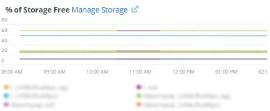
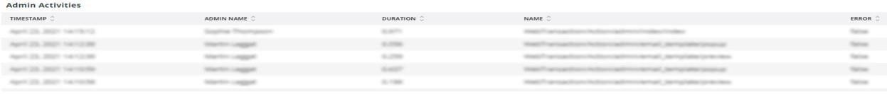
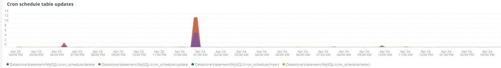

# La variable [!UICONTROL Summary] tab

La variable [!UICONTROL Summary] de [!DNL Observation for Adobe Commerce] est conçu pour afficher rapidement certains des problèmes rencontrés par les sites afin de vous aider à résoudre ou à identifier automatiquement les causes potentielles des problèmes du site. Les onglets supplémentaires fournissent des informations de niveau plus détaillé sur les services de composants, la base de données, l’infrastructure et les états de processus.

## [!UICONTROL Transaction Overview]

### [Qu’est-ce qu’une transaction ?](https://docs.newrelic.com/docs/apm/transactions/intro-transactions/transactions-new-relic-apm/#:%7E:text=transactions%20are%20reported.-,What%20is%20a%20transaction%3F,work%20in%20a%20software%20application.&amp;text=For%20APM%2C%20it%20will%20many, when%20the%20response%20is%20sent)

&quot;À [!DNL New Relic], une transaction est définie comme une unité de travail logique dans une application logicielle. Plus précisément, il fait référence aux appels de fonction et aux appels de méthode qui constituent cette unité de travail. Il fait souvent référence à une transaction web, qui représente une activité qui se produit à partir du moment où l’application reçoit une demande web vers le moment où la réponse est envoyée.&quot;

### Types de transactions :

**Web :** Les transactions web sont initiées avec une requête HTTP. Pour la plupart des organisations, ces interactions sont axées sur les clients et sont donc les transactions les plus importantes à surveiller.

**Non-web :** Les transactions non web ne sont pas initiées avec une requête web. Il peut s’agir de processus de travail non Web, de processus en arrière-plan, de scripts, d’activité de file d’attente de messages et d’autres tâches.

Si vous observez le **[!UICONTROL Transaction Overview]** Dans l’image ci-dessus, il y a eu près de 53 000 transactions avec un score APDEX moyen de 0,76, et 95 % de ces transactions ont eu lieu en moins de 2,313 secondes. Il s’agit d’une période dans laquelle une période plus courte peut indiquer une déviation par rapport à cette moyenne actuelle en cas d’accès APDEX pendant une courte période.

## [!UICONTROL 404 page errors frame]

La variable **[!UICONTROL 404 page errors]** Le cadre répertorie les [URI](https://en.wikipedia.org/wiki/Uniform_Resource_Identifier) et le nombre d’erreurs de page 404 pour une période sélectionnée.

## [!UICONTROL % of Storage Free frame]

La variable **[!UICONTROL % of Storage Free]** frame affiche le pourcentage moyen sans montage de stockage sur tous les noeuds de la grappe. Par exemple, si vous disposez d’une grappe de trois noeuds, l’image affiche la valeur \&lt;mount point=&quot;&quot;>, \&lt;environment name=&quot;&quot;>. Ce cadre peut être trompeur s’il existe une variance entre trois noeuds. Un exemple d’écart serait le suivant : `/data/mysql` le point de montage free était une valeur différente dans la grappe de trois noeuds. Il y a une image sous la balise [!UICONTROL MySQL] qui facette les points de montage par nom de noeud pour voir plus précisément ce que la variable `/data/mysql` le stockage libre sur chaque noeud est en fait suffisant.

## [!UICONTROL % of system memory that is free frame]

La variable **% de la mémoire système disponible** frame affiche, par noeud, la quantité de mémoire système disponible sur chaque noeud.

## [!UICONTROL Swap memory free in bytes]

La variable **[!UICONTROL Swap memory free in bytes]** frame affiche, par noeud, la quantité de mémoire SWAP libre sur le noeud.

## [!UICONTROL CPU % by host]

L’agrégat de tous les environnements et noeuds s’affiche dans la variable **[!UICONTROL CPU % by host]** cadre. Désélectionnez les environnements hors production. Notez également toutes les instances où tous les noeuds de l’environnement de production ne sont pas présents. Pour plus d’informations sur l’utilisation élevée du processeur, reportez-vous à la section [Dépannage des performances à l’aide de New Relic sur Adobe Commerce](https://experienceleague.adobe.com/docs/commerce-knowledge-base/kb/troubleshooting/miscellaneous/troubleshoot-performance-using-new-relic-on-magento-commerce.html).

## [!UICONTROL Alerts during timeframe]

La variable **[!UICONTROL Alerts during timeframe]** affiche toutes les alertes, y compris la variable [!UICONTROL Managed Alerts] ajouté par la prise en charge d’Adobe Commerce.

## [!UICONTROL CPU Usage]

Si la variable **[!UICONTROL CPU Usage]** est vide, cela indique que l’application d’infrastructure de [!DNL New Relic] n’est pas activé. Si votre site est sur Starter, ces informations ne s’affichent pas. Si votre site est sur Pro, ouvrez une [ticket de support](https://experienceleague.adobe.com/docs/commerce-knowledge-base/kb/help-center-guide/magento-help-center-user-guide.html) à [!DNL New Relic Infrastructure] activée pour votre site.

## [!UICONTROL Average Response Time]

La variable **[!UICONTROL Average Response Time]** Le graphique présente le temps de réponse moyen pour les transactions (web et autres).

## [!UICONTROL Long duration cron_schedule updates]

La variable **[!UICONTROL cron_schedule]** est écrit au début et à la fin des tâches cron. Les tâches cron de longue durée peuvent indiquer une latence dans la mise à jour de ce tableau, ce qui peut indiquer une empilement de cron ou un problème de planification des crons.

## [!UICONTROL Response Code]

La variable **[!UICONTROL Response Code]** frame est une bonne indication du trafic web et du code de réponse des requêtes. Il s’agit de [!DNL New Relic's] les données de transaction et sont facettées par la variable `httpResponseCode` renvoyée.

## [!UICONTROL Web Traffic volume compared with one week ago Magento Managed Alerts Information]

Ce cadre affiche le volume comparatif du trafic Web de la semaine écoulée et de la semaine en cours.

## [!UICONTROL Deployment Log Entries]

La variable **[!UICONTROL Deployment Log Entries]** frame affiche le nombre d’entrées de journal de déploiement et de cloud et facette les nombres par nom de journal de déploiement.

## [!UICONTROL Deployment State]

La variable **[!UICONTROL Deployment State]** frame facette des phases de déploiement particulières à partir des journaux de déploiement. Voici quelques exemples de phases comptabilisées dans le journal et le nom de la facette :

**Phases du journal de déploiement :**

* &quot;%Démarrage de la génération de la commande%&quot;) comme &quot;start_gen&quot;
* &quot;%git apply /app/vendor/magento/ece-tools/Correctifs%&quot;) as &#39;apply_Correctifs&#39;
* &quot;%Set flag : .static_content_deploy%&quot;) comme &quot;SCD&quot;
* &#39;%NOTICE : générer la commande terminée%&#39;) en tant que &#39;gen_compl&#39;
* &#39;%NOTICE : déploiement terminé%&#39;) en tant que &#39;deploy_compl&#39;
* &#39;%REMARQUE : Démarrage du post-déploiement.%&#39;) comme &quot;start_pdeploy&quot;
* &quot;%AVERTISSEMENT : le post-déploiement est terminé%&quot;) comme &quot;déploiement&quot;
* &#39;%deploy-complete%&#39;) comme &#39;cl_deploy_compl&#39;

## [!UICONTROL IP Frequency]

La variable **[!UICONTROL IP Frequency]** frame comptabilise les états (&#39;MISS&#39; et &#39;PASS&#39;) pour chaque IP de la variable [!DNL Fastly] journaux. Les requêtes Web avec ces états atteignent le serveur d’origine et ajouteront de la charge au serveur. Il affiche les vingt premières adresses en fréquence. Ce cadre peut être utilisé pour détecter les attaques IP ou les sources de charge importante sur un site web.

## [!UICONTROL IP Response – top 20 URLs in duration]

La variable **[!UICONTROL IP Response – top 20 URLs in duration]** frame affiche les URL avec la durée de réponse la plus longue. Il peut indiquer des fichiers image ou des pages volumineux, une API ou des pages avec la plus longue durée de réponse.

## [!UICONTROL API Calls by IP]

La variable **[!UICONTROL API Calls by IP]** frame permet d’identifier le trafic important par rapport aux API et aux adresses IP qui effectuent des requêtes des URL d’API.

## [!UICONTROL API Calls by IP, details by URL]

La variable **[!UICONTROL API Calls by IP, details by URL]** frame fournit des détails sur le trafic important par rapport aux API et des détails sur les URL qui effectuent les requêtes.

## [!UICONTROL IP Frequency Rate per minute]

Il est parfois difficile de déterminer l’adresse IP qui a le plus de requêtes dans les autres cadres. La variable **[!UICONTROL IP Frequency Rate per minute]** image affiche la vitesse par minute par adresse IP.

## [!UICONTROL Potential Bots]

La variable **[!UICONTROL Potential Bots]** frame examine les requêtes avec un nom request_user_agent tel que NULL ou &#39;%bot%&#39;. En règle générale, request_user_agent &quot;%bot%&quot; suit la configuration de la stratégie dans `robots.txt` fichier .

## [!UICONTROL Transaction Errors]

La variable **[!UICONTROL Transaction Errors]** frame affiche le nombre d’erreurs de transaction provenant de [!DNL New Relic].

## [!UICONTROL Nginx access by node]

La variable **[!UICONTROL Nginx access by node]** frame examine les décomptes des `access.log` par noeud . Il est utile de voir si la charge est répartie uniformément. Il s’affiche souvent lorsqu’un noeud tombe. Le cadre affiche également la charge sur l’ensemble du site.

## [!UICONTROL Galera Log]

[[!DNL Galera]](https://galeracluster.com/library/galera-documentation.pdf) est utilisé pour la grappe de base de données. Cette image est axée sur des signaux spécifiques provenant de la fonction [!UICONTROL Galera] grappe. Les signaux se concentrent sur les noeuds entrant et sortant de la grappe, ce qui est normal pour maintenir l’intégrité des données de la base de données. Les noeuds sont synchronisés au fur et à mesure que la fonction [!UICONTROL Galera] modifications de l’état du cluster.

**Liste de [!UICONTROL Galera] changements d’état :**

* &quot;%1047 WSREP n’a pas encore préparé le noeud pour l’application use%&quot;) comme &quot;node_not_prep_for_use&quot;
* &#39;%\[ERROR\] WSREP : échec de la lecture à partir de : wsrep_sst_xtrabackup-v2%&#39;) en tant que &#39;xtrabackup_read_fail&#39;
* &#39;%\[ERROR\] WSREP : processus terminé avec erreur : wsrep_sst_xtrabackup-v2 %&#39;) comme &#39;xtrabackup_compl_w_err&#39;
* &#39;%\[ERROR\] WSREP: rbr write fail%&#39;) comme &#39;rbr_write_fail&#39;
* &quot;%self-leave%&quot;) sous la forme &quot;usp_node&quot;
* &#39;%members = 3/3 (joint/total)%&#39;) comme &#39;3of3&#39;
* &#39;%members = 2/3 (joint/total)%&#39;) comme &#39;2of3&#39;
* ’%members = 2/2%’) as ’2of2’ * ’%members = 1/2%’) as ’1of2’ * ’%members = 1/3%’) as ’1of3’
* &#39;%members = 1/1%) as &#39;1of1&#39;
* &#39;%\[Remarque\] /usr/sbin/mysqld (mysqld 10.%&#39;) comme &quot;sql_restart&quot;
* &#39;%Quorum : aucun noeud avec l’état complet :%&#39;) comme &#39;no_node_count&#39;
* &#39;%WSREP: Member 0%&#39;) comme &#39;mem_0&#39;
* ’%WSREP: Member 1.0%’) as ’mem_1’
* &#39;%WSREP: Member 2%&#39;) as &#39;mem2&#39;
* &#39;%WSREP : synchronisé avec le groupe, prêt pour les connexions%&#39;) comme &quot;prêt&quot;
* &#39;%/usr/sbin/mysqld, Version:%&#39;) comme &#39;mysql_restart_mysql.ralenti&#39;
* &#39;%\[Remarque\] WSREP : nouvelle vue de grappe : état global :%&#39;) comme &#39;galera_cluster_view_chng&#39;

Ces signaux peuvent indiquer des problèmes de stockage, de mémoire ou de requête si l’état change fréquemment.

## [!UICONTROL Database errors]

**Liste des erreurs ou messages de la base détectés :**

* &quot;%Taille de mémoire allouée à la table temporaire est supérieure à 20 % de innodb_buffer_pool_size%&quot;) en tant que &quot;temp_tbl_buff_pool&quot;
* &#39;%\[ERROR\] WSREP: rbr write fail%&#39;) comme &#39;rbr_write_fail&#39;
* &#39;%mysqld : disque plein%&#39;) comme &#39;disque_plein&#39;
* &quot;%Error number 28%&quot;) as &#39;err_28&#39;
* &quot;%rollback%&quot;) comme &quot;rollback&quot;
* &quot;%Contrainte de clé étrangère échoue pour table%&quot;) en tant que &quot;contrainte_clé_étrangère&quot;
* &#39;%Error_code: 114%&#39;) as &#39;sql_1114_full&#39;
* &#39;%CRITICAL : SQLSTATE\[HY00\] \[2006\] Le serveur MySQL a disparu%&#39;) comme &quot;sql_gone&quot;
* &#39;%SQLSTATE\[HY00\] \[1040\] Trop de connexions%&#39;) comme &#39;sql_1040&#39;
* &#39;%CRITICAL : SQLSTATE\[HY00\] \[2002\]%&#39;) en tant que &#39;sql_2002&#39;
* &#39;%SQLSTATE\[08S01\]:%&#39;) en tant que &#39;sql_1047&#39;
* &#39;%\[Avertissement\] Connexion abandonnée%&#39;) en tant que &#39;aborted_conn&#39;
* &#39;%SQLSTATE\[23000\] : violation de contrainte d’intégrité :%&#39;) en tant que &#39;sql_23000&#39;
* &quot;%1205 Verrouillage Délai d’attente d’attente %&quot;) en tant que &quot;sql_1205&quot;
* &#39;%SQLSTATE\[HY00\] \[1049\] Base de données inconnue%&#39;) en tant que &#39;sql_1049&#39;
* &#39;%SQLSTATE\[42S02\] : table ou vue de base introuvable :%&#39;) en tant que &#39;sql_42S02&#39;
* &#39;%Erreur générale : 114%&#39;) en tant que &#39;sql_1114&#39;
* &#39;%SQLSTATE\[4001\]%&#39;) en tant que &#39;sql_1213&#39;
* &#39;%SQLSTATE\[42S22\] : Colonne introuvable : 1054 Colonne inconnue%&#39;) en tant que &#39;sq1_1054&#39;
* &#39;%SQLSTATE\[42000\] : Erreur de syntaxe ou violation d’accès :%&#39;) en tant que &#39;sql_42000&#39;
* &#39;%SQLSTATE\[21000\] : violation de cardinalité :%&#39;) en tant que &#39;sql_1241&#39;
* &#39;%SQLSTATE\[22003\]:%&#39;) en tant que &#39;sql_22003&#39;
* &#39;%SQLSTATE\[HY00\] \[9000\] Client avec adresse IP%&#39;) comme &#39;sql_9000&#39;
* &#39;%SQLSTATE\[HY000\] : Erreur générale : 2014%&#39;) en tant que &#39;sql_2014&#39;
* &quot;%1927 La connexion a été tuée%&quot;) en tant que &quot;sql_1927&quot;
* &#39;%1062 \[\ERROR\] InnoDB:%&#39;) comme &#39;sql_1062_e&#39;
* &#39;%\[Remarque\] WSREP : vidage de la carte mémoire sur le disque..%&#39;) comme &#39;mem_map_flush&#39;.
* &#39;%Code d’erreur interne MariaDB : 1146%&#39;) en tant que &#39;sql_1146&#39;
* &#39;%Code d’erreur interne MariaDB : 1062%&#39;) comme &#39;sql_1062&#39; * &#39;%1062 \[Avertissement\] InnoDB:%&#39;) comme &#39;sql_1062_w&#39;
* &#39;%Code d’erreur interne MariaDB : 1064%&#39;) en tant que &#39;sql_1064&#39;
* &#39;%InnoDB : échec de l’affirmation dans le fichier%&#39;) en tant que &#39;assertion_err&#39;
* &#39;%mysqld_safe Nombre de processus en cours d’exécution : 0 %&#39;) en tant que &#39;mysql_oom&#39;
* &#39;%\[ERROR\] mysqld a reçu signal%&#39;) comme &#39;mysql_sigterm&#39;
* &quot;%1452 Impossible d’ajouter%&quot;) comme &quot;sql_1452&quot;
* &#39;%ERROR 1698%&#39;) en tant que &#39;sql_1698&#39;
* &#39;%SQLSTATE\[HY000\] : Erreur générale : 3%&#39;) comme &#39;cnt_write_tmp&#39;
* &#39;%Erreur générale : 1 %&#39;) en tant que &#39;sql_syntaxe&#39;
* &#39;%42S22%&#39;) en tant que &#39;sql_42S22&#39;
* &#39;%InnoDB : erreur (clé en double)%&#39;) en tant que &#39;innodb_dup_key&#39;

## [!UICONTROL Database traces]

La variable **[!UICONTROL Database traces]** frame examine les données de la variable [trace sql](https://docs.newrelic.com/docs/apm/transactions/transaction-traces/transaction-traces-database-queries-page/) entity of [!DNL New Relic] et renvoie le chemin de la trace.

## [!UICONTROL Database mysql-slow.log]

La variable **[!UICONTROL Database mysql-slow.log]** L’image comptabilise les entrées dans la variable [mysql-lent.log](https://dev.mysql.com/doc/refman/5.7/en/slow-query-log.html) par type de requête. Il isole visuellement les délais susceptibles de présenter un intérêt dans le fichier mysql-ralenti.log (journal de requête lent). Les requêtes de tables sans index ou requêtes mettant à jour des tables volumineuses peuvent bloquer d’autres requêtes.

## [!UICONTROL Redis synchronization from Log]

[[!DNL Redis]](https://redis.io/docs/about/) est un magasin de structure de données en mémoire libre (sous licence BSD) utilisé en tant que base de données, cache et courtier de messages. Il peut effectuer la mise en cache de la base de données et de la session si elle est configurée. La variable **[!UICONTROL Redis synchronization from Log]** se concentre sur [[!DNL Redis] synchronisation](https://redis.io/docs/manual/replication/). Plus la taille de la variable [!DNL Redis] jeu de données, plus il y aura de problèmes de synchronisation (plus de données à synchroniser).

**[!DNL Redis]Erreurs et messages :**

* &#39;%Synchronisation des ESCLAVES : aucun espace laissé sur l’appareil%&#39;) comme &#39;espace&#39;
* ’%Server started, Redis version%’) as &#39;serve_start&#39;
* &quot;%Le serveur est maintenant prêt à accepter les connexions%&quot;) comme &quot;prêt&quot;
* ’%Connexion avec le gabarit perdue.%&#39;) comme &quot;mstr_missing&quot;
* &quot;%+sdown sentinel%&quot;) comme &quot;+sentinelle&quot;
* &quot;%-sdown sentinel%&quot;) comme &quot;-sentinelle&quot;
* &#39;%-esclave descendant%&#39;) comme &#39;-esclave&#39;, &#39;%+esclave descendant%&#39;) comme &#39;+esclave&#39;
* &#39;%-failover-abort-not-selected master mymaster%&#39;) comme &#39;-failover&#39;
* &#39;%+basculement-abort-maître non sélectionné mymaster%&#39;) comme &#39;+basculement&#39;
* &#39;%Resynchronisation partielle impossible (aucun maître en cache)%&#39;) en tant que &#39;part_sync_err&#39;
* ’%PRINCIPAL de l’abandon de la réplication avec une erreur : ERR Can%’) en tant que &#39;mstr_sync_err&#39;
* &#39;%Principal ne prend pas en charge PSYNC ou est dans un état d’erreur%&#39;) comme &#39;mstr_psync_err&#39;
* &#39;%SLAVE sync: Fini avec succès%&#39;) en tant que &#39; slv_sync_suc&#39;
* ’%PRINCIPAL de l’abandon de la réplication avec une erreur : ERR Can%’) en tant que &#39;mstr_sync_err,coun&#39;
* &quot;%Commande OOM non autorisée en cas d’utilisation de memory%&quot;) en tant que &quot; max_mem_err&quot;
* &#39;%CredisException(code : 0) : erreur de lecture sur la connexion%&#39;) en tant que &#39;credis_read_error&#39;
* &#39;%Uncaught RedisException:%&#39;) as &#39;redis_excp_err&#39;
* &#39;%psync programmé à fermer ASAP pour le dépassement du tampon de sortie%&#39;) en tant que &#39;output_buf_err&#39;

## [!UICONTROL PHP process states]

Le comportement du ou des processus PHP dépend du [configuration](https://www.php.net/manual/en/install.fpm.configuration.php). La configuration est complexe, avec de nombreuses variables et options. La variable **[!UICONTROL PHP process states]** frame vous aide à comprendre quand les processus PHP sont arrêtés et redémarrés.

### [!UICONTROL PHP errors]

La variable **[!UICONTROL PHP errors]** frame affiche le nombre d’erreurs PHP avec les programmes de travail pendant la période sélectionnée. Pour plus d’informations, voir [Paramètres PHP d’Adobe Commerce](../../installation/prerequisites/php-settings.md).

**Erreurs et messages PHP :**

* &#39;%worker_connections n’est pas suffisant%&#39;) comme &#39;worker&#39;
* &#39;%PHP Erreur fatale : taille de la mémoire autorisée !%&#39;) comme &quot;mem_size&quot;
* &#39;%exited sur le signal 11 (SIGSEGV)%&#39;) en tant que &#39;sig_11&#39;
* &#39;%exited sur le signal 7 (SIGBUS%&#39;) en tant que &#39;sig_7&#39;
* &#39;%augmentation pm.start_servers%&#39;) en tant que &#39;pmstart_Servan&#39;
* &#39;%max_children%&#39;) comme &#39;max_children_cnt&#39;
* &quot;%PHP Erreur fatale : taille de mémoire autorisée de %&quot;) comme &quot;mem_exhst_coun&quot;
* &quot;%Impossible d’allouer de la mémoire pour pool%&quot;) en tant que &quot;opc_mem_count&quot;
* &#39;%Warning Interned string buffer overflow%&#39;) as &#39;opc_str_buf&#39;
* &#39;%Chaîne non autorisée offsetl%&#39;) comme &#39;opc_sv_comments&#39;
* &#39;%PHP Erreur fatale : RedisException non interceptée : erreur de lecture sur la connexion%&#39;) en tant que &#39;php_exc&#39;

## [!UICONTROL PHP processes]

[PHP-FPM](https://php-fpm.org/) est un [!UICONTROL FastCGI Process Manager] utilisé par [!DNL Nginx]. Pour en savoir plus sur la configuration requise, reportez-vous à la section [Exigences de version PHP mappées aux versions Adobe Commerce](../../installation/system-requirements.md). La variable **[!UICONTROL PHP processes]** frame affiche le nombre de processus PHP exécutés à une heure donnée dans la chronologie sélectionnée.

## [!UICONTROL Secondary processes]

Les processus Secondaires peuvent avoir un impact sur la réponse du site. La variable **[!UICONTROL Secondary processes]** frame indique un processus ou des processus qui peuvent ajouter de la charge au site. La base de données contient principalement le plus de processus secondaires en cours d’exécution.

## [!UICONTROL Traffic vs Week Ago]

La variable **[!UICONTROL Traffic vs Week Ago]** frame examine le trafic du site web (requêtes) provenant de la variable [!DNL Fastly] journaux avec les états de cache (&#39;MISS&#39;, &#39;PASS&#39;). Ces requêtes ajoutent de la charge aux serveurs d’origine. Ce cadre affiche le volume comparatif des requêtes Web de la semaine en cours et de la semaine précédente au cours de la même période.

## [!UICONTROL Fastly Cache]

La variable **[!UICONTROL Fastly Cache]** Le cadre affiche une vue agrégée de l’état du cache des requêtes provenant de la [!DNL Fastly] journaux. Si vous sélectionnez ERROR, le pourcentage d’erreurs s’affichera dans les requêtes. Cela augmente généralement lorsque le serveur d’origine ne répond pas assez rapidement aux requêtes de page.

## [!UICONTROL Page Rendering]

La variable **[!UICONTROL Page Rendering]** cadre affiche la durée moyenne de rendu de page de la semaine en cours à partir de la source de page vue de [!DNL New Relic] par rapport à la semaine précédente pendant la même période.

## [!UICONTROL Page loading detail]

La variable **[!UICONTROL Page loading detail]** frame décrit les événements de chargement de page. Il détaille la signification de ces facettes. Voici la requête exécutée pour ce cadre :

`SELECT percentile(timeToResponseStart, 50) AS 'first byte', percentile(firstPaint, 50) as 'First paint', percentile(firstContentfulPaint, 50) as 'First contentful paint', percentile(timeToDomContentLoadedEventEnd, 50) AS 'DOM content loaded', percentile(duration, 50) AS 'Window load + AJAX' FROM BrowserInteraction TIMESERIES`

## [!UICONTROL Transactions – Avg, Max, Min]

La durée des transactions est en secondes. Selon la transaction, elle peut avoir un impact sur d’autres transactions si elles sont de longue durée. Les transactions répertoriées sous le nom et les durées correspondent à une période spécifique. S’il existe un délai de problème concis, redimensionnez la variable [!DNL Observation for Adobe Commerce] sélecteur de date/heure correspondant à cette période étroite.

## [!UICONTROL Admin Activities]

La variable **[!UICONTROL Admin Activities]** frame identifie les transactions avec un utilisateur administrateur.

## [!UICONTROL Order transactions (default?)]

La variable **[!UICONTROL Order transactions (default?)]** frame recherche les transactions `request.headers.host` des transactions, où le nom = `WebTransaction/Action/checkout/onepage/success`. Si l’URL de réussite de la commande est différente, ce cadre ne contiendra pas de données.

## [!UICONTROL Elasticsearch Index information]

**[Statuts des Elasticsearch :](https://www.elastic.co/guide/en/elasticsearch/reference/current/cluster-health.html)**

* Vert : tous les éclats sont attribués.
* Jaune : tous les éclats principaux sont affectés, mais un ou plusieurs éclats de réplication ne sont pas affectés. Si un noeud de la grappe échoue, certaines données peuvent ne pas être disponibles tant que ce noeud n’est pas réparé.
* Rouge : un ou plusieurs éclats primaires ne sont pas attribués, certaines données ne sont donc pas disponibles. Cela peut se produire brièvement au démarrage de la grappe lorsque des éclats principaux sont attribués.

## [!UICONTROL Elasticsearch Errors]

**[!DNL Elasticsearch]errors:**

* &#39;%all shards failed%&#39; as &#39;all_shards_failed&#39;
* &#39;%NoNodesAvailableException%&#39; comme &#39;no_alive_nodes&#39;
* &#39;%PHP Erreur fatale : erreur non interceptée : paramètres erronés pour l’Elasticsearch%&#39; comme &#39;bad_param&#39;
* &quot;%Vous pouvez résoudre ce problème en mettant à niveau le service Elasticsearch de votre infrastructure cloud Magento vers la version%&quot; en tant que &quot;ver_err&quot;.
* L’état d’intégrité de la grappe est passé de \[JAUNE\] à \[ROUGE\] (motif :%&#39; comme &#39;jaune_rouge&#39;
* &#39;%Aucun espace laissé sur l’appareil%&#39; comme &#39;no_space&#39;
* &#39;% Échec de l&#39;exécution de [SearchRequest{searchType=%&#39; en tant que &#39;failed_query&#39;

## [!UICONTROL Cron view]

La variable **[!UICONTROL Cron view]** frame examine le journal cron pour trouver l’équilibre entre le nombre de crons démarrés et le nombre de crons terminés.

## [!UICONTROL Cron error]

**Erreurs Cron de cron.log :**

* &#39;%_stg%&#39; comme &#39;stg_crons&#39;
* &#39;%Impossible d’acquérir le verrouillage pour la tâche cron%&#39; en tant que &#39;cron_lock&#39;
* &quot;%Erreur générale : le serveur MySQL 2006 a disparu%&quot; en tant que &quot;mysql_has_gone_away&quot;
* &#39;%error%&#39; comme &#39;erreur&#39;
* &#39;%Erreur générale : délai d’attente du verrouillage 1205 dépassé%&#39; en tant que sql_1205_cron

## [!UICONTROL cron_schedule table updates]

La variable **[!UICONTROL cron_schedule table updates]** frame examine la durée maximale en secondes pendant laquelle les mises à jour des opérations de banque de données impliquent la table cron_schedule. Elle est facettée sur le type de requête SQL.

## [!UICONTROL Datastore Operations Tables]

Ceci **[!UICONTROL Datastore Operations Tables]** frame affiche les 25 premières opérations par durée, nom de table et type de requête SQL. Passez la souris sur les pics pour afficher les détails de la table à laquelle l’accès a été effectué et le type de requête utilisé.

## [!UICONTROL Cache Flush]

**Purge du cache détectée :**

* &#39;%config%&#39; en tant que &#39;config_cache_flushed&#39;
* &#39;%layout%&#39; en tant que &#39;layout_cache_flush&#39;
* &#39;%block_html%&#39; comme &#39;block_html_cache_flush&#39;
* &#39;%collections%&#39; en tant que &#39;collections_cache_flush&#39;
* &#39;%reflet%&#39; comme &#39;reflet_cache_flush&#39;
* &#39;%db_ddl%&#39; comme &#39;db_ddl_cache_flush&#39;
* &#39;%compile_config%&#39; en tant que &#39;compile_config_cache_flush&#39;
* &#39;%eav%&#39; comme &#39;eav_cache_flush&#39;
* &#39;%customer_notification%&#39; comme &#39;cust_notif_cache_flush&#39;
* &#39;%config_integration%&#39; comme &#39;config_intg_cache_flush&#39;
* &#39;%config_integration_api%&#39; comme &#39;config_intg_api_cache_flush&#39;
* &#39;%full_page%&#39; comme &#39;full_page_cache_flush&#39;
* &#39;%config_webservice%&#39; comme &#39;config_webserve_cache_flush&#39;
* &#39;%translate%&#39; comme &#39;translate_cache_flush&#39;
