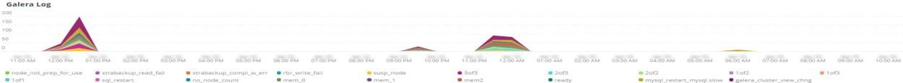

# Onglet [!UICONTROL Summary]

L’onglet [!UICONTROL Summary] de [!DNL Observation for Adobe Commerce] est destiné à afficher rapidement certains des problèmes rencontrés par les sites afin de vous aider à résoudre automatiquement ou à identifier les causes profondes potentielles des problèmes de site. Les onglets supplémentaires fournissent des informations plus détaillées sur les services de composants, la base de données, l’infrastructure et les états de processus.

## [!UICONTROL Transaction Overview]

### [Qu&#39;est-ce qu&#39;une transaction ?](https://docs.newrelic.com/docs/apm/transactions/intro-transactions/transactions-new-relic-apm/#:%7E:text=transactions%20are%20reported.-,What%20is%20a%20transaction%3F,work%20in%20a%20software%20application.&text=For%20APM%2C%20it%20will%20souvent, quand%20la%20réponse%20est%20envoyée)

« Au [!DNL New Relic], une transaction est définie comme une unité logique de travail dans une application logicielle. Plus précisément, il fait référence aux appels de fonction et aux appels de méthode qui constituent cette unité de travail. Il fait souvent référence à une transaction web, qui représente une activité qui se produit entre le moment où l’application reçoit une requête web et le moment où la réponse est envoyée. »

### Types de transactions :

**Web:** Les transactions web sont déclenchées avec une requête HTTP. Pour la plupart des entreprises, il s’agit d’interactions axées sur les clients, c’est pourquoi il s’agit des transactions les plus importantes à surveiller.

**Non-web :** les transactions non-web ne sont pas initiées avec une requête web. Ils peuvent inclure des processus de travail non Web, des processus en arrière-plan, des scripts, des activités de file d’attente de messages et d’autres tâches.

Si vous regardez le cadre de **[!UICONTROL Transaction Overview]** ci-dessus, il y a eu près de 53 000 transactions avec un score APDEX moyen de .76, et 95% de ces transactions se sont produites en moins de 2,313 secondes. Il s’agirait d’une période où un délai plus court peut montrer un écart par rapport à cette moyenne actuelle en cas d’accès à l’APDEX pendant une courte période.

## [!UICONTROL 404 page errors frame]

Le cadre de **[!UICONTROL 404 page errors]** répertorie l’[URI](https://en.wikipedia.org/wiki/Uniform_Resource_Identifier) et le nombre d’erreurs de page 404 pour un cadre de temps sélectionné.

## [!UICONTROL % of Storage Free frame]

L’image **[!UICONTROL % of Storage Free]** affiche le pourcentage moyen d’espace libre des montages de stockage sur tous les nœuds de votre cluster. Par exemple, si vous disposez d’un cluster de trois nœuds, l’image affiche les caractères \&lt;point de montage\>, \&lt;nom de l’environnement\>. Cette trame peut être trompeuse s’il existe une variance entre trois nœuds. Un exemple de variation serait si le point de montage `/data/mysql` libre était une valeur différente sur les trois nœuds du cluster. Un cadre se trouve sous l’onglet [!UICONTROL MySQL] qui facette les points de montage par nom de nœud pour voir plus précisément ce qu’est le stockage `/data/mysql` disponible sur chaque nœud.

## [!UICONTROL % of system memory that is free frame]

La trame **% de mémoire système libre affiche** par nœud, la quantité de mémoire système libre sur chaque nœud.

## [!UICONTROL Swap memory free in bytes]

L’image **[!UICONTROL Swap memory free in bytes]** affiche, par nœud, la quantité de mémoire SWAP disponible sur le nœud.

## [!UICONTROL CPU % by host]

L’agrégat de tous les environnements et nœuds s’affiche dans le cadre **[!UICONTROL CPU % by host]**. Vous devez désélectionner les environnements hors production. Notez également les instances où tous les nœuds de l’environnement de production ne sont pas présents. Pour plus d’informations sur l’utilisation élevée de CPU, voir [Résolution des problèmes de performances à l’aide de New Relic sur Adobe Commerce](https://experienceleague.adobe.com/docs/commerce-knowledge-base/kb/troubleshooting/miscellaneous/troubleshoot-performance-using-new-relic-on-magento-commerce.html).

## [!UICONTROL Alerts during timeframe]

Le **[!UICONTROL Alerts during timeframe]** affiche toutes les alertes, y compris les [!UICONTROL Managed Alerts] ajoutées par la prise en charge d’Adobe Commerce.

## [!UICONTROL CPU Usage]

Si la trame de **[!UICONTROL CPU Usage]** est vide, cela indique que l’application d’infrastructure de [!DNL New Relic] n’est pas activée. Si votre site est en version Starter, vous ne voyez pas ces informations. Si votre site est en version Pro, ouvrez un ticket d’assistance [support](https://experienceleague.adobe.com/docs/commerce-knowledge-base/kb/help-center-guide/magento-help-center-user-guide.html) pour que les [!DNL New Relic Infrastructure] soient activées pour votre site.

## [!UICONTROL Average Response Time]

Le graphique **[!UICONTROL Average Response Time]** affiche le temps de réponse moyen pour les transactions (web et autres).

## [!UICONTROL Long duration cron_schedule updates]

Le tableau **[!UICONTROL cron_schedule]** est écrit au début et à la fin des tâches cron. Les tâches cron de longue durée peuvent indiquer une latence dans la mise à jour de ce tableau, ce qui peut indiquer un empilement cron ou un problème lié à la planification des tâches cron.

## [!UICONTROL Response Code]

La trame **[!UICONTROL Response Code]** est une bonne indication du trafic web et du code de réponse des requêtes. Il s’agit de données de transaction [!DNL New Relic's], qui sont facettisées par les `httpResponseCode` renvoyées.

## [!UICONTROL Web Traffic volume compared with one week ago Magento Managed Alerts Information]

Cette image affiche le volume de trafic web comparatif de la semaine passée et de la semaine en cours.

## [!UICONTROL Deployment Log Entries]

Le cadre de **[!UICONTROL Deployment Log Entries]** affiche le nombre d’entrées du journal de déploiement et du journal cloud et facette les nombres par le nom du journal de déploiement.

## [!UICONTROL Deployment State]

Le cadre de **[!UICONTROL Deployment State]** facette des phases de déploiement particulières à partir des journaux de déploiement. Voici quelques exemples de phases comptabilisées dans le journal et le nom de la facette :

**Phases du journal de déploiement :**

* &#39;%Starting generate command%&#39;) as &#39;start_gen&#39;
* « %git apply /app/seller/magento/ece-tools/patches% ») as « apply_patches »
* &#39;%Set flag: .static_content_deploy%&#39;) as &#39;SCD&#39;
* &#39;%REMARQUE : commande Generate terminée%&#39;) en tant que &#39;gen_compl&#39;
* &#39;%REMARQUE : déploiement terminé%&#39;) comme &#39;deploy_compl&#39;
* &#39;%REMARQUE : démarrage après le déploiement.%&#39;) comme &#39;start_deploy&#39;
* &#39;%REMARQUE : le post-déploiement est terminé%&#39;) comme &#39;déploiement&#39;
* &#39;%deploy-complete%&#39;) comme &#39;cl_deploy_compl&#39;

## [!UICONTROL IP Frequency]

La trame **[!UICONTROL IP Frequency]** compte les statuts (&#39;MISS&#39; et &#39;PASS&#39;) pour chaque IP des logs de [!DNL Fastly]. Les requêtes web avec ces statuts atteignent le serveur d’origine et ajoutent de la charge au serveur. Il affiche les vingt premières adresses en fréquence. Cette trame peut être utilisée pour détecter des attaques IP ou des sources de charge importante sur un site web.

## [!UICONTROL IP Response – top 20 URLs in duration]

réponse 

Le cadre **[!UICONTROL IP Response – top 20 URLs in duration]** affiche en réponse les URL dont la durée est la plus longue. Cela peut indiquer des fichiers image ou des pages volumineux, une API ou des pages avec la plus longue durée de réponse.

## [!UICONTROL API Calls by IP]

La trame **[!UICONTROL API Calls by IP]** permet d’identifier le trafic élevé par rapport aux API et aux adresses IP qui effectuent des requêtes à partir des URL d’API.

## [!UICONTROL API Calls by IP, details by URL]

Le cadre de **[!UICONTROL API Calls by IP, details by URL]** fournit des détails sur le trafic élevé par rapport aux API et les détails des URL effectuant les requêtes.

## [!UICONTROL IP Frequency Rate per minute]

Il est parfois difficile de déterminer quelle adresse IP a le plus de requêtes sur les autres trames. L’image **[!UICONTROL IP Frequency Rate per minute]** affiche le taux par minute par adresse IP.

## [!UICONTROL Potential Bots]

Le cadre **[!UICONTROL Potential Bots]** examine les requêtes portant un nom request_user_agent tel que NULL ou &#39;%bot%&#39;. En règle générale, l&#39;agent request_user_agent &#39;%bot%&#39; suit la configuration de la stratégie dans `robots.txt` fichier.

## [!UICONTROL Transaction Errors]

La trame **[!UICONTROL Transaction Errors]** affiche le nombre d’erreurs de transaction provenant de l’[!DNL New Relic].

## [!UICONTROL Nginx access by node]

Le cadre de **[!UICONTROL Nginx access by node]** examine les nombres du `access.log` par nœud. Il est utile de voir si la charge est uniformément répartie. Elle s’affiche souvent lorsqu’un nœud est abandonné. Le cadre affiche également la charge sur le site.

## [!UICONTROL Galera Log]

[[!DNL Galera]](https://galeracluster.com/library/galera-documentation.pdf) est utilisé pour le cluster de base de données. Cette trame est focalisée sur des signaux particuliers du cluster [!UICONTROL Galera]. Les signaux se concentrent sur les nœuds entrant et sortant du cluster, ce qui est un comportement normal pour maintenir l’intégrité des données de la base de données. Les nœuds restent synchronisés à mesure que l’état du cluster [!UICONTROL Galera] change.

**Liste des changements d’état de [!UICONTROL Galera] :**

* &#39;%1047 WSREP n&#39;a pas encore préparé le nœud pour l&#39;utilisation de l&#39;application%&#39;) comme &#39;node_not_prep_for_use&#39;
* &#39;%\[ERROR\] WSREP : échec de la lecture depuis : wsrep_sst_xtrabackup-v2%&#39;) en tant que &#39;xtrabackup_read_fail&#39;
* &#39;%\[ERROR\] WSREP : processus terminé avec erreur : wsrep_sst_xtrabackup-v2 %&#39;) as &#39;xtrabackup_compl_w_err&#39;
* &#39;%\[ERROR\] WSREP : échec d’écriture rbr%&#39;) as &#39;rbr_write_fail&#39;
* &#39;%self-leave%&#39;) comme &#39;susp_node&#39;
* &#39;%members = 3/3 (joint/total)%&#39;) as &#39;3of3&#39;
* &#39;%members = 2/3 (joint/total)%&#39;) as &#39;2of3&#39;
* &#39;%members = 2/2%&#39;) as &#39;2of2&#39; * &#39;%members = 1/2%&#39;) as &#39;1of2&#39; * &#39;%members = 1/3%&#39;) as &#39;1of3&#39;
* &#39;%members = 1/1%&#39;) comme &#39;1of1&#39;
* &#39;%\[Note\] /usr/sbin/mysqld (mysqld 10.%&#39;) as &#39;sql_restart&#39;
* &#39;%Quorum : aucun nœud avec l&#39;état complet :%&#39;) comme &#39;no_node_count&#39;
* &#39;%WSREP: Member 0%&#39;) as &#39;mem_0&#39;
* &#39;%WSREP: Member 1.0%&#39;) as &#39;mem_1&#39;
* &#39;%WSREP: Member 2%&#39;) as &#39;mem2&#39;
* &#39;%WSREP : synchronisé avec le groupe, prêt pour les connexions%&#39;) comme &#39;prêt&#39;
* &#39;%/usr/sbin/mysqld, Version:%&#39;) as &#39;mysql_restart_mysql.slow&#39;
* &#39;%\[Remarque\] WSREP : nouvelle vue de cluster : état global :%&#39;) as &#39;galera_cluster_view_chng&#39;

Ces signaux peuvent indiquer des problèmes de stockage, de mémoire ou de requête si l’état change fréquemment.

## [!UICONTROL Database errors]

**Liste des erreurs ou messages de base de données détectés:**

* &#39;%La taille de la mémoire allouée à la table temporaire est supérieure à 20 % de innodb_buffer_pool_size%&#39;) en tant que &#39;temp_tbl_buff_pool&#39;
* &#39;%\[ERROR\] WSREP : échec d’écriture rbr%&#39;) as &#39;rbr_write_fail&#39;
* &#39;%mysqld: Disque plein%&#39;) comme &#39;disk_full&#39;
* &#39;%Error number 28%&#39;) as &#39;err_28&#39;
* &#39;%rollback%&#39;) comme &#39;rollback&#39;
* &#39;%Foreign key_constraint échoue pour la table%&#39;) en tant que &#39;foreign_key_constraint&#39;
* &#39;%Error_code: 1114%&#39;) as &#39;sql_1114_full&#39;
* &#39;%CRITICAL: SQLSTATE\[HY000\] \[2006\] MySQL Server a disparu%&#39;) comme &#39;sql_gone&#39;
* &#39;%SQLSTATE\[HY000\] \[1040\] Trop de connexions%&#39;) comme &#39;sql_1040&#39;
* &#39;%CRITICAL: SQLSTATE\[HY000\] \[2002\]%&#39;) as &#39;sql_2002&#39;
* &#39;%SQLSTATE\[08S01\]:%&#39;) as &#39;sql_1047&#39;
* &#39;%\[Warning\] Abandon de la connexion%&#39;) comme &#39;aborted_conn&#39;
* &#39;%SQLSTATE\[23000\] : violation de contrainte d&#39;intégrité :%&#39;) as &#39;sql_23000&#39;
* &#39;%1205 Verrouiller le délai d&#39;attente%&#39;) comme &#39;sql_1205&#39;
* &#39;%SQLSTATE\[HY000\] \[1049\] Base de données inconnue%&#39;) as &#39;sql_1049&#39;
* &#39;%SQLSTATE\[42S02\] : table ou vue de base introuvable :%&#39;) en tant que &#39;sql_42S02&#39;
* « %Erreur générale : 1114 % ») comme « sql_1114 »
* &#39;%SQLSTATE\[40001\]%&#39;) as &#39;sql_1213&#39;
* &#39;%SQLSTATE\[42S22\] : colonne introuvable : 1054 colonne inconnue%&#39;) sous la forme &#39;sq1_1054&#39;
* &#39;%SQLSTATE\[42000\] : erreur de syntaxe ou violation d&#39;accès :%&#39;) en tant que &#39;sql_42000&#39;
* &#39;%SQLSTATE\[21000\] : violation de cardinalité :%&#39;) as &#39;sql_1241&#39;
* &#39;%SQLSTATE\[22003\]:%&#39;) as &#39;sql_22003&#39;
* &#39;%SQLSTATE\[HY000\] \[9000\] Client avec adresse IP%&#39;) comme &#39;sql_9000&#39;
* &#39;%SQLSTATE\[HY000\] : erreur générale : 2014%&#39;) en tant que &#39;sql_2014&#39;
* &#39;%1927 Connexion interrompue%&#39;) en tant que &#39;sql_1927&#39;
* &#39;%1062 \[\ERROR\] InnoDB:%&#39;) as &#39;sql_1062_e&#39;
* &#39;%\[Remarque\] WSREP : vidage du mappage de mémoire sur le disque...%&#39;) en tant que &#39;mem_map_flush&#39;
* &#39;%Code d&#39;erreur interne MariaDB : 1146%&#39;) as &#39;sql_1146&#39;
* &#39;%Internal MariaDB error code: 1062%&#39;) as &#39;sql_1062&#39; * &#39;%1062 \[Warning\] InnoDB:%&#39;) as &#39;sql_1062_w&#39;
* &#39;%Code d&#39;erreur interne MariaDB : 1064%&#39;) as &#39;sql_1064&#39;
* &#39;%InnoDB : échec de l&#39;assertion dans le fichier%&#39;) en tant que &#39;assertion_err&#39;
* &#39;%mysqld_safe Nombre de processus en cours d&#39;exécution : 0%&#39;) comme &#39;mysql_oom&#39;
* &#39;%\[ERROR\] mysqld a obtenu le signal%&#39;) en tant que &#39;mysql_sigterm&#39;
* &#39;%1452 Impossible d&#39;ajouter%&#39;) en tant que &#39;sql_1452&#39;
* &#39;%ERROR 1698%&#39;) as &#39;sql_1698&#39;
* &#39;%SQLSTATE\[HY000\] : erreur générale : 3%&#39;) comme &#39;cnt_write_tmp&#39;
* &#39;%Erreur générale : 1 %&#39;) comme &#39;sql_syntax&#39;
* &#39;%42S22%&#39;) comme &#39;sql_42S22&#39;
* &#39;%InnoDB : erreur (clé en double)%&#39;) comme &#39;innodb_dup_key&#39;

## [!UICONTROL Database traces]

Le cadre de **[!UICONTROL Database traces]** examine les données de l’entité [sql trace](https://docs.newrelic.com/docs/apm/transactions/transaction-traces/transaction-traces-database-queries-page/) de [!DNL New Relic] et renvoie le chemin d’accès de la trace.

## [!UICONTROL Database mysql-slow.log]

Le cadre de **[!UICONTROL Database mysql-slow.log]** compte les entrées du fichier [mysql-slow.log](https://dev.mysql.com/doc/refman/5.7/en/slow-query-log.html) par type de requête. Il isole visuellement les périodes qui peuvent présenter un intérêt dans le mysql-slow.log (log de requête lente). Les requêtes de tables sans index ou les requêtes qui mettent à jour des tables volumineuses peuvent bloquer d&#39;autres requêtes.

## [!UICONTROL Redis synchronization from Log]

[[!DNL Redis]](https://redis.io/docs/about/) est un magasin de structure de données en mémoire open source (sous licence BSD) utilisé comme base de données, cache et courtier de messages. Il peut mettre en cache la base de données et la session s’il est configuré. L’image **[!UICONTROL Redis synchronization from Log]** se concentre sur la [[!DNL Redis] synchronisation](https://redis.io/docs/latest/operate/oss_and_stack/management/replication/). Plus le jeu de données [!DNL Redis] est volumineux, plus il est probable qu’il y ait des problèmes de synchronisation (plus il y a de données à synchroniser).

**[!DNL Redis]des erreurs et des messages :**

* &#39;%SLAVE synchronization: No space left on device%&#39;) as &#39;space&#39;
* &#39;%Server started, Redis version%&#39;) as &#39;serv_start&#39;
* &#39;%Le serveur est maintenant prêt à accepter les connexions%&#39;) comme &#39;prêt&#39;
* &#39;%Connexion avec le maître perdue.%&#39;) as &#39;mstr_loss&#39;
* &#39;%+sentinelle descendante%&#39;) comme &#39;+sentinelle&#39;
* &#39;%-sentinel%&#39;) as &#39;-sentinal&#39;
* &#39;%-slave%&#39;) comme &#39;-slave&#39;, &#39;%+slave%&#39;) comme &#39;+slave&#39;
* &#39;%-failover-abort-not-selected master%&#39;) as &#39;-failover&#39;
* &#39;%+failover-abort-not-selected master%&#39;) as &#39;+failover&#39;
* &#39;%Resynchronisation partielle impossible (pas de maître mis en cache)%&#39;) en tant que &#39;part_sync_err&#39;
* &#39;%PRINCIPAL a abandonné la réplication avec une erreur : ERR Peut%&#39;) comme &#39;mstr_sync_err&#39;
* &#39;%Principal ne prend pas en charge PSYNC ou est en état d&#39;erreur%&#39;) comme &#39;mstr_psync_err&#39;
* &#39;%SLAVE sync: terminé avec succès%&#39;) en tant que &#39; slv_sync_sync&#39;
* &#39;%PRINCIPAL a abandonné la réplication avec une erreur : ERR Peut%&#39;) comme &#39;mstr_sync_err,count&#39;
* La commande %OOM n&#39;est pas autorisée si elle est utilisée en tant que « max_mem_err »
* &#39;%CredisException(code : 0) : erreur de lecture sur la connexion%&#39;) comme &#39;credis_read_error&#39;
* &#39;%Uncaught RedisException:%&#39;) as &#39;redis_excp_err&#39;
* &#39;%psync planifié pour être fermé dès que possible pour surmonter le tampon de sortie%&#39;) en tant que &#39;output_buf_err&#39;

## [!UICONTROL PHP process states]

La façon dont les processus PHP se comportent dépend de la [configuration](https://www.php.net/manual/en/install.fpm.configuration.php). La configuration est complexe, avec de nombreuses variables et options. Le cadre **[!UICONTROL PHP process states]** vous aide à comprendre quand les processus PHP sont arrêtés et redémarrés.

### [!UICONTROL PHP errors]

Le cadre **[!UICONTROL PHP errors]** montre le nombre d&#39;erreurs PHP avec des programmes de travail sur la période sélectionnée. Pour plus d&#39;informations, consultez la section [Paramètres Adobe Commerce PHP](../../installation/prerequisites/php-settings.md).

**Erreurs et messages PHP :**

* &#39;%worker_connections are not enough%&#39;) as &#39;worker&#39;
* &#39;%Erreur fatale PHP : taille de la mémoire autorisée !%&#39;) as &#39;mem_size&#39;
* &#39;%exited on signal 11 (SIGSEGV)%&#39;) as &#39;sig_11&#39;
* &#39;%exited on signal 7 (SIGBUS)%&#39;) as &#39;sig_7&#39;
* &#39;%increased pm.start_servers%&#39;) as &#39;pmstart_serv&#39;
* &#39;%max_children%&#39;) comme &#39;max_children_cnt&#39;
* &#39;%PHP Erreur fatale : taille de la mémoire autorisée de%&#39;) comme &#39;mem_export_count&#39;
* &#39;%Impossible d&#39;allouer de la mémoire pour le pool%&#39;) comme &#39;opc_mem_count&#39;
* &#39;%Warning Interned string buffer overflow%&#39;) as &#39;opc_str_buf&#39;
* &#39;%Offset de chaîne non autorisé%&#39;) en tant que &#39;opc_sv_comments&#39;
* &#39;%Erreur fatale PHP : RedisException non trouvée : erreur de lecture sur la connexion%&#39;) comme &#39;php_exc&#39;

## [!UICONTROL PHP processes]

[PHP-FPM](https://php-fpm.org/) est un [!UICONTROL FastCGI Process Manager] utilisé par [!DNL Nginx]. Pour en savoir plus sur la configuration requise, reportez-vous à [Configuration requise pour les versions PHP mappées aux versions Adobe Commerce](../../installation/system-requirements.md). Le cadre **[!UICONTROL PHP processes]** montre le nombre de processus PHP exécutés à un moment donné dans la chronologie sélectionnée.

## [!UICONTROL Secondary processes]

Les processus Secondaires peuvent avoir un impact sur la réponse du site. Le cadre de **[!UICONTROL Secondary processes]** indique un ou plusieurs processus susceptibles d’ajouter de la charge au site. La base de données contient principalement la plupart des processus secondaires en cours d’exécution.

## [!UICONTROL Traffic vs Week Ago]

Le cadre **[!UICONTROL Traffic vs Week Ago]** examine le trafic du site web (requêtes) provenant des journaux [!DNL Fastly] avec les statuts de cache (&#39;MISS&#39;, &#39;PASS&#39;). Ces requêtes ajoutent de la charge aux serveurs d’origine. Ce cadre affiche le volume comparatif de requêtes web de la semaine en cours et de la semaine précédente au cours de la même période.

## [!UICONTROL Fastly Cache]

Le cadre de **[!UICONTROL Fastly Cache]** affiche une vue globale de l’état du cache des requêtes provenant des journaux de [!DNL Fastly]. Si vous sélectionnez ERREUR, le pourcentage d’erreurs dans les requêtes s’affiche. Cela augmente généralement lorsque le serveur d’origine ne répond pas assez rapidement aux requêtes de page.

## [!UICONTROL Page Rendering]

Le cadre de **[!UICONTROL Page Rendering]** affiche la durée moyenne de rendu des pages de la semaine en cours à partir de la source de [!DNL New Relic] page vue par rapport à la semaine précédente au cours de la même période.

## [!UICONTROL Page loading detail]

Le cadre **[!UICONTROL Page loading detail]** décrit les événements de chargement de page. Il détaille la signification de ces facettes. Voici la requête exécutée pour ce cadre :

`SELECT percentile(timeToResponseStart, 50) AS 'first byte', percentile(firstPaint, 50) as 'First paint', percentile(firstContentfulPaint, 50) as 'First contentful paint', percentile(timeToDomContentLoadedEventEnd, 50) AS 'DOM content loaded', percentile(duration, 50) AS 'Window load + AJAX' FROM BrowserInteraction TIMESERIES`

## [!UICONTROL Transactions – Avg, Max, Min]

La durée de la transaction est exprimée en secondes. Selon la transaction, elle peut avoir un impact sur d’autres transactions si elle est de longue durée. Les transactions répertoriées sous le nom et les durées sont pour la période spécifique. En cas de problème dans un délai court, redimensionnez le sélecteur date/heure [!DNL Observation for Adobe Commerce] en fonction de ce délai court.

## [!UICONTROL Admin Activities]

Le cadre **[!UICONTROL Admin Activities]** identifie les transactions avec un utilisateur administrateur.

## [!UICONTROL Order transactions (default?)]

Le cadre de **[!UICONTROL Order transactions (default?)]** recherche les transactions `request.headers.host` à partir des transactions, où le nom = `WebTransaction/Action/checkout/onepage/success`. Si l’URL de réussite de la commande est différente, ce cadre ne contient pas de données.

## [!UICONTROL Elasticsearch Index information]

**[états d’Elasticsearch :](https://www.elastic.co/guide/en/elasticsearch/reference/current/cluster-health.html)**

* Vert : toutes les partitions sont attribuées.
* Jaune : toutes les partitions principales sont affectées, mais une ou plusieurs partitions répliquées ne sont pas affectées. Si un nœud du cluster échoue, certaines données peuvent être indisponibles jusqu’à ce que ce nœud soit réparé.
* Rouge : L’affectation d’une ou de plusieurs partitions principales est annulée, de sorte que certaines données ne sont pas disponibles. Cela peut se produire brièvement au démarrage du cluster, car des partitions principales sont attribuées.

## [!UICONTROL Elasticsearch Errors]

**[!DNL Elasticsearch]des erreurs :**

* « %all_shards_failed% » comme « all_shards_failed »
* « %NoNodesAvailableException% » comme « no_alive_nodes »
* « %PHP Erreur fatale : erreur non trouvée : paramètres incorrects pour Elasticsearch% » en tant que « mauvais_param »
* « %Vous pouvez résoudre ce problème en mettant à niveau le service Elasticsearch de votre infrastructure cloud Magento vers la version % » en tant que « ver_err »
* &#39;%cluster health status changed from \[YELLOW\] to \[RED\] (reason:%&#39; as &#39;yel_red&#39;
* &#39;%Aucun espace restant sur l’appareil%&#39; en tant que &#39;no_space&#39;
* &#39;% n&#39;a pas réussi à exécuter [SearchRequest{searchType=%&#39; en tant que &#39;failed_query&#39;

## [!UICONTROL Cron view]

L’image **[!UICONTROL Cron view]** examine le journal cron pour trouver l’équilibre entre le nombre de crons lancés et le nombre de crons terminés.

## [!UICONTROL Cron error]

**Erreurs Cron de cron.log:**

* &#39;%_stg%&#39; en tant que &#39;stg_crons&#39;
* &#39;%Impossible d&#39;acquérir le verrou pour la tâche cron%&#39; en tant que &#39;cron_lock&#39;
* « %Erreur générale : le serveur MySQL 2006 a disparu% » comme « mysql_has_gone_away »
* &#39;%error%&#39; as &#39;error&#39;
* « %Erreur générale : le délai d&#39;attente du verrouillage 1205 a dépassé % » en tant que sql_1205_cron

## [!UICONTROL cron_schedule table updates]

Le cadre **[!UICONTROL cron_schedule table updates]** examine la durée maximale en secondes où les mises à jour des opérations du magasin de données impliquent la table cron_schedule. Elle est facettisée sur le type de requête SQL.

## [!UICONTROL Datastore Operations Tables]

Ce cadre de **[!UICONTROL Datastore Operations Tables]** affiche les 25 principales opérations par durée, heure, nom de la table et type de requête SQL. Pointez sur les pics pour afficher les détails du tableau accessible et le type de requête.

## [!UICONTROL Cache Flush]

**Vidages de cache détectés :**

* « %config% » comme « config_cache_flushed »
* « %layout% » comme « layout_cache_flush »
* &#39;%block_html%&#39; comme &#39;block_html_cache_flush&#39;
* « %collections% » comme « collections_cache_flush »
* &#39;%reflet%&#39; comme &#39;reflet_cache_flush&#39;
* &#39;%db_ddl%&#39; comme &#39;db_ddl_cache_flush&#39;
* &#39;%compilated_config%&#39; en tant que &#39;compilé_config_cache_flush&#39;
* « %eav% » comme « eav_cache_flush »
* « %customer_notification% » comme « cust_notif_cache_flush »
* « %config_integration% » comme « config_integ_cache_flush »
* « %config_integration_api% » comme « config_integ_api_cache_flush »
* &#39;%full_page%&#39; comme &#39;full_page_cache_flush&#39;
* « %config_webservice% » comme « config_webserv_cache_flush »
* &#39;%translate%&#39; en tant que &#39;translate_cache_flush&#39;
