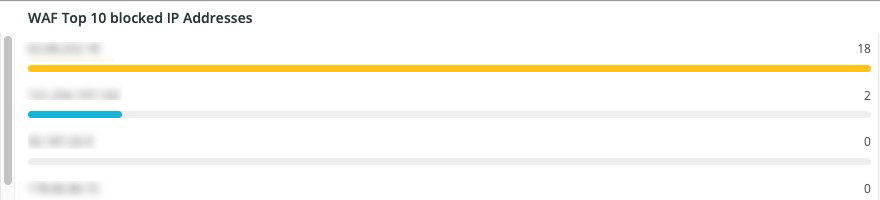

# Onglet [!DNL WAF]

L’onglet **[!DNL WAF]** affiche le trafic transmis et bloqué par le [!DNL firewall].

## [!DNL WAF traffic summary]

L’image **[!DNL WAF traffic summary]** affiche le nombre de trafic transmis, consignés, bloqués et en échec par le [!DNL firewall].

## [!DNL WAF Top 10 blocked IP Addresses]

La trame **[!DNL WAF Top 10 blocked IP Addresses]** affiche les 10 adresses IP les plus bloquées par le [!DNL firewall].

## [!DNL WAF Top 10 countries for blocked requests]

L’image **[!DNL WAF Top 10 countries for blocked requests]** affiche le nombre de demandes bloquées pour les pays dans le top 10 pour les demandes bloquées par l’[!DNL firewall].

## [!DNL WAF Top 10 logged IP Addresses]

L’image **[!DNL WAF Top 10 logged IP Addresses]** affiche les adresses IP dans le top 10 des adresses IP consignées par le [!DNL firewall].

## [!DNL Top 10 WAF Rules Executed and Logged by IP address]

L’image **[!DNL Top 10 WAF Rules Executed and Logged by IP address]** affiche les adresses IP qui se trouvent dans les 10 premières adresses IP correspondant le plus souvent aux règles de [!DNL firewall].

## [!DNL WAF Logged Details]

Le cadre **[!DNL WAF Logged Details]** affiche les requêtes enregistrées par le [!DNL firewall], y compris des détails tels que l’horodatage, la ville, la région et le centre de données.

## [!DNL WAF Blocked Details]

Le cadre **[!DNL WAF Blocked Details]** affiche les requêtes bloquées par le [!DNL firewall], y compris des détails tels que l’horodatage, la ville, la région et le centre de données.
