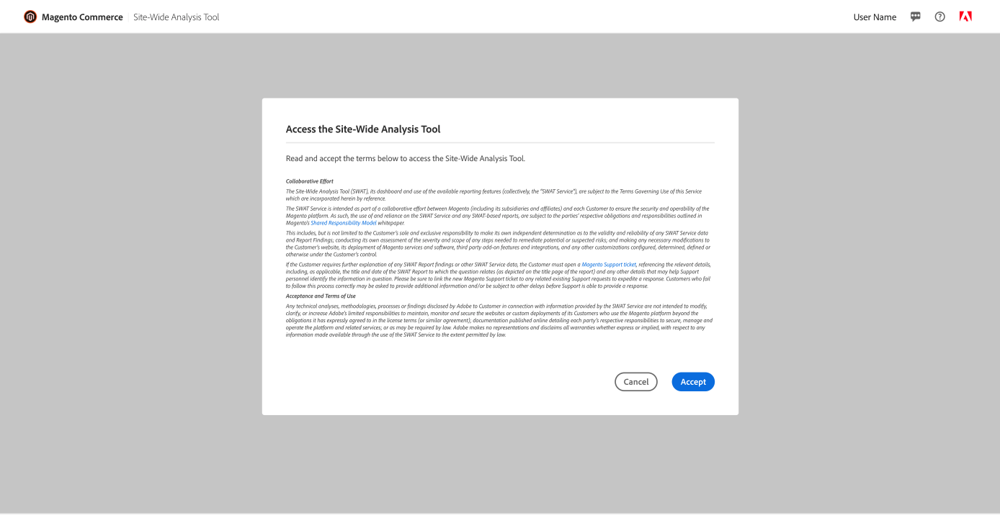

# Accès à la [!DNL Site-Wide Analysis Tool]

Le [!DNL Site-Wide Analysis Tool] Le service est disponible dans [mode de production](https://docs.magento.com/user-guide/magento/installation-modes.html) pour [!DNL Admin] utilisateurs autorisés à accéder à [ressources de rôle](https://docs.magento.com/user-guide/system/permissions-user-roles.html).

>[!NOTE]
>
>Si vous disposez d’une installation sur site d’Adobe Commerce, vous devez installer une [agent](../site-wide-analysis-tool/installation.md) sur votre infrastructure pour utiliser l’outil.

*[!DNL Site-Wide Analysis Tool]Tableau de bord*

## Étape 1 : Vérification des autorisations

Vérifiez que la variable [!DNL Admin] compte utilisateur autorisé à accéder à [!DNL Site-Wide Analysis Tool] à travers leur [rôle d’utilisateur attribué](https://docs.magento.com/user-guide/system/permissions-user-roles.html).

>[!IMPORTANT]
>
>Le [!DNL Site-Wide Analysis Tool] la ressource de rôle (autorisation) est **not** attribué automatiquement. Elle DOIT être activée pour le rôle utilisateur et le rôle affectés individuellement à chaque compte utilisateur dans la variable [!UICONTROL Admin].

Pour le rôle personnalisé qui requiert [!DNL Site-Wide Analysis Tool] accédez à , procédez comme suit :

1. Sélectionnez la **[!UICONTROL Reports]** > *[!UICONTROL System Insights]* > **[!UICONTROL Site-Wide Analysis Tool]** ressource de rôle.

   
   *[!DNL Site-Wide Analysis Tool]autorisation sélectionnée pour le rôle*

1. Cliquez sur **[!UICONTROL Save Role]**.

1. Informer les utilisateurs auxquels ce rôle est affecté de se déconnecter de la fonction [!DNL Admin]et reconnectez-vous.

>[!NOTE]
>
>Si vous avez vérifié que le compte utilisateur est autorisé à accéder à la variable [!DNL Site-Wide Analysis Tool] et l’utilisateur reçoit une erreur 403 lorsqu’il tente d’accéder à l’outil à partir de la fonction [!DNL Admin], le contrôle d’accès HTTP peut être activé pour votre instance d’Adobe Commerce sur l’infrastructure cloud. Le [!DNL Site-Wide Analysis Tool] Le tableau de bord n’est PAS pris en charge si l’authentification HTTP est activée. Pour plus d’informations sur la résolution de ce problème, voir notre [Article sur le support](https://support.magento.com/hc/en-us/articles/360057400172-403-errors-when-accessing-Site-Wide-Analysis-Tool-on-Magento?_ga=2.168901729.117144580.1649172612-1623400270.1640858671).

## Étape 2 : Accès [!DNL Site-Wide Analysis Tool]

1. Sur le *[!UICONTROL Admin]* barre latérale, accédez à **[!UICONTROL Reports]** > *[!UICONTROL System Insights]* > **[!UICONTROL Site-Wide Analysis Tool]**.

1. Lisez le *Conditions d’utilisation* pour le [!DNL Site-Wide Analysis Tool] et cliquez sur **[!UICONTROL Accept]** pour continuer.

   Chaque utilisateur doit accepter les Conditions d’utilisation de la session. Cette étape est répétée pour chaque session connectée.

   
   *Conditions d’utilisation*

1. Dans la partie supérieure du tableau de bord, cliquez sur l’onglet que vous souhaitez afficher.

   
   *[!DNL Site-Wide Analysis Tool]informations*

## Étape 3 : Générer un rapport

1. Dans le coin supérieur droit du tableau de bord, cliquez sur **[!UICONTROL Generate Report]**.

1. Cochez la case pour chaque **[!UICONTROL Type]** et **[!UICONTROL Priority]** que vous souhaitez inclure dans le rapport.

1. Cliquez sur **[!UICONTROL Generate Report]**.

   
   *Paramètres des rapports*

| ONGLET | DESCRIPTION |
| --- | --- |
| Tableau de bord | Affiche l’intégrité de votre système avec les notifications et recommandations actuelles par priorité. |
| Informations | Fournit des informations sur les contacts client et un résumé des tickets en cours, avec des informations détaillées sur chaque produit Adobe Commerce installé. |
| Recommendations | Répertorie les recommandations basées sur les bonnes pratiques pour résoudre les problèmes détectés sur votre site. |
| Exceptions | Répertorie les erreurs générées par l’application par des conditions anormales sans gestionnaire d’erreurs. |
| Extensions | Répertorie toutes les extensions tierces et bibliothèques tierces. |

>[!NOTE]
>
>Après l’application d’une recommandation, il peut s’écouler quelques jours avant qu’elle ne soit mise à jour dans la variable [!DNL Site-Wide Analysis Tool] Tableau de bord ou rapport généré.
