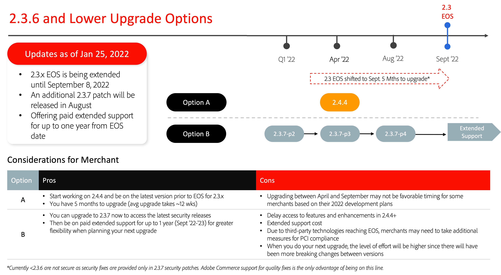

# Chemins de mise à niveau recommandés pour 2022

Une mise en oeuvre d’e-commerce est une évolution qui n’est jamais vraiment terminée. Votre entreprise doit garder une longueur d’avance sur les tendances en introduisant les dernières fonctionnalités qui maintiennent vos clients engagés. La mise à niveau vers Adobe Commerce 2.4.4 ou version ultérieure vous permet de rester en avance sur votre pack avec les innovations les plus performantes et de garantir la sécurité de votre entreprise grâce aux fonctionnalités suivantes :

- Accès plus rapide aux fonctionnalités innovantes proposées sous forme de services SaaS
- Maintenance et mises à niveau plus simples et plus rentables
- Flexibilité et personnalisation continues pour répondre aux besoins uniques de l’entreprise
- Augmentation significative des performances et de l’évolutivité
- Amélioration de l’expérience et des outils des développeurs
- Possibilité d’une intégration plus poussée avec d’autres applications Adobe Experience Cloud

Pour offrir plus de flexibilité à nos commerçants lors de la planification de leur mise à niveau vers la version 2.4.4 ou ultérieure, nous avons récemment mis à jour notre [Calendrier des versions 2022](https://devdocs.magento.com/release/), a prolongé la date de fin de prise en charge 2.3 et annoncé de nouvelles options de prise en charge étendues pour certaines versions de nos logiciels. Pour plus d&#39;informations sur ces mises à jour, consultez notre blog.

Vous trouverez ci-dessous les chemins recommandés par Adobe Commerce vers la version 2.4.4 ou ultérieure pour garantir la sécurité et les performances de votre site tout en effectuant une mise à niveau vers l’une des dernières versions.

## Mise à niveau à partir des versions 2.3.6 et antérieures

## Mise à niveau à partir de la version 2.3.7

## Mise à niveau de la version 2.4.0-2.4.3

## Mise à niveau à partir de la version 2.4.3 (ou nouvelle mise à niveau)

