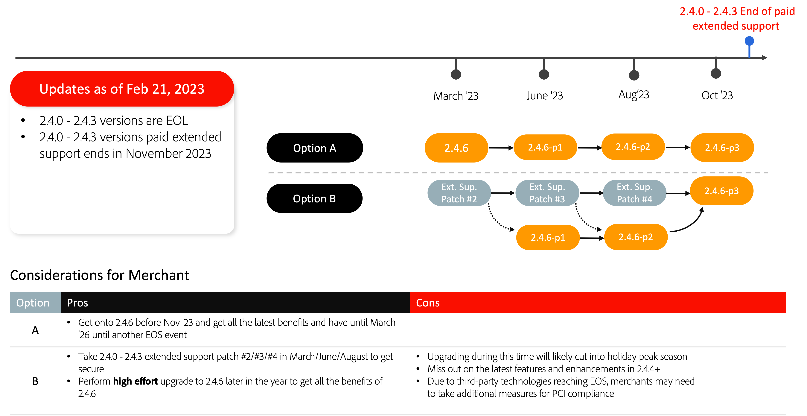

# Chemins de mise à niveau recommandés

Une implémentation eCommerce est une évolution, elle n&#39;est jamais vraiment terminée. Votre entreprise doit garder une longueur d’avance sur les tendances en introduisant les dernières fonctionnalités et capacités qui maintiennent l’engagement de vos clients. La mise à niveau vers la dernière version d’Adobe Commerce vous permet de rester en tête du peloton avec des innovations haut de gamme et de garantir l’avenir de votre entreprise avec :

- Accès plus rapide aux fonctionnalités innovantes proposées en tant que services SaaS
- Maintenance et mises à niveau plus simples et plus rentables
- Flexibilité et personnalisation continues pour répondre aux besoins spécifiques de l’entreprise
- Amélioration significative des performances et de l’évolutivité
- Meilleure expérience et meilleurs outils pour les développeurs
- Possibilité d’intégrer plus profondément à d’autres applications Adobe Experience Cloud

Vous trouverez ci-dessous les chemins de mise à niveau recommandés par Adobe Commerce pour garantir la sécurité et les performances de votre site lors de la mise à niveau vers l’une des dernières versions.

## Mise à niveau depuis la version 2.3.7

## Mise à niveau de la version 2.4.0 vers la version 2.4.3

## Mise à niveau depuis les versions 2.4.4 et 2.4.5

