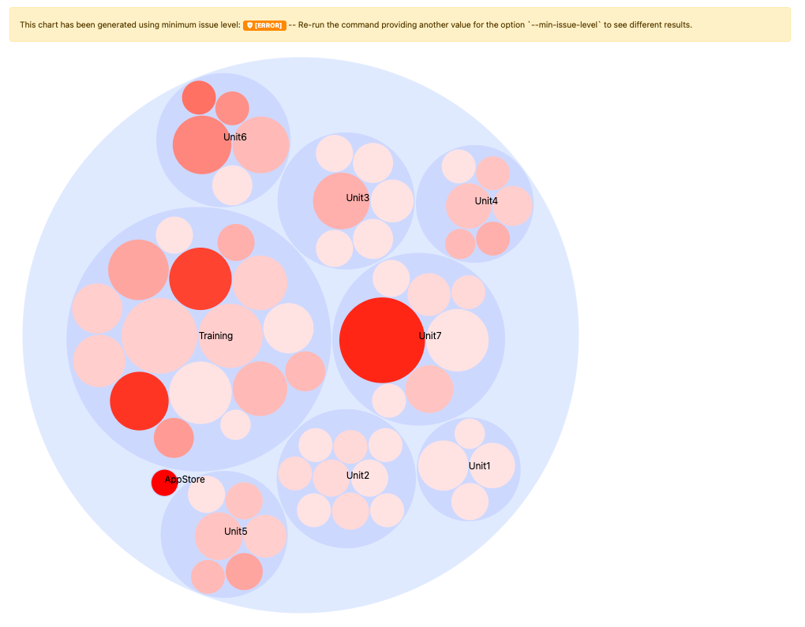

# Exécutez la variable [!DNL Upgrade Compatibility Tool]

{{commerce-only}}

Le [!DNL Upgrade Compatibility Tool] est un outil de ligne de commande qui vérifie une instance personnalisée d’Adobe Commerce par rapport à une version spécifique en analysant tous les modules qui y sont installés. Elle renvoie une liste des problèmes, erreurs et avertissements critiques qui doivent être résolus avant la mise à niveau vers la dernière version d’Adobe Commerce.

Le [!DNL Upgrade Compatibility Tool] identifie les problèmes potentiels qui doivent être résolus dans votre code avant de tenter une mise à niveau vers une version plus récente d’Adobe Commerce.

## Utilisez la variable `upgrade:check` command

Le `upgrade:check` est la commande principale pour exécuter l’outil :

```bash
bin/uct upgrade:check <dir>
```

>[!TIP]
>
>Le `<dir>` est le répertoire dans lequel se trouve votre instance Adobe Commerce.

Le `upgrade:check` exécute la commande [!DNL Upgrade Compatibility Tool] et vérifie une instance personnalisée Adobe Commerce par rapport à une version spécifique en analysant tous les modules qui y sont installés. Elle renvoie une liste des problèmes, erreurs et avertissements critiques qui doivent être résolus avant la mise à niveau vers la dernière version de votre Adobe Commerce.

>[!WARNING]
>
>Exécutez uniquement lorsque le répertoire racine du projet (ou principal) est fourni.

Cette commande recherche les modifications de code principal pour cette instance Adobe Commerce spécifique et toutes les modifications de code personnalisé qui y sont installées.

Vous pouvez exécuter la variable `core:code:changes` pour analyser uniquement les modifications de code principal pour cette instance Adobe Commerce spécifique. Voir [Modifications du code principal](../upgrade-compatibility-tool/run.md#use-the-core:code:changes-command) .

Vous pouvez utiliser la variable `graphql:compare` pour comparer deux schémas GraphQL afin de rechercher les modifications entre eux. Voir [Vérification de la compatibilité des schémas GraphQL](../upgrade-compatibility-tool/run.md#graphql-schema-compatibility-verification) .

### Recommendations pour utiliser la variable `upgrade:check` command

- Le [!DNL Upgrade Compatibility Tool] nécessite au moins 2 Go de mémoire vive pour fonctionner. Ce paramètre est recommandé pour éviter les problèmes en raison d’une faible limitation de mémoire. Le [!DNL Upgrade Compatibility Tool] affiche une question si vous exécutez le `upgrade:check` avec une valeur faible `memory_limit` .
- Spécifiez la variable `-m` pour exécuter l’outil sur un module spécifique :

   ```bash
   bin/uct upgrade:check <dir> -m[=MODULE-PATH]
   ```

Où les arguments sont les suivants :

- `<dir>`: Répertoire d’installation d’Adobe Commerce.
- `[=MODULE-PATH]`: Répertoire de chemin d’accès au module spécifique.

### Utilisez la variable `--help` option

Pour afficher la variable [!DNL Upgrade Compatibility Tool] options générales de la commande et aide, exécutez :

```bash
bin/uct --help
```

Cependant, il est possible d’exécuter `--help` comme option lors de l’exécution d’une commande spécifique, comme `bin/uct upgrade:check`. Cette fonction renvoie des `--help` options pour cette commande :

```bash
bin/uct upgrade:check --help
```

Disponible `--help` options de la variable `upgrade:check` command :

- `-m, --module-path[=MODULE-PATH]`: Chemin des modules à analyser
- `-a, --current-version[=CURRENT-VERSION]`: La version actuelle d’Adobe Commerce, la version de l’installation d’Adobe Commerce, sera utilisée si elle est omise.
- `-c, --coming-version[=COMING-VERSION]`: La version d’Adobe Commerce de Target, la dernière version d’Adobe Commerce publiée sera utilisée si vous l’omettez. Fournit une liste de toutes les versions d’Adobe Commerce disponibles.
- `--json-output-path[=JSON-OUTPUT-PATH]`: Chemin du fichier dans lequel la sortie sera exportée au format json.
- `--html-output-path[=HTML-OUTPUT-PATH]`: Chemin du fichier dans lequel la sortie sera exportée au format HTML.
- `--min-issue-level`: Niveau de problème minimal à afficher dans le rapport. Le niveau par défaut est [AVERTISSEMENT].
- `-i, --ignore-current-version-compatibility-issues`: Utilisez cette option lorsque vous ne souhaitez pas inclure les problèmes critiques connus, les erreurs et les avertissements dans votre [!DNL Upgrade Compatibility Tool] rapport.
- `--context=CONTEXT`: Contexte d&#39;exécution. Cette option est destinée à des fins d’intégration et n’affecte pas le résultat de l’exécution.
- `-h, --help`: Affichez l’aide pour cette commande spécifique. Si aucune commande n’est fournie, `list` est le résultat par défaut.
- `-q, --quiet`: Ne sortez aucun message lors de l’exécution de la commande.
- `-v, --version`: Afficher la version de l’application.
- `--ansi, --no-ansi`: Activez la sortie ANSI.
- `-n, --no-interaction`: Ne posez aucune question interactive lors de l’exécution de la commande.
- `-v, --vv, --vvv, --verbose`: Augmenter la verbalisation des communications de sortie. 1 pour la sortie normale, 2 pour la sortie en mode verbeux et 3 pour la sortie DEBUG.

### Sortie

Suite à l’analyse effectuée, la variable [!DNL Upgrade Compatibility Tool] exporte un rapport contenant une liste de problèmes pour chaque fichier spécifiant sa gravité, son code d’erreur et sa description de l’erreur.

Voir l’exemple ci-dessous :

```terminal
File: /app/code/Custom/CatalogExtension/Controller/Index/Index.php
------------------------------------------------------------------
 * [WARNING][1131] Line 23: Extending from class 'Magento\Framework\App\Action\Action' that is @deprecated on version '2.4.2'
 * [ERROR][1429] Line 103: Call method 'Magento\Framework\Api\SearchCriteriaBuilder::addFilters' that is non API on version '2.4.2'
 * [CRITICAL][1110] Line 60: Instantiating class/interface 'Magento\Catalog\Model\ProductRepository' that does not exist on version '2.4.2'
```

Vérifiez les [Référence des messages d’erreur](error-messages.md) pour plus d’informations.

Le rapport contient également un résumé détaillé qui indique :

- *Version actuelle*: la version actuellement installée.
- *Version cible*: la version vers laquelle vous souhaitez effectuer la mise à niveau.
- *Heure d’exécution*: le temps nécessaire à l&#39;analyse pour construire le rapport (mm:ss).
- *Modules nécessitant une mise à jour*: le pourcentage de modules qui contiennent des problèmes de compatibilité et nécessitent une mise à jour.
- *Fichiers nécessitant une mise à jour*: le pourcentage de fichiers qui contiennent des problèmes de compatibilité et nécessitent une mise à jour.
- *Nombre total d’erreurs critiques*: le nombre d’erreurs critiques détectées.
- *Erreurs totales*: le nombre d’erreurs détectées.
- *Avertissements totaux*: le nombre d’avertissements trouvés.

Voir l’exemple ci-dessous :

```terminal
 ----------------------------- ------------------
  Current version               2.4.2
  Target version                2.4.3
  Execution time                1m:10s
  Modules that require update   78.33% (47/60)
  Files that require update     21.62% (115/532)
  Total critical issues         35
  Total errors                  201
  Total warnings                103
 ----------------------------- ------------------
```

>[!NOTE]
>
>Par défaut, la variable [!DNL Upgrade Compatibility Tool] exporte le rapport dans 2 formats différents : `json` et `html`.

#### JSON

Le fichier JSON contient exactement les mêmes informations que celles affichées en sortie :

- Liste des problèmes identifiés.
- Résumé de l&#39;analyse.

Pour chaque problème rencontré, le rapport fournit des informations détaillées telles que la gravité et la description du problème.

>[!NOTE]
>
>Le chemin par défaut du dossier de sortie est `var/output/[TIME]-results.json`.

Pour exporter ce rapport dans un dossier de sortie différent, exécutez :

```bash
bin/uct upgrade:check <dir> --json-output-path[=JSON-OUTPUT-PATH]
```

Où les arguments sont les suivants :

- `<dir>`: Répertoire d’installation d’Adobe Commerce.
- `[=JSON-OUTPUT-PATH]`: Répertoire de chemin d’accès pour l’exportation `.json` fichier de sortie.

>[!NOTE]
>
>Le chemin par défaut du dossier de sortie est `var/output/[TIME]-results.json`.

#### HTML

Le fichier de HTML contient également le résumé de l’analyse et la liste des problèmes identifiés.


Vous pouvez facilement parcourir les problèmes identifiés au cours de la [!DNL Upgrade Compatibility Tool] analyse :


Le rapport HTML comprend également quatre graphiques différents :

- **Modules par gravité des problèmes**: Affiche la répartition de la gravité par modules.
- **Fichiers par gravité des problèmes**: Affiche la répartition de la gravité par fichiers.
- **Modules classés par nombre total de problèmes**: Affiche les 10 modules les plus compromis en prenant en compte les avertissements, les erreurs et les erreurs critiques.
- **Modules avec des tailles et des problèmes relatifs**: Plus un module contient de fichiers, plus son cercle est volumineux. Plus un module a de problèmes, plus son cercle rouge apparaît.

Ces graphiques vous permettent d’identifier (en un coup d’oeil) les parties les plus compromises et celles qui nécessitent davantage de travail pour effectuer une mise à niveau.


Vous pourrez filtrer les problèmes affichés sur le rapport en fonction du niveau de problème minimum (par défaut, [AVERTISSEMENT]).

Une liste déroulante dans le coin supérieur droit vous permet de sélectionner une autre option en fonction de vos besoins. La liste des problèmes identifiés sera filtrée en conséquence.


Veuillez noter que les problèmes avec un niveau de problème inférieur sont supprimés mais que vous recevez une notification afin que vous soyez toujours conscient des problèmes identifiés par module.

Les diagrammes sont également mis à jour en conséquence, à l’exception du `Modules with relative sizes and issues`, qui est généré avec l’événement `min-issue-level` configuration initiale.

Si vous souhaitez afficher des résultats différents, vous devrez exécuter à nouveau la commande en fournissant une autre valeur pour la variable `--min-issue-level` .



Pour exporter ce rapport dans un dossier de sortie différent, exécutez :

```bash
bin/uct upgrade:check <dir> --html-output-path[=HTML-OUTPUT-PATH]
```

Où les arguments sont les suivants :

- `<dir>`: Répertoire d’installation de {{site.data.var.ee}}.
- `[=HTML-OUTPUT-PATH]`: Répertoire de chemin d’accès pour l’exportation `.html` fichier de sortie.

>[!NOTE]
>
>Le chemin par défaut du dossier de sortie est `var/output/[TIME]-results.html`.

### Utilisez la variable `--ignore-current-version-compatibility-issues` option

Le [!DNL Upgrade Compatibility Tool] vous permet d’exécuter la variable `upgrade:check` avec une commande `--ignore-current-version-compatibility-issues` , de sorte qu’elle n’affiche que les problèmes critiques, erreurs et avertissements nouveaux ou inconnus. Utilisez cette option lorsque vous ne souhaitez pas inclure les problèmes critiques connus, les erreurs et les avertissements dans votre [!DNL Upgrade Compatibility Tool] rapport.

```bash
bin/uct upgrade:check --ignore-current-version-compatibility-issues <dir>
```

>[!NOTE]
>
>Cela s’applique uniquement aux validations d’API PHP.

### Installation de vanille

A _vanille_ l’installation est une installation propre d’une balise ou d’une branche de version spécifiée pour une version spécifique.

Le `bin/uct core:code:changes` vérifie si votre système contient une instance Vanilla. Si c’est la première fois que vous utilisez une installation Vanilla, une question de ligne de commande interactive vous invite à télécharger le projet Vanilla à partir du référentiel Adobe Commerce (`https://repo.magento.com/`).

Vous pouvez exécuter une [!DNL Upgrade Compatibility Tool] avec la commande `--vanilla-dir` pour spécifier le répertoire d’installation d’Adobe Commerce vanilla.

Voir [Déploiement de l’instance Vanilla](https://devdocs.magento.com/contributor-guide/contributing.html#vanilla-pr) pour plus d’informations.

## Utilisez la variable `list` command

Pour renvoyer une liste de la variable [!DNL Upgrade Compatibility Tool] commandes disponibles, exécutez :

```bash
bin/uct list
```

Le `list` renvoie les informations suivantes :

- `-h, --help`: Affichez l’aide pour cette commande spécifique. Si aucune commande n’est fournie, `list` est le résultat par défaut.
- `-q, --quiet`: Ne sortez aucun message lors de l’exécution de la commande.
- `-v, --version`: Afficher la version de l’application.
- `--ansi, --no-ansi`: Activez la sortie ANSI.
- `-n, --no-interaction`: Ne posez aucune question interactive lors de l’exécution de la commande.
- `-v, --vv, --vvv, --verbose`: Augmenter la verbalisation des communications de sortie. 1 pour la sortie normale, 2 pour la sortie en mode verbeux et 3 pour la sortie DEBUG.

## Utilisez la variable `core:code:changes` command

Vous pouvez comparer votre installation Adobe Commerce actuelle à une installation Vanilla propre pour voir si le code principal a apporté des modifications pour mettre en oeuvre une nouvelle fonctionnalité ou personnalisation. Cette validation permet d’estimer l’effort requis par la mise à niveau en fonction de ces modifications.

```bash
bin/uct core:code:changes <dir> <vanilla dir>
```

Où les arguments sont les suivants :

- `<dir>`: Répertoire d’installation d’Adobe Commerce.
- `<vanilla dir>`: Répertoire d’installation d’Adobe Commerce vanilla.

L’exécution de cette commande présente certaines limites :

- Exécutez uniquement lorsque le répertoire racine du projet (ou principal) est fourni.
- Affiche une liste des modifications principales uniquement.

### Utilisez la variable `core:code:changes` avec la commande `--help` option

Disponible `--help` options de la variable `core:code:changes` command :

- `-h, --help`: Affichez l’aide pour cette commande spécifique. Si aucune commande n’est fournie, `list` est le résultat par défaut.
- `-q, --quiet`: Ne sortez aucun message lors de l’exécution de la commande.
- `-v, --version`: Afficher la version de l’application.
- `--ansi, --no-ansi`: Activez la sortie ANSI.
- `-n, --no-interaction`: Ne posez aucune question interactive lors de l’exécution de la commande.
- `-v, --vv, --vvv, --verbose`: Augmenter la verbalisation des communications de sortie. 1 pour la sortie normale, 2 pour la sortie en mode verbeux et 3 pour la sortie DEBUG.

## Version

Vous pouvez comparer votre installation actuelle d’Adobe Commerce aux versions d’Adobe Commerce `>=2.3`.

Vous devez fournir la version comme paramètre lors de l’exécution de la commande :

```bash
bin/uct upgrade:check <dir> -c 2.4.3
```

>[!NOTE]
>
>Ce paramètre fournit une liste de toutes les versions d’Adobe Commerce disponibles.

Où :

- `-c, --coming-version[=COMING-VERSION]`: La version ciblée Adobe Commerce.

Il existe certaines limites lors de l’exécution de la commande précédente :

- Ce paramètre fait référence à toute balise qui identifie une version spécifique d’Adobe Commerce.
- Il s&#39;agit d&#39;une obligation explicite; fournir uniquement la valeur de ne fonctionne pas.
- Fournissez la version de la balise sans guillemets (ni simples ni doubles) : ~~&#39;2.4.1-develop&#39;~~.
- Vous ne devez PAS fournir d’anciennes versions que celle que vous avez installée actuellement, ni plus de 2.3, qui est la plus ancienne version prise en charge actuellement.

### Utilisez la variable `refactor` command

Le [!DNL Upgrade Compatibility Tool] permet de résoudre automatiquement un ensemble réduit de problèmes :

- Fonctions qui étaient autorisées à être utilisées sans passer d’argument, mais avec une telle utilisation désormais obsolète.
- Utilisation de `$this` dans les modèles de Magento.
- Utilisation du mot-clé PHP `final` dans des méthodes privées.

Exécutez :

```bash
bin/uct refactor <dir>
```

Où les arguments sont les suivants :

- `<dir>`: Répertoire d’installation d’Adobe Commerce.

## Vérification de la compatibilité des schémas GraphQL

Le [!DNL Upgrade Compatibility Tool] fournit également la possibilité d’analyser deux points d’entrée GraphQL et de comparer leurs schémas à la recherche de modifications risquées et de rupture entre eux :

```bash
bin/uct graphql:compare <schema1> <schema2>
```

Où les arguments sont les suivants :

- `<schema1>`: URL du point d’entrée pour l’installation existante.
- `<schema2>`: URL du point d’entrée pour l’installation Vanilla.

Vous devez courir. `instance before` et `instance after` la mise à niveau.

### Commande de comparaison GraphQL `--help` options

Disponible `--help` options de la variable `graphql:compare` command :

- `-h, --help`: Affichez l’aide pour cette commande spécifique. Si aucune commande n’est fournie, `list` est le résultat par défaut.
- `-q, --quiet`: Ne sortez aucun message lors de l’exécution de la commande.
- `-v, --version`: Afficher la version de l’application.
- `--ansi, --no-ansi`: Activez la sortie ANSI.
- `-n, --no-interaction`: Ne posez aucune question interactive lors de l’exécution de la commande.
- `-v, --vv, --vvv, --verbose`: Augmenter la verbalisation des communications de sortie. 1 pour la sortie normale, 2 pour la sortie en mode verbeux et 3 pour la sortie DEBUG.

### Exemple avec une liste de problèmes critiques, d’erreurs et d’avertissements pour GraphQL

```terminal
 *   [WARNING] FIELD_CHANGED_KIND: ConfigurableProduct.gender changed type from Int to String.
 *   [WARNING] OPTIONAL_INPUT_FIELD_ADDED: An optional field sku on input type ProductAttributeSortInput was added.
```

Vous pouvez exécuter la variable [!DNL Upgrade Compatibility Tool] avec une configuration d’exécution via le module externe PhpStorm. Voir [[!DNL Upgrade Compatibility Tool] Exécuter la configuration](https://devdocs.magento.com/guides/v2.3/ext-best-practices/phpstorm/uct-run-configuration.html) pour plus d’informations.

Voir [tutoriel vidéo](https://experienceleague.adobe.com/docs/commerce-learn/tutorials/upgrade/uct-phpstorm.html?lang=en) (06:30) pour savoir comment utiliser la variable [!DNL Upgrade Compatibility Tool] avec le module externe PHPStorm Magento.


## Actions recommandées

### Optimiser vos résultats

Le [!DNL Upgrade Compatibility Tool] fournit un rapport contenant les résultats avec tous les problèmes identifiés par défaut sur votre projet. Vous pouvez optimiser les résultats pour vous concentrer sur les problèmes que vous devez corriger pour terminer la mise à niveau :

- Utiliser l’option `--ignore-current-version-compatibility-issues`, qui supprime tous les problèmes critiques, erreurs et avertissements connus par rapport à votre version actuelle d’Adobe Commerce. Il ne fournit des erreurs que par rapport à la version vers laquelle vous essayez de mettre à niveau.
- Ajoutez la variable `--min-issue-level` , ce paramètre permet de définir le niveau de problème minimum afin de n’établir la priorité que sur les problèmes les plus importants de votre mise à niveau.
- Si vous souhaitez analyser uniquement un certain fournisseur, module ou même répertoire, vous pouvez également spécifier le chemin d’accès comme option. Exécutez la variable `bin` avec l’option ajoutée `-m`. Cela permet à la variable [!DNL Upgrade Compatibility Tool] pour analyser indépendamment un module spécifique et aide à résoudre les problèmes de mémoire qui peuvent se produire lors de l’exécution de la variable [!DNL Upgrade Compatibility Tool].

### Suivre les bonnes pratiques d’Adobe Commerce

- Évitez d’avoir deux modules portant le même nom.
- Suivez Adobe Commerce [normes de codage](https://devdocs.magento.com/guides/v2.4/coding-standards/bk-coding-standards.html).

## Dépannage

### Erreur de segmentation

Lorsque deux modules portent le même nom, la variable [!DNL Upgrade Compatibility Tool] affiche une erreur de segmentation.

Pour éviter cette erreur, il est recommandé d’exécuter la variable `bin` avec l’option ajoutée `-m`:

```bash
bin/uct upgrade:check /<dir>/<instance-name> --coming-version=2.4.1 -m /vendor/<vendor-name>/<module-name>
```

>[!NOTE]
>
>Le `<dir>` est le répertoire dans lequel se trouve votre instance Adobe Commerce.

Le `-m` permet à la fonction [!DNL Upgrade Compatibility Tool] pour analyser chaque module spécifique indépendamment afin d’éviter de rencontrer deux modules portant le même nom dans votre instance Adobe Commerce.

Cette option de commande permet également d’activer la fonction [!DNL Upgrade Compatibility Tool] pour analyser un dossier contenant plusieurs modules :

```bash
bin/uct upgrade:check /<dir>/<instance-name> --coming-version=2.4.1 -m /vendor/<vendor-name>/
```

Cette recommandation permet également de résoudre les problèmes de mémoire qui peuvent se produire lors de l’exécution de la variable [!DNL Upgrade Compatibility Tool].

### Sortie vide

>[!NOTE]
>
>Le `M2_VERSION` est la version Adobe Commerce cible que vous souhaitez comparer à votre instance Adobe Commerce.

Si après avoir exécuté cette commande :

```bash
bin/uct upgrade:check INSTALLATION_DIR -c M2_VERSION
```

La seule sortie est `Upgrade compatibility tool`:

```terminal
bin/uct upgrade:check /var/www/project/magento/ -c 2.4.1
Upgrade compatibility tool
```

La cause probable est une limitation de la mémoire PHP.
Remplacez la limitation de mémoire en définissant `memory_limit` to `-1`:

```bash
php -d memory_limit=-1 /bin/uct upgrade:check INSTALLATION_DIR -c M2_VERSION
```
